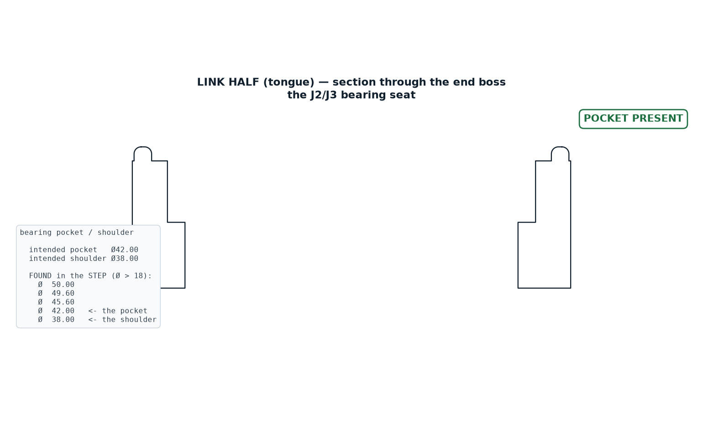
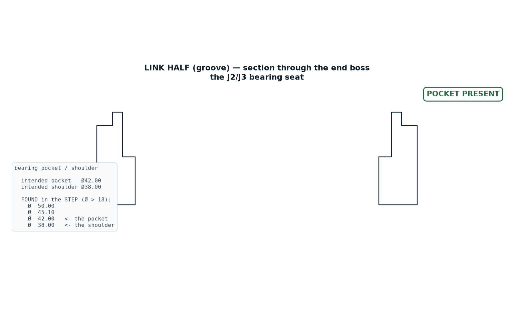
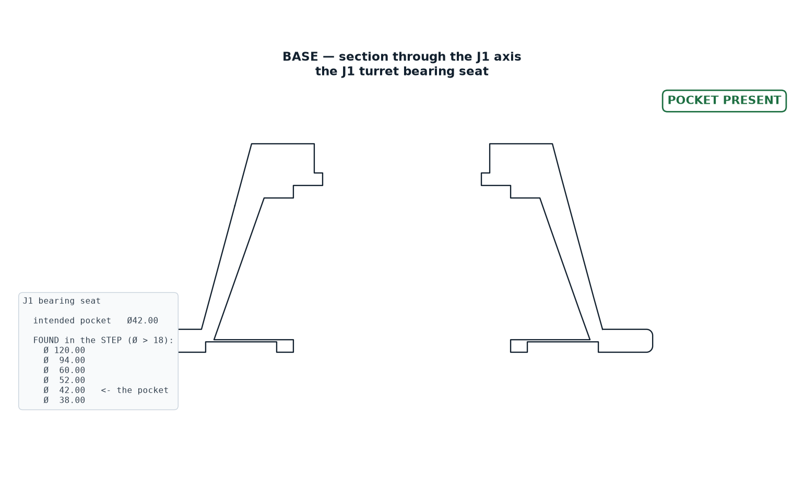
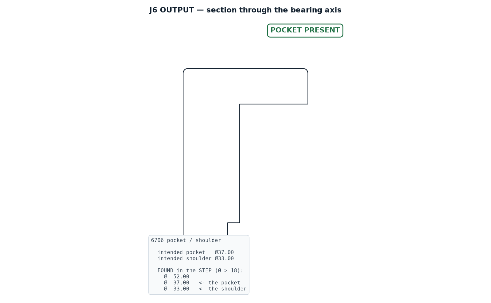

# ARM-450 — Part-by-Part Geometry Audit

**Read from the STEP B-rep, not from the source that made it and not from a mesh.**

> ## STATUS: ALL DEFECTS FIXED — 2026-08-21
>
> **52 features verified present · 0 needing attention.** Nothing had been printed when
> these were found, so every fix went in at the source and every part was regenerated.
> The sections in this document are re-rendered from the corrected geometry: all nine now
> read **POCKET PRESENT**.
>
> | # | part | defect | fix |
> | --- | --- | --- | --- |
> | 1–2 | link halves | no Ø42 bearing pocket | solid boss ring unioned back before counterboring |
> | 3 | base | no Ø42 J1 seat | cable bore now stops below the seat, leaving a Ø38 shoulder |
> | 4 | `wrist_j6_output` | 3 of 4 tool bolts | honest **3-bolt** interface at 160/250/340°, all in material |
> | 5 | `wrist_j5_yoke` | cheek spacing 38.02 | SPAN derived from `BRG_SPACING` → **40.00** |
> | 6 | wrist parts | `horn_pattern()` no-ops | **still open — needs your decision, see §6** |
>
> **Mass went 1143 g → 1191 g.** The boss rings cost 48 g. That is 9 g under the 1.2 kg
> limit — real but very tight, and worth knowing before anything else is added.
>
> The pre-print gate now runs this audit as check 56, so this class of defect cannot pass
> it again.

---

`audit_parts.py` enumerates every cylindrical face in each STEP file, groups the faces into
physical holes, and checks each part against the features it is supposed to have.
`draw_2d_verify.py` then cuts a true section through each bearing interface so every finding
can be confirmed by eye.

---

## Why the pre-print gate did not catch any of this

The gate contains this check:

```python
check(abs((BRG_OD + BRG_FIT) - 42.00) < 1e-6, "bearing pocket Ø42.00", ...)
```

That checks the **parameter**. It confirms two numbers in `params.py` add up to 42.00. It
never opens the part. Every one of the defects below passed that gate 55/55, because in
each case the parameter is perfectly correct and the *geometry* does not contain it.

**A gate that reads the design intent instead of the produced geometry cannot find a
feature that was silently consumed by an earlier cut.** That is the single most useful
thing this audit established, and it is why `audit_parts.py` now exists alongside the gate.

---

## What was found, and what it was

| # | part | defect | severity |
| --- | --- | --- | --- |
| 1 | `link_half_tongue` | no Ø42 bearing pocket | **BLOCKING** |
| 2 | `link_half_groove` | no Ø42 bearing pocket | **BLOCKING** |
| 3 | `base` | no Ø42 J1 bearing seat | **BLOCKING** |
| 4 | `wrist_j6_output` | 3 of 4 tool-face bolt holes | moderate |
| 5 | `wrist_j5_yoke` | cheek spacing 38.02, drawing says 40.00 | minor |
| 6 | all wrist parts | `horn_pattern()` calls are no-ops | needs a decision |

---

### 1 & 2 — The link halves have no bearing pocket



The section is taken straight through the end boss. **There is no counterbore step.** The
wall runs straight from the web to the seam face.

Diameters the STEP actually contains at that boss: **Ø50.00, Ø49.60, Ø45.60, Ø45.20,
Ø38.00.** There is no Ø42.

**Cause.** In `cad/link_shell.py` the shell is hollowed at step 2 and the pocket is cut at
step 3. The hollow uses `boss_r - WALL_FLANGE` = 25 − 2.4 = **Ø45.20** at the end boss.
The pocket cut that follows is Ø42.00 — *smaller than the hole it is cutting into*, so it
removes nothing at all. CadQuery does not complain: cutting a small cylinder out of an
already-empty region is a legal no-op.

**Consequence.** A Ø42.00 bearing dropped into a Ø45.20 bore has **1.60 mm of radial
clearance**. At the 360 mm tool radius that is roughly 20 mm of tool wander — the joint has
no location at all. This is the exact failure the paired-bearing redesign was written to
eliminate, and it has been present in every version of the link.



Identical on the groove half.

---

### 3 — The base has no J1 bearing seat



Both pedestal walls end in a plain flat rim. There is no step for a bearing to sit in.
Diameters found: **Ø120.00 and Ø52.00**. No Ø42.

**Cause.** In `cad/base_wrist.py`:

```python
b = b.cut(... circle(CABLE_BORE / 2) ...)   # Ø52, straight through
b = b.cut(... circle((BRG_OD + BRG_FIT) / 2) ...)   # Ø42 "seat"
```

The Ø52 cable bore is cut through the full height first. The Ø42 seat is then cut inside a
hole that is already Ø52. **42 < 52, so it removes nothing.**

**Consequence.** The J1 bearing has nothing to seat in — a Ø42 bearing over a Ø52 hole
drops straight through. The whole arm has no defined rotation axis at its base.

---

### 4 — J6 tool face has three bolt holes, not four



Holes found at r = 15.00 (correct, Ø30 BCD): **(−10.61, −10.61), (−10.61, +10.61),
(+10.61, −10.61)**. The fourth, at (+10.61, +10.61), is absent — the servo pocket opening
occupies that quadrant, so there is no material to drill.

The isometric sheet calls out "4 × Ø3.40 ON Ø30.00 BCD". Three of four means a tool bolts
on asymmetrically, and the drawing overstates what is there.

---

### 5 — J5 yoke cheek spacing

Bearing-face spacing measures **38.02 mm**. `BRG_SPACING` is 40.00 and the isometric sheet
says "CHEEK SPACING 40.00". Moment stiffness goes as spacing squared, so 38.02 against
40.00 is a **9.6 % loss of moment stiffness** — small, but the drawing should not claim a
number the part does not have.

---

### 6 — The horn patterns are no-ops

`horn_pattern()` is called on `wrist_j4_housing`, `wrist_j6_output` and `turret_j1`. **None
of the three parts contains a single hole on the Ø14 horn bolt circle.** The pattern is cut
at r = 7.0, which in every case falls inside the Ø38 through bore or the Ø42 pocket —
already-empty space, so again a legal no-op.

This one needs a decision rather than a fix: if the servo body is captured in the pocket
and its horn bolts to the *mating* part, no horn holes are needed here and the calls should
be deleted. If the horn is meant to drive this part, the holes have to move outboard of the
Ø38 bore.

---

## The pattern behind all of it

Every one of these is the same mistake in a different place: **a cut made into a region
that a previous cut had already emptied.** Boolean subtraction of a smaller shape from a
larger void is silent — no error, no warning, no change in volume. It looks exactly like
success.

Three defences now exist:

1. `audit_parts.py` — reads geometry, not intent, and checks that each expected feature is
   physically present at the right size and place.
2. `draw_2d_verify.py` — a section through every bearing interface, so a missing seat is
   visible rather than inferred.
3. `cad/volumes.py` — a single generator for the mass table, so derived numbers cannot go
   stale unnoticed.

**All of findings 1–5 are now fixed and verified.** In each case the fix was ordering:
restore the material before counterboring it, or stop the earlier cut short of the feature
it would otherwise swallow.

Finding 6 is a design decision and is still open — see above.

The durable change is check 56 in `preprint_check.py`: the gate now runs this audit and
fails on any missing feature. Checking the parameter was never going to be enough.
