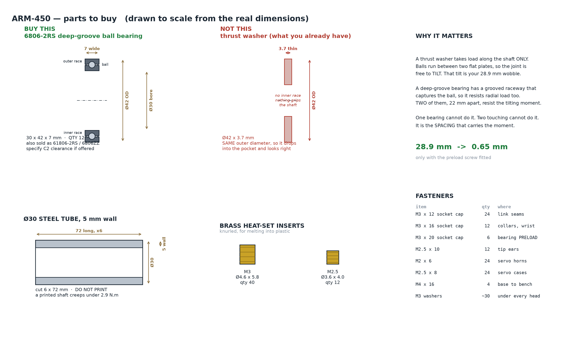
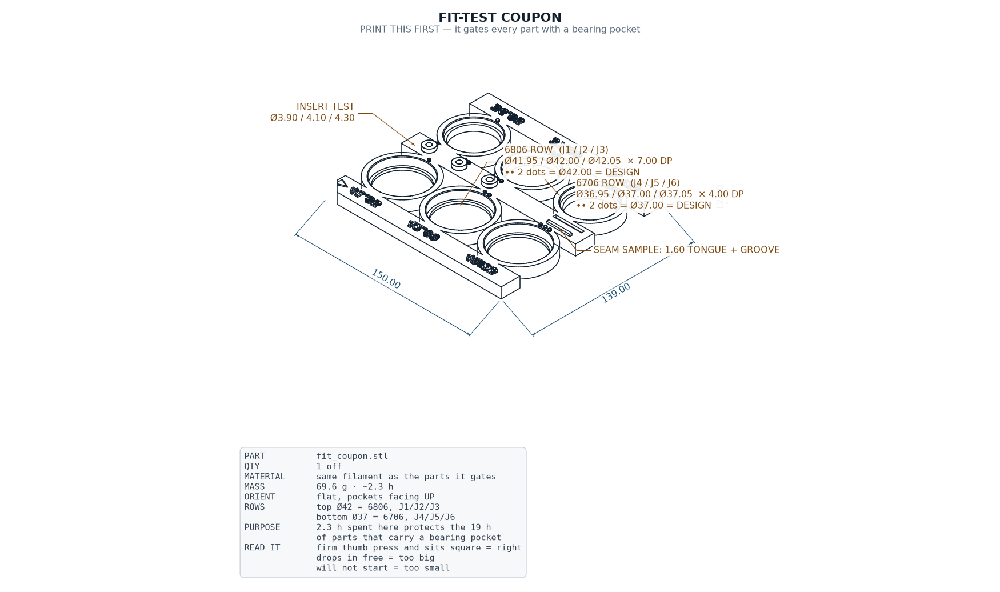

# ARM-450 — Purchasing List

- **Date:** 2026-08-20
- **What this covers:** everything that must be **bought**, not printed.
- **Printed parts** are covered separately in `ARM450_DRAWINGS_2D.pdf`.

---

> ## ⚠ READ BEFORE YOU SLICE — 2026-08-23
>
> **0. THE BUILD MATERIAL IS NOW PLAIN PLA**, not carbon-filled — `params.MATERIAL = "PLA"`.
> Every load case was re-run: **10 of 10 pass**, worst-case deflection 0.197 mm against a
> 0.30 mm limit, and backlash still dominates at 2.25 mm so it is invisible at the tool.
> Three things change for the better — **no hardened nozzle needed** (brass is fine), better
> layer adhesion, and the printed structure is **24 g lighter** at 1.24 g/cm³.
> One thing gets worse: plain PLA shrinks **0.40 %** against CF's 0.15 %, which is
> **0.17 mm on a Ø42 bore** — larger than the coupon's whole 0.10 mm bracket.
> **Budget two coupon prints.**
>
> **1. `output/cad/` contains 12 files that must NOT be printed.** Superseded parts
> (`bearing_yoke`, `wrist_yoke_j5`, `roll_module`, `wrist`, `tool_flange`), models of
> bought items (`bearing_6806`, `joint_shaft`, `shaft_tube` — the shaft is an aluminium
> tube), and assembly renders (`arm450_assembly_*`, `arm450_parts_kit`). **Print only the
> 17 files named in the print list below.** `python3 final_audit.py` lists them.
>
> **2. The assembled arm is ~1608 g, not 1365 g.** The mass gate never had a fastener term:
> 40 brass inserts, six M5 × 90 preload bolts and ~100 screws come to **244 g**, and steel
> and brass are 6–7× the density of the plastic they hold. That is **158 g over the 1450 g
> ceiling** and it cannot be closed with fastener substitutions alone (everything
> compatible saves 78 g). This does not affect printing — no printed part changes — but the
> mass requirement is not met. See `mass_options.py`.
>
> **3. The gripper was re-cut on 2026-08-23.** Rack teeth were 1.20 mm deep instead of
> 2.40 (the cutter was centred on the bar face, so half of it cut air), the rack channels
> broke out of the body by 0.05 mm leaving the jaws in an open slot, and the end tooth land
> was below the printable floor. **Re-export before printing any gripper part.**

## 1. The one part that matters most

### TWO bearing sizes — read this before ordering

**2026-08-21: the wrist changed to a smaller bearing.** The arm no longer uses one part
number. Ordering 12 × 6806 will leave you unable to build the wrist.

| joint | bearing | size | qty |
| --- | --- | --- | --- |
| J1 turret, J2 shoulder, J3 elbow | **6806-2RS** | 30 × 42 × 7 | **6** |
| J4 roll, J5 pitch, J6 tool roll | **6706-2RS** | 30 × 37 × 4 | **6** |

Both have the **same 30 mm bore**, so the aluminium tube, the shaft clamp and the horn
adapter are identical at every joint. Only the housing pockets differ — Ø42.00 × 7.00 at
J1–J3, Ø37.00 × 4.00 at J4–J6. The two are visibly different sizes, but **label the bags**:
a 6706 dropped into a Ø42 pocket has 2.5 mm of radial slop and will look almost right.

**Why the wrist got smaller.** The loads there are tiny. Worst case at J4, arm horizontal
with a 300 g payload: 3.3 N radial and 390 N·mm of moment, which is a 9.7 N couple across
the 40 mm bearing spacing — **safety factor 103**. A 6806 there was carrying nothing.
The swap saves **93 g**, about 6 % of the whole arm. Moment stiffness is unaffected because
it goes as bearing *spacing* squared, and the spacing is unchanged at 40 mm.

J1–J3 could take the smaller bearing too on load alone (SF 20–46), and were deliberately
left at 6806: those three set tool droop, and a thinner race in a shallower printed pocket
is exactly where a printed part loses squareness.

### 6806-2RS deep-groove ball bearing — **quantity 6** (J1, J2, J3)

| | |
| --- | --- |
| Size | **30 × 42 × 7 mm** |
| Also sold as | **61806-2RS** (ISO name), **6806ZZ** (metal shields — equally fine) |
| Seals | 2RS = rubber both sides; ZZ = metal shields |
| Clearance | ask for **C2** if offered; standard **CN** is acceptable |
| Quantity | **12** — two per joint × six joints |

**Why 12 and not 6.** A single bearing at one location cannot resist tilting. Two
bearings **22 mm apart** react the tilting couple across that span. Your link half already
has a 7 mm deep Ø42 pocket, so an assembled link takes one bearing in each half.

**This is the fix for the 28.9 mm wobble** — down to 0.65 mm, and only if the preload
screw is fitted as well. Without preload the pair buys 4×, not 44×.

### Do NOT reuse the thrust washer you already have

The `thrust ball bearing.stl` on your Desktop is a **Ø42 × 3.7 mm thrust washer**.

**It shares the same Ø42 outer diameter**, so it will drop into the new pocket and look
correct. But it is 3.7 mm thick against a 7 mm pocket, has **no inner race** for the shaft
to clamp to, and carries **zero moment**. It is the part that caused the wobble.

---

## 2. Shaft material

| item | spec | qty |
| --- | --- | --- |
| **Aluminium 6061 tube** | **Ø30 mm OD, 2 mm wall** (Ø26 bore) | ~500 mm, cut into 6 × 72 mm |
| M5 × 90 socket cap + nyloc + washers | preload through-bolt | 6 sets |
| Ø3 × 20 spring/roll pin | clamp anti-rotation | 12 |

### Why aluminium, and why not steel or printed

There are **six** joints, so six shafts. That count is what makes the material choice
decisive — a per-shaft figure that looks harmless is multiplied by six.

| shaft spec | each | × 6 | arm total | verdict |
| --- | --- | --- | --- | --- |
| Steel Ø30 × 5 | 222 g | 1332 g | 2270 g | 1070 g over budget |
| Steel Ø30 × 3 | 144 g | 863 g | 1801 g | 601 g over |
| Steel Ø30 × 2 | 99 g | 597 g | 1535 g | 335 g over |
| Alu Ø30 × 3 | 49 g | 297 g | 1235 g | 35 g over |
| **Alu Ø30 × 2** | **34 g** | **205 g** | **1144 g** | **fits, 56 g spare** |

Aluminium Ø30 × 2 is the only option that closes the 1.2 kg budget.

**Printing the shaft is not ruled out by strength.** That was the surprise when the
numbers were run: at the 2.94 N·m servo stall a printed Ø30 shaft sees 0.55 MPa of
shear (SF 32) and 0.57 MPa of bending (SF 104). Torsion and bending are nowhere near
the limit. It fails for two other reasons:

1. **The M5 preload thread strips.** Threads tapped into a printed part are cut across
   the layer lines, so they hold at roughly 18 MPa. The preload screw needs 2 N·m,
   which puts ~16 MPa in the thread — inside the scatter band. Preload is the entire
   reason the paired bearings work at all (it is what takes joint wobble from 6.55 mm
   down to 0.65 mm), so a thread that may or may not hold is not acceptable there.
2. **The press fit creeps away.** A press fit is stored elastic strain. Plastic relaxes
   under sustained strain, so the 0.02 mm interference bleeds toward zero over days and
   the inner race starts turning on the shaft.

Both failures are **local** — one thread, one bearing seat. So the fix is to put metal
only where metal is needed:

- The **tube** provides the two bearing seats and the compression path.
- A **steel M5 through-bolt** carries the preload, passing right through the Ø26 bore
  and taking a nyloc on the far side. This is better than the tapped end it replaces:
  no thread cut in soft aluminium, and the bolt is in pure tension.
- A **Ø3 roll pin** through the tube replaces the clamp's grub screws and the machined
  D-flat. It works in double shear (4241 N capacity against the 196 N the joint torque
  demands, SF 22), so nothing relies on friction and there is no flat to mill.

### One thing to check when the tube arrives

Extruded aluminium tube is held to about ±0.10–0.20 mm on OD. A bearing seat wants
roughly +0.011/+0.002. That is 10–20× looser than needed, so **measure the tube with
calipers before cutting**:

| measured OD | what to do |
| --- | --- |
| 29.98 – 30.01 | use as-is, light press |
| down to 29.92 | retaining compound (Loctite 603 or 638) — rated ~15 MPa shear across a gap up to 0.10 mm; this is the standard industrial fix for a slack seat, not a bodge |
| below 29.92 | buy drawn/ground tube, or turn it to size |

---

## 3. Fasteners

| item | qty | where it goes |
| --- | --- | --- |
| M3 heat-set inserts, Ø4.6 × 5.8 | 40 | link seams, wrist, collars |
| M2.5 heat-set inserts, Ø3.6 × 4.0 | 12 | link tip ears |
| **M3 × 20 socket cap** | 24 | link seams — see the grip note below |
| M3 × 16 socket cap | 12 | collars, wrist interfaces |
| **M5 × 90 socket cap + nyloc** | **6** | **bearing preload through-bolt — do not skip** |
| **M2.5 × 18** | 12 | tip ears — see the grip note below |
| M2.5 × 8 | 24 | servo case mounting |
| M2 × 6 | 24 | servo horns |
| M4 × 16 | 4 | base to bench |
| M3 washers | ~30 | under every head |
| M3 spacer / shim, ~2 mm | 6 | between the bearing inner races |

### Seam screw length — get this right or nothing clamps

The seam screw enters from **outside**, through the flat back face of the **tongue** half,
passes through that half, crosses the seam and threads into a brass insert set into the
**groove** half's boss. So the grip length is the full half-shell depth, not the boss height:

| | seam (M3) | tip ear (M2.5) |
| --- | --- | --- |
| grip through the tongue half | 14.50 | 14.50 |
| insert length | 5.80 | 4.00 |
| **ideal screw** | **20.30 → M3 × 20** | **18.50 → M2.5 × 18** |
| usable range | 18.0 – 22.0 | 16.9 – 19.5 |

**Too short and it never reaches the insert.** An M3 × 12 — which this list previously
specified — stops 2.5 mm short of the seam plane and does not engage anything at all.

**Too long and it bottoms in the blind hole and jacks the two halves apart**, which
recreates the seam gap the tongue-and-groove exists to close. The blind hole is 7.5 deep
against a 5.8 insert, so the ceiling is 22.0 mm for M3 and 19.5 mm for M2.5.

The heads sit **proud on the outer face** — there is no counterbore. That is deliberate:
a counterbore in a 2.4 mm wall would leave under 1 mm of material under the head.

The **M3 × 20 preload screws** are the single most important fastener in the machine.
They pull the two inner races of each pair together, removing the clearance that causes
both the wobble and the limit-cycle oscillation.

---

## 4. Actuators — you already have these

| item | qty | note |
| --- | --- | --- |
| Waveshare **ST3215** serial-bus servo | 6 | 30 kgf·cm at 12 V |

All six joints take the same servo. Confirmed against the datasheet: 45.22 × 24.72 ×
37.25 mm case, output axis **10.11 mm from one end** (not centred), horn bolt circle
**Ø14.0**, encoder 4096 counts = 0.0879°.

---

## 5. Consumables

| item | note |
| --- | --- |
| PLA+CF filament | ~600 g for the full set |
| Hardened steel nozzle, **0.6 mm** | CF is abrasive; brass wears out in a few hundred grams |
| Soldering iron with a heat-set tip | for the brass inserts, 200–220 °C |

---

## 6. Parts to PRINT — nothing here needs buying

All files are in `output/cad/`. Thirteen printed pieces, **310 g total**, about
**356 g of filament** once supports and purge are counted — so one 1 kg spool covers the
whole arm with room for a reprint.

| # | file | part name | qty | g ea | g total |
| --- | --- | --- | --- | --- | --- |
| 1 | `link_half_tongue.stl` | Link half — TONGUE side | 2 | 47.9 | 95.9 |
| 2 | `link_half_groove.stl` | Link half — GROOVE side | 2 | 44.7 | 89.5 |
| 3 | `wrist_j4_housing.stl` | J4 roll housing | 1 | 40.6 | 40.6 |
| 4 | `wrist_j5_yoke.stl` | J5 pitch yoke | 1 | 34.5 | 34.5 |
| 5 | `wrist_j6_output.stl` | J6 output / tool flange | 1 | 36.9 | 36.9 |
| 6 | `horn_adapter.stl` | Servo horn adapter | 6 | 6.6 | 39.3 |
| 7 | `shaft_clamp.stl` | Shaft clamp (split) | 2 | 6.6 | 13.3 |
| 8 | `servo_collar.stl` | Servo collar | 2 | 22.3 | 44.7 |
| 9 | `turret_j1.stl` | J1 turret | 1 | 73.5 | 73.5 |
| 10 | `base.stl` | Base pedestal | 1 | 135.5 | 135.5 |
| | | **TOTAL** | **19** | | **604** |

**19 printed pieces, 604 g.** About 694 g of filament with supports and
purge, so one 1 kg spool still covers the whole arm with room for a reprint.

> **Mass model corrected 2026-08-21.** These figures use a 0.90 fill factor, not the 0.55
> used previously. The parts are modelled **hollow** — 2.4 mm link walls, a 3.0 mm base
> shell — so the STEP volume is already the wall material, and 4 perimeters on a 0.6 nozzle
> prints a 2.4 mm wall essentially solid. The old 0.55 discounted the hollowing a second
> time and hid about 240 g.
>
> **Arm total 1437 g** = 604 printed + 360 servos + 268 bearings + 205 shafts, against
> an accepted **hard ceiling of 1450 g**. Headroom is 13 g. The pre-print gate now **fails**
> on mass rather than warning, so anything added from here is blocked rather than noted.

**`horn_adapter` is new.** It closes the torque path — servo horn to adapter to roll pin to
tube to clamp to link. Before it existed there was none: the old solid shaft carried its own
horn shoulder, and that went away when the shaft became a bought tube. It reuses the roll-pin
hole the tube already has, so the tube needs no extra machining.

Two link halves of each kind make **one** link; you need two links (upper arm and
forearm), which is where the qty 2 comes from. `fit_coupon.stl` is a test piece and is
not part of the arm.

### Orientation — decide this before any other setting

**Every bearing bore prints with its axis VERTICAL.** This is not a preference. Your
printer shrinks 0.02 mm in XY and nothing in Z, so a bore drawn by XY nozzle motion comes
out uniformly 0.02 mm under — which *is* the light press fit. Printed on its side, the
same bore shrinks in XY but not in Z and comes out **oval**, which puts back exactly the
tilt and wobble the paired-bearing redesign exists to remove.

| part | how it sits on the bed |
| --- | --- |
| Link halves | Split face flat on the bed, open side up. No supports, and the mating face prints against glass so it is genuinely flat — that flatness is what closes the seam gap you saw on the first print. Bearing bores end up vertical automatically. |
| Wrist J4 / J5 / J6 | Bearing bore axis vertical. |
| Shaft clamp | Ø30 bore vertical. |
| Servo collar | Collar axis vertical. |
| J1 turret | Bearing seat vertical. |
| Base pedestal | Foot down, upright — the natural orientation, and it puts the J1 seat vertical. |

### Slicer settings

| setting | link halves | everything else |
| --- | --- | --- |
| Material | PLA+CF | PLA+CF (PLA acceptable for collars/clamps) |
| Layer height | 0.20 mm | 0.16 mm |
| First layer | 0.25 mm | 0.25 mm |
| **Perimeters** | **4** | **6** |
| Top / bottom | 5 | 6 |
| **Infill** | **10–15 %** gyroid | **100 %** clamps & collars, 50–60 % base/turret |
| Nozzle temp | 230–245 °C | 230–245 °C |
| Bed | 60–65 °C | 60–65 °C |
| Fan | 15 % (0 % first 2 layers) | 15 % |
| Outer perimeter speed | 25 mm/s | 25 mm/s |

**Perimeters matter far more than infill here.** In bending, resistance goes as ∫y²dA, so
the outer quarter of the thickness carries 87.5 % of the moment — and that is exactly
where the perimeters live. On a 2 mm wall the walls *are* the part; raising infill from
20 % to 50 % adds core mass and buys a few percent. Going from 3 walls to 6 converts the
whole load-bearing zone from broken infill into continuous aligned extrusions.

**Dry the filament** — PLA+CF at 50 °C for 6–8 h. Moisture flashes to steam at the nozzle
and leaves voids in the weld, attacking the exact property you are printing for.

---

## 7. Print this first — the fit-test coupon

`fit_coupon.stl` — **150 × 139 × 12 mm, 70 g, ≈2.3 h.**

It carries **two rows** of bearing pockets stepped 0.05 mm apart — Ø42 for the 6806 and
Ø37 for the 6706 — three insert-boss hole sizes, and a tongue-and-groove seam sample. One
print tells you which fit is right on this machine before eight hours of parts are
committed to it.

**The wrist row was added on 2026-09-01.** The wrist moved to the 6706 on 2026-08-21 and
the coupon was never followed through, so six of the arm's twelve bearings had no fit test
at all. Offered up to a Ø42 pocket a 6706 simply drops through — which reads as a faulty
bearing when the truth is that the coupon had no station for it.

**Every feature is labelled on the part itself.** Printed, three pockets 0.05 mm apart are
identical to the eye — you press a bearing in, it fits, and you have no idea which one it
was, which makes the coupon useless. So it carries:

| mark | where | reads |
| --- | --- | --- |
| raised numerals `41.95` `42.00` `42.05` | label strip along the top | 6806 pocket diameter |
| raised numerals `36.95` `37.00` `37.05` | label strip along the bottom | 6706 pocket diameter |
| raised `6806` / `6706` | right-hand end of each strip | which bearing that row is for |
| 1 / 2 / 3 raised dots | in the ring around each pocket | the same thing, upside-down-proof |
| 1 / 2 / 3 raised dots | below each insert boss | Ø3.9 / Ø4.1 / Ø4.3 |
| raised ▶ arrow | top-left of the strip | counts always ASCEND left to right |
| clipped corner | top-left | which way up the part reads |

Marks stand **0.9 mm proud and are raised, not engraved** — in dark carbon-filled PLA an
engraved character is nearly invisible, while a raised one catches the light. The numerals
are bold at 8 mm so the strokes clear two extrusion widths; anything neater would be
dropped by the slicer.

The doubling is deliberate. `05` upside down reads `50` and `95` reads `56`, and this is
the one part in the build whose entire job is to be unambiguous.

| pocket, as modelled | after your 0.02 mm shrink | expected result |
| --- | --- | --- |
| Ø41.95 | Ø41.93 | firm interference press |
| **Ø42.00** | **Ø41.98** | **light press — the design value** |
| Ø42.05 | Ø42.03 | clearance, will wobble |

**How to read it.** Press a 6806 into each pocket by hand. The right one needs firm thumb
pressure or a light tap and then sits square on the Ø38 shoulder. If it drops in freely,
that pocket is too big; if it will not start at all, too small. Whichever works, set
`BRG_FIT` in `cad/params.py` to that difference and every part regenerates.

Then test an insert at each of the three hole sizes — the boss must not split — and check
that the tongue engages the groove without rocking.

---

## 8. Print order

**~21 hours of printing on one machine.** You have three printers, so the real constraint
is not total time but *sequence* — one 2.3 h test print gates everything else.

| stage | part | qty | h ea | h stage | why here |
| --- | --- | --- | --- | --- | --- |
| **0** | `fit_coupon.stl` | 1 | 2.3 | **2.3** | **Gate. Nothing else starts until this is measured.** |
| **1** | `link_half_tongue.stl` | 2 | 1.4 | 2.8 | Longest chain of dependent parts — start the moment the gate clears |
| **1** | `link_half_groove.stl` | 2 | 1.3 | 2.5 | Prints alongside the tongue halves on a second machine |
| **2** | `wrist_j4_housing.stl` | 1 | 1.7 | 1.7 | Wrist is three parts that only mean anything together |
| **2** | `wrist_j5_yoke.stl` | 1 | 1.4 | 1.4 | |
| **2** | `wrist_j6_output.stl` | 1 | 1.5 | 1.5 | |
| **3** | `shaft_clamp.stl` | 2 | 0.3 | 0.6 | Quick; fill gaps between big jobs |
| **3** | `servo_collar.stl` | 2 | 0.9 | 1.8 | |
| **4** | `turret_j1.stl` | 1 | 3.0 | 3.0 | Large but least coupled to the bearing fit |
| **4** | `base.stl` | 1 | 5.6 | 5.6 | Longest single print, least critical — run it overnight |
| | | **13** | | **~21 h** | |

Times assume 0.6 mm nozzle, 4–6 walls, 25 mm/s outer perimeter. **Trust your slicer's
number over mine** — this is a volumetric estimate, not a simulation.

### Why this order and not simply largest-first

**Stage 0 is a hard gate.** The coupon tells you whether Ø42.00 is the right pocket. If it
is not, `BRG_FIT` changes and **every part with a bearing pocket is scrapped** — that is
stages 1, 2 and 4, roughly 19 of the 21 hours. Spending 0.9 h to protect 19 h is the whole
point. Do not start stage 1 "to save time while the coupon prints".

**Stage 1 before stage 2** because the link halves are the parts you have already printed
once and got wrong. They carry the seam, the tongue-and-groove and the bearing bosses —
the three things the first print exposed. Getting them in hand early leaves time to react.

**Base and turret last** because they are the only large parts whose fit does not feed
anything else. The base is 5.6 h and would otherwise block a machine all evening for a
part that bolts on at the very end.

### Running three machines

Put stage 1 on the two machines that can do PLA+CF and keep the third for the small
stage-3 parts. That collapses ~21 h into roughly **11 h of wall clock**. Print the base
overnight on whichever machine frees up first — it needs no supervision.

### If the bearings have not arrived

**Print anyway.** Plastic is the long-lead item; the bearings drop in afterwards. The one
thing not to do is test a joint with the old thrust washers — it will wobble and tell you
nothing about this design, because the wobble you measure will be the washer's, not the
joint's.

### After the parts come off the bed

1. Install heat-set inserts while the parts are still fresh — 200–220 °C, pressed slowly and square.
2. Check the seam closes dry, before any bearing goes in.
3. Press bearings in with the pocket **vertical**, using a flat plate — never a hammer on the inner race.
4. Assemble one joint completely and check it before building the other five.

---

## 8A. End effectors — what to buy and print

Two quick-change tools, one shared bayonet coupling. Neither is on the critical path for
the arm; print them after it.

### To buy

| item | qty | for |
| --- | --- | --- |
| **SG90 micro servo** (9 g) | 1 | drives the gripper pinion |
| **M3 × 16 thumbscrew** | 2 | the tool lock — one per tool |
| M3 × 8 socket cap | 4 | SG90 mounting, dock target bolt-down |

The SG90 is the only new actuator in the whole design. The **docking tool needs none** —
its latch is a bayonet and **J6 turns it**.

### To print — 7 parts

| order | file | qty | g | note |
| --- | --- | --- | --- | --- |
| 1 | `tool_adapter.stl` | 1 | 14.4 | bolts to J6 once and stays |
| 2 | `tool_dock.stl` | 1 | 48.0 | docking probe |
| 2 | `dock_target.stl` | 1 | 12.6 | passive port, bench test — not on the arm |
| 2 | `dock_target_sealed.stl` | 1 | 12.5 | the same port with an O-ring groove, for FLUID transfer |
| 3 | `tool_gripper.stl` | 1 | 43.4 | gripper body, SG90 pocket |
| 3 | `gripper_jaw.stl` | 2 | 5.7 | **100 % infill**, print the second mirrored |
| 3 | `gripper_pinion.stl` | 1 | 2.3 | **100 % infill — small teeth** |

Same PLA+CF spool as the arm. **Print the pinion and the jaw racks at 100 % infill**:
the teeth are 2 mm and sparse infill leaves them hollow.

Dock first if you want the earliest useful test — `dock_target` lets the docking interface
be proved on a bench with no arm, no fuel and no flight software.

> **Both docking parts were re-cut on 2026-08-22 and the earlier STLs are dead.** The probe
> exported as four solids (the three latch lugs floated clear of the bore), the target's
> capture groove had severed its own spigot tip, and the cone was deeper than the spigot
> was long so the two could not have mated at any depth or angle. Throat is now Ø16, mouth
> Ø34, cone 9 mm deep, spigot 21 mm. The mate is simulated mesh-on-mesh in
> `check_tool_fit.py` — insert, latch, catch, release — see ARM450_END_EFFECTORS.pdf.

### Mass — a tool is payload, not arm

The arm is 1365 g against its 1450 g hard ceiling with 85 g spare, and neither tool fits in
that. Neither needs to: every load analysis assumed **300 g at the TCP**. The heaviest
configuration — adapter + gripper + SG90 — is **75 g**, a quarter of the allowance.
Only one tool is fitted at a time.

### One consequence worth knowing — settled

**A fitted tool extends the arm past its 450 mm specification.** The 450 mm is the arm,
base to the J6 tool face; the tool is payload hanging off the end of it.

| fitted | reach past J6 | max reach | horizontal reach |
| --- | --- | --- | --- |
| bare J6 face | — | 450 mm | 360 mm |
| pen | 30 mm | 480 mm | 390 mm |
| **gripper** | **42 mm** | **492 mm** | **402 mm** |
| dock probe | 36 mm | 486 mm | 396 mm |

**Settled 2026-08-22: 492 mm with a gripper is acceptable.** 450 mm binds the arm, not the
system. Recorded as `params.SYSTEM_REACH_MAX = 495 mm` and checked in preflight stage 8, so
that a *later, longer* tool cannot quietly push the system past what was agreed — if one
needs more, that is a decision to re-make rather than a number to edit.

The "reach past J6" column is measured off the assembly, not typed in. The dock figure was
43 mm until the capture cone was shortened on 2026-08-22; it is 36 mm now.

---

## 9. Where to buy — links

Checked 2026-08-20. **My web search only returns US retailers**, so the links below are
US-based. If you are ordering in India, the two right-hand columns give the exact search
term and the local stores that carry this class of part — use those instead. Product links
rot; the **spec** is the thing to match, not the link.

### Bearings — 6806-2RS × 6  ·  6706-2RS × 6

| supplier | note |
| --- | --- |
| [Bearings Direct — 6806-2RS 30×42×7](https://bearingsdirect.com/6806-2rs-ball-bearing-30x42x7-sealed/) | ~$14.74 each, 24 h dispatch. Six needed, for J1–J3. |
| [Amazon — 10 pcs 6806-2RS](https://www.amazon.com/Bearing-6806-2RS-61806-2RS1-30x42x7-Bearings/dp/B0CHJ53SCS) | 10-pack, cheapest per unit; order 2 packs. |
| [VXB — 6806-2RS premium sealed](https://vxb.com/products/6806-2rs-bearing-30x42x7-sealed) | Same-day dispatch. |
| [USA Roller Chain — 6806-2RS](https://usarollerchain.com/products/2278-brg-6806-2rs) | ABEC-3, tighter grade than the Amazon generics. |
| [The Big Bearing Store](https://thebigbearingstore.com/6806-2rs-6806-zz-radial-ball-bearing-30x42x7/) | Bulk pricing. |
| [123Bearing (EU)](https://www.123bearing.com/bearing-housing/deep-groove-bearing/single-row/6806-2rs) | European option. |

**For the 6706 (30 × 37 × 4), qty 6** — a thin-section deep-groove bearing. Less commonly
stocked than the 6806, so order early. Search **`6706 2RS 30x37x4`**, also sold as
**61706-2RS**. If it proves hard to source locally, the fallback is to run 6806 throughout
and accept 1458 g instead of 1365 g — the design works either way, it is only mass.

**India:** [Robu.in bearings category](https://robu.in/product-category/mechanical-parts-and-tools/bearings/) ·
[Robokits India](https://robokits.co.in/). Search term: **`6806 2RS bearing 30x42x7`**
(also sold as **61806-2RS**). If neither stocks it, any local bearing dealer will — this is
a standard bicycle bottom-bracket size and is stocked everywhere.

**When ordering, get 2RS (rubber sealed), not ZZ (metal shielded).** 2RS holds grease
better in a joint that mostly sits still and moves slowly.

### Aluminium tube — Ø30 OD × 2 mm wall, ~500 mm

| supplier | note |
| --- | --- |
| [Online Metals — 30 mm OD × 2 mm wall × 26 mm ID round tube](https://www.onlinemetals.com/en/buy/aluminum/30mm-od-x-2mm-wall-x-26mm-id-aluminum-round-tube-6060-metric-60-length/pid/22433) | **Exact match.** Alloy is 6060 rather than 6061 — slightly softer, and completely fine here: our safety factors are 21–31, so the alloy difference is irrelevant. Sold in 60″ lengths; you need 500 mm. |
| [Chalco Aluminum](https://www.chalcoaluminum.com/product/aluminum-tube/6061-aluminum-tube/) | True 6061, OD 3–600 mm, wall from 0.5 mm, min order 1 piece on stock sizes. |
| [Online Metals — 6061 pipe range](https://www.onlinemetals.com/en/buy/aluminum-pipe-6061) | Browse if the metric size is out of stock. |

**India:** any local aluminium/hardware market stocks this. Search term:
**`aluminium round tube 30mm OD 2mm wall 6061`** or **`26mm ID`**. Ask for **round tube**,
not pipe — pipe is sized by nominal bore and you will get the wrong OD.

**Measure the OD with calipers before you cut it.** See section 2 — extrusion tolerance is
10–20× looser than a bearing seat needs, and this one check decides whether you use it
as-is, add retaining compound, or send it back.

### Heat-set inserts — M3 × 40, M2.5 × 12

| supplier | note |
| --- | --- |
| [Amazon — 140 pcs M3, 5.7 long × 4.6 OD](https://www.amazon.com/Threaded-Inserts-knurled-Printing-Components/dp/B0DDWS7BTS) | **Matches our Ø4.6 × 5.8 spec.** One pack covers the arm several times. |
| [Prusa — M3 inserts, 100 pcs](https://www.prusa3d.com/product/threaded-inserts/) | Consistent quality, well known dimensions. |
| [MakerTechStore — M3 heat-set](https://www.makertechstore.com/products/heat-set-threaded-inserts-m3-threads) | |
| [AndyMark — M3 heat-set](https://andymark.com/products/m3-heat-set-threaded-insert) | |

**India:** Robu.in and Robokits both stock these. Search term:
**`M3 heat set insert brass knurled 4.6mm`**.

The critical dimension is **OD 4.6 mm**, because that is what our Ø4.1 boss hole is sized
for. A 5.0 mm OD insert will split the boss. The fit coupon carries Ø3.9 / 4.1 / 4.3 test
holes so you can confirm before committing.

### Fasteners, roll pins, retaining compound

Standard stock — any fastener supplier, or Amazon/Robu/Robokits. Nothing here is special:

- M5 × 90 socket cap + M5 nyloc + M5 washers, 6 sets — **the preload bolts, do not skip**
- M3 × 12 / × 16 socket cap, M2.5 × 8
- Ø3 × 20 spring (roll) pins, qty 12
- **Loctite 603 or 638** retaining compound — only if the tube measures loose

### What you already have

Six ST3215 servos, and the 3 kg-cm-class hardware from the earlier build. Nothing to
order there.

