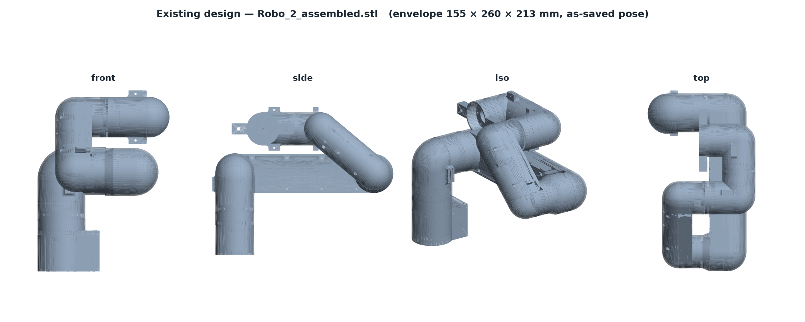
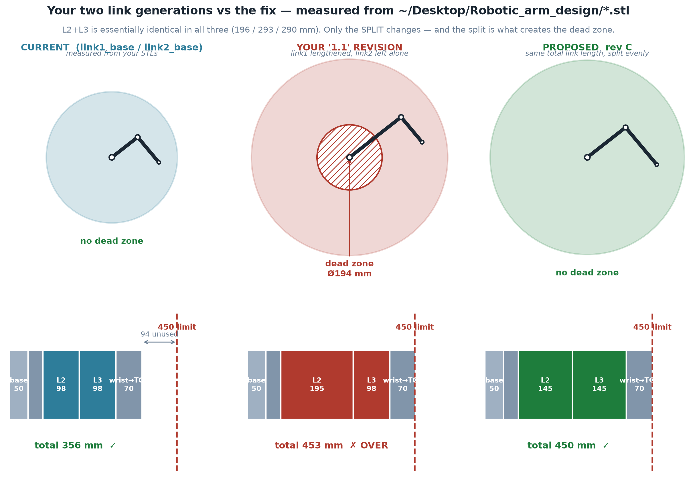
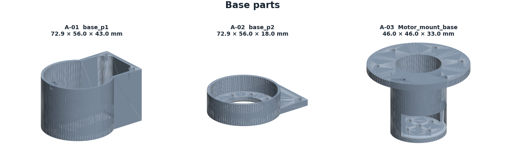
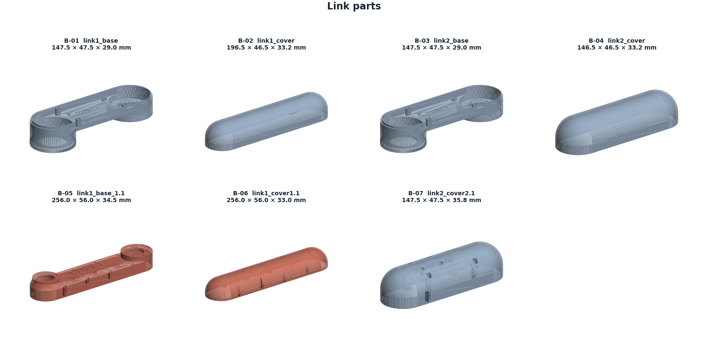
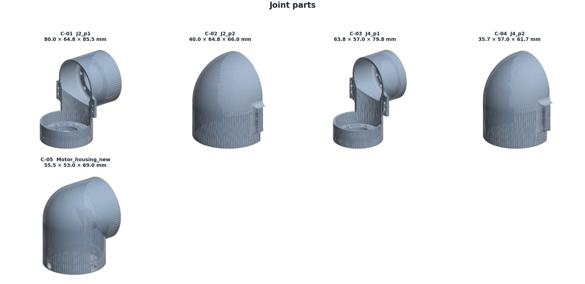
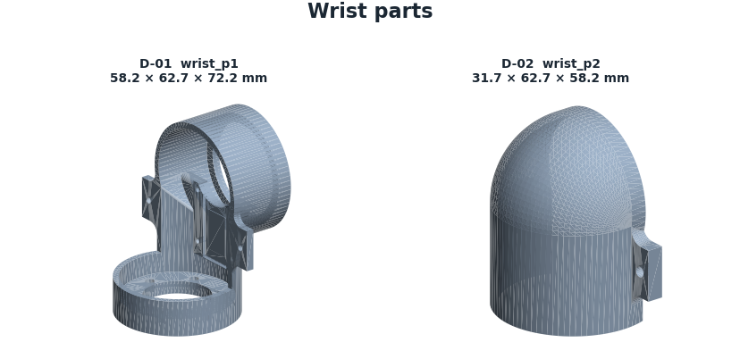
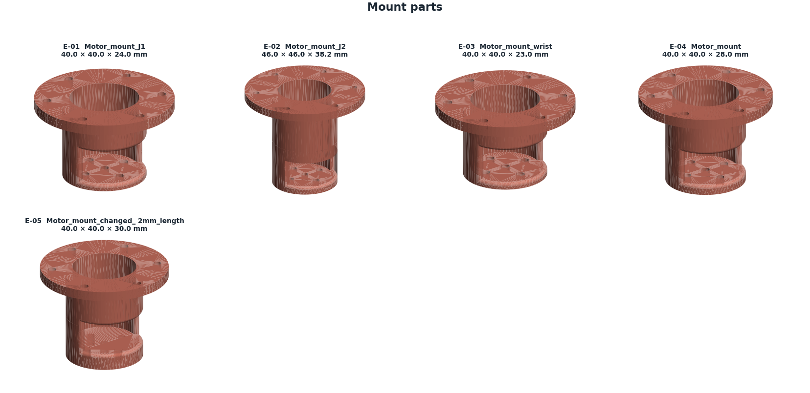
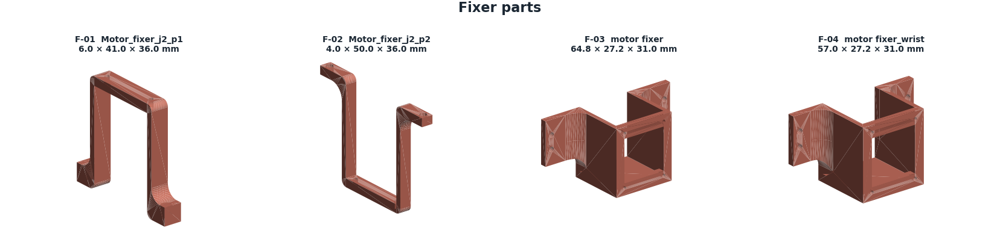
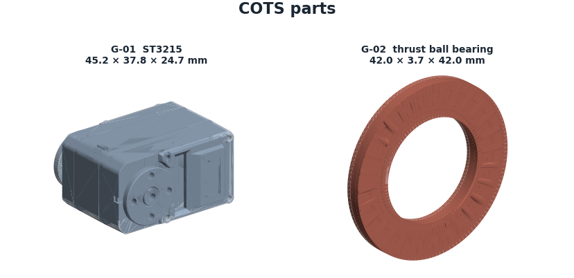
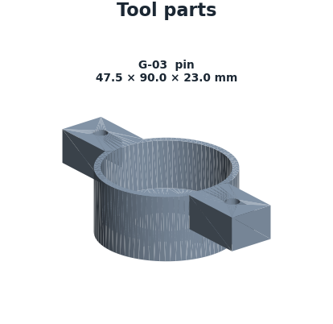

# ARM-450 — Parts, Drawings and Dimensions

- **Source:** `~/Desktop/Robotic_arm_design/` (Fusion 360 export)
- **Date:** 2026-08-13
- **Units:** all dimensions in millimetres
- **Method:** every dimension below was measured directly from the STL geometry, not read off a drawing. Envelope = axis-aligned bounding box of the part as exported.

---

## 1. How to read this document

Each part carries a part number, its measured envelope, an estimated printed mass, and a status. Status meanings:

- **keep** — Carry forward unchanged.
- **revise** — Minor revision — fillets and bearing seats.
- **LENGTHEN** — Lengthen to 145 mm joint-to-joint.
- **MISMATCH** — Envelope does not pair with its base shell — check before reuse.
- **REJECT** — Unequal link length; creates a dead zone and exceeds 450 mm.
- **REDESIGN** — Redesign as a full-perimeter collar; current form is understrength.
- **FAILS** — Fails at servo stall torque. Do not reprint as-is.
- **COTS** — Commercial off-the-shelf, not printed.
- **REPLACE** — Replace with a spaced, preloaded pair of deep-groove bearings.

**Important:** the envelope is not the same as the kinematic link length. A capsule link has a circular boss at each end and the joint axis sits at the boss centre, inset from the part end by the boss radius. Section 4 gives the true joint-to-joint lengths.

---

## 2. Assembly overview

The as-printed assembly measures 155 × 260 × 213 mm in the pose it was saved in. Fully extended the chain is longer; section 4 gives the dimension chain that must total 450 mm.

---

## 3. Master parts list

| Part | File | Group | Function | Envelope (mm) | Wall | Mass est. | Status |
| --- | --- | --- | --- | --- | --- | --- | --- |
| A-01 | base_p1 | Base | Lower base shell, D-profile | 72.9 × 56.0 × 43.0 | 2.7 | 17.3 g | keep |
| A-02 | base_p2 | Base | Base cover / floor plate | 72.9 × 56.0 × 18.0 | 2.8 | 8.8 g | keep |
| A-03 | Motor_mount_base | Base | J1 servo mount, top-hat flange | 46.0 × 46.0 × 33.0 | 2.3 | 4.9 g | revise |
| B-01 | link1_base | Link | Upper-arm shell, lower half | 147.5 × 47.5 × 29.0 | 2.0 | 15.8 g | LENGTHEN |
| B-02 | link1_cover | Link | Upper-arm shell, upper half | 196.5 × 46.5 × 33.2 | 2.2 | 22.1 g | MISMATCH |
| B-03 | link2_base | Link | Forearm shell, lower half | 147.5 × 47.5 × 29.0 | 2.0 | 15.8 g | LENGTHEN |
| B-04 | link2_cover | Link | Forearm shell, upper half | 146.5 × 46.5 × 33.2 | 1.9 | 14.8 g | LENGTHEN |
| B-05 | link1_base_1.1 | Link | Upper-arm shell rev 1.1 (longer) | 256.0 × 56.0 × 34.5 | 2.7 | 43.2 g | REJECT |
| B-06 | link1_cover1.1 | Link | Upper-arm cover rev 1.1 | 256.0 × 56.0 × 33.0 | 2.1 | 30.9 g | REJECT |
| B-07 | link2_cover2.1 | Link | Forearm cover rev 2.1 | 147.5 × 47.5 × 35.8 | 1.9 | 17.5 g | keep |
| C-01 | J2_p1 | Joint | J2 shoulder yoke, driven side | 80.0 × 64.8 × 85.5 | — | — | revise |
| C-02 | J2_p2 | Joint | J2 shoulder yoke, idler side | 40.0 × 64.8 × 66.0 | 2.0 | 8.3 g | revise |
| C-03 | J4_p1 | Joint | J4 yoke, driven side | 63.8 × 57.0 × 79.8 | — | — | revise |
| C-04 | J4_p2 | Joint | J4 yoke, idler side | 35.7 × 57.0 × 61.7 | 2.2 | 7.7 g | revise |
| C-05 | Motor_housing_new | Joint | Elbow motor housing | 55.5 × 53.0 × 69.0 | 2.6 | 17.4 g | keep |
| D-01 | wrist_p1 | Wrist | Wrist body, driven side | 58.2 × 62.7 × 72.2 | 2.5 | 12.5 g | keep |
| D-02 | wrist_p2 | Wrist | Wrist body, idler side | 31.7 × 62.7 × 58.2 | 2.2 | 7.0 g | keep |
| E-01 | Motor_mount_J1 | Mount | J1 servo mount | 40.0 × 40.0 × 24.0 | 2.1 | 3.1 g | REDESIGN |
| E-02 | Motor_mount_J2 | Mount | J2 servo mount | 46.0 × 46.0 × 38.2 | 2.3 | 5.4 g | REDESIGN |
| E-03 | Motor_mount_wrist | Mount | Wrist servo mount | 40.0 × 40.0 × 23.0 | 2.1 | 3.0 g | REDESIGN |
| E-04 | Motor_mount | Mount | Generic servo mount | 40.0 × 40.0 × 28.0 | 2.2 | 3.6 g | REDESIGN |
| E-05 | Motor_mount_changed_ 2mm_length | Mount | Servo mount, +2 mm variant | 40.0 × 40.0 × 30.0 | 2.4 | 4.1 g | REDESIGN |
| F-01 | Motor_fixer_j2_p1 | Fixer | J2 servo clamp, 6 mm plate | 6.0 × 41.0 × 36.0 | 1.7 | 0.9 g | FAILS |
| F-02 | Motor_fixer_j2_p2 | Fixer | J2 servo clamp, 4 mm plate | 4.0 × 50.0 × 36.0 | 1.4 | 0.6 g | FAILS |
| F-03 | motor fixer | Fixer | Servo clamp, U-channel | 64.8 × 27.2 × 31.0 | 2.2 | 4.5 g | FAILS |
| F-04 | motor fixer_wrist | Fixer | Wrist servo clamp | 57.0 × 27.2 × 31.0 | 2.1 | 4.2 g | FAILS |
| G-01 | ST3215 | COTS | Feetech ST3215 serial-bus servo | 45.2 × 37.8 × 24.7 | 4.3 | 23.4 g | COTS |
| G-02 | thrust ball bearing | COTS | Thrust ball bearing Ø42 | 42.0 × 3.7 × 42.0 | — | — | REPLACE |
| G-03 | pin | Tool | Grasp pin / end effector | 47.5 × 90.0 × 23.0 | 2.9 | 9.9 g | keep |

Mass estimates assume PLA at roughly 35 % infill (0.55 g/cm³ effective) and are indicative only — weigh the real parts to confirm. Wall is the effective shell thickness computed as 2V/A; it is meaningless for solid parts and is shown as a dash where the mesh is not watertight.

---

## 4. Kinematic dimension chain — the 450 mm budget

| Segment | Length | Notes |
| --- | --- | --- |
| Round base height | 50 | user's sketch dimension |
| Base top → J2 shoulder axis | 40 | shoulder barrel centre |
| **L2 upper arm, J2 → J3** | **145** | must equal L3 |
| **L3 forearm, J3 → J5** | **145** | must equal L2 |
| Wrist centre → TCP | 70 | J6 flange plus tool |
| **TOTAL** | **450** | meets the requirement exactly |

Horizontal reach from the J1 axis is 145 + 145 + 70 = **360 mm**.

### Why L2 must equal L3

The reachable region of a two-link chain is an annulus whose **inner radius is |L2 − L3|**. Equal links collapse that inner hole to zero. Unequal links punch a dead zone directly in front of the robot that no amount of joint travel can reach.

| Configuration | L2 | L3 | Dead zone | Total length |
| --- | --- | --- | --- | --- |
| As printed | 97.9 | 97.9 | none | 356 mm |
| Revision 1.1 | 195.1 | 97.9 | **Ø194 mm** | 453 mm — over |
| **Recommended** | **145** | **145** | **none** | **450 mm** |

---

## 5. Measured link geometry

Joint centres were recovered by fitting circles to the end bosses (`measure_joint_centres.py`), because the bounding box overstates the kinematic length by the sum of the two boss radii.

| Part | Envelope length | Boss radius A | Boss radius B | **Joint-to-joint** |
| --- | --- | --- | --- | --- |
| link1_base | 147.5 | 25.2 | 25.0 | **97.9** |
| link2_base | 147.5 | 25.2 | 25.0 | **97.9** |
| link1_base_1.1 | 256.0 | 29.5 | 29.2 | **195.1** |
| link1_cover | 196.5 | 16.8 | 17.6 | 167.6 |
| link2_cover | 146.5 | 18.2 | 17.2 | 115.9 |
| link1_cover1.1 | 256.0 | 27.1 | 27.1 | 196.0 |

**Flag:** `link1_cover` (envelope 196.5) does not pair with `link1_base` (envelope 147.5). `link2_cover` (146.5) does pair with `link2_base` (147.5). Check this before reprinting — a mismatched shell pair is a likely cause of both the assembly gaps and any URDF export errors.

---

## 6. Link cross-section

| Property | Value |
| --- | --- |
| Outer width × depth | 47.5 × 29.0 |
| Wall thickness, as printed | 2.0 |
| Wall thickness, recommended | **2.4** (6 × 0.4 mm nozzle passes) |
| Second moment of area I, closed, t=2.0 | 39,899 mm⁴ |
| Torsion constant J, closed, t=2.0 | 83,267 mm⁴ |
| Torsion constant J, **seam open** | 661 mm⁴ — a 126× loss |

---

## 7. Part drawings by group

### Base

| Part | Envelope (mm) | Wall | Status |
| --- | --- | --- | --- |
| A-01 base_p1 | 72.9 × 56.0 × 43.0 | 2.7 | keep |
| A-02 base_p2 | 72.9 × 56.0 × 18.0 | 2.8 | keep |
| A-03 Motor_mount_base | 46.0 × 46.0 × 33.0 | 2.3 | revise |

### Link

| Part | Envelope (mm) | Wall | Status |
| --- | --- | --- | --- |
| B-01 link1_base | 147.5 × 47.5 × 29.0 | 2.0 | LENGTHEN |
| B-02 link1_cover | 196.5 × 46.5 × 33.2 | 2.2 | MISMATCH |
| B-03 link2_base | 147.5 × 47.5 × 29.0 | 2.0 | LENGTHEN |
| B-04 link2_cover | 146.5 × 46.5 × 33.2 | 1.9 | LENGTHEN |
| B-05 link1_base_1.1 | 256.0 × 56.0 × 34.5 | 2.7 | REJECT |
| B-06 link1_cover1.1 | 256.0 × 56.0 × 33.0 | 2.1 | REJECT |
| B-07 link2_cover2.1 | 147.5 × 47.5 × 35.8 | 1.9 | keep |

### Joint

| Part | Envelope (mm) | Wall | Status |
| --- | --- | --- | --- |
| C-01 J2_p1 | 80.0 × 64.8 × 85.5 | — | revise |
| C-02 J2_p2 | 40.0 × 64.8 × 66.0 | 2.0 | revise |
| C-03 J4_p1 | 63.8 × 57.0 × 79.8 | — | revise |
| C-04 J4_p2 | 35.7 × 57.0 × 61.7 | 2.2 | revise |
| C-05 Motor_housing_new | 55.5 × 53.0 × 69.0 | 2.6 | keep |

### Wrist

| Part | Envelope (mm) | Wall | Status |
| --- | --- | --- | --- |
| D-01 wrist_p1 | 58.2 × 62.7 × 72.2 | 2.5 | keep |
| D-02 wrist_p2 | 31.7 × 62.7 × 58.2 | 2.2 | keep |

### Mount

| Part | Envelope (mm) | Wall | Status |
| --- | --- | --- | --- |
| E-01 Motor_mount_J1 | 40.0 × 40.0 × 24.0 | 2.1 | REDESIGN |
| E-02 Motor_mount_J2 | 46.0 × 46.0 × 38.2 | 2.3 | REDESIGN |
| E-03 Motor_mount_wrist | 40.0 × 40.0 × 23.0 | 2.1 | REDESIGN |
| E-04 Motor_mount | 40.0 × 40.0 × 28.0 | 2.2 | REDESIGN |
| E-05 Motor_mount_changed_ 2mm_length | 40.0 × 40.0 × 30.0 | 2.4 | REDESIGN |

### Fixer

| Part | Envelope (mm) | Wall | Status |
| --- | --- | --- | --- |
| F-01 Motor_fixer_j2_p1 | 6.0 × 41.0 × 36.0 | 1.7 | FAILS |
| F-02 Motor_fixer_j2_p2 | 4.0 × 50.0 × 36.0 | 1.4 | FAILS |
| F-03 motor fixer | 64.8 × 27.2 × 31.0 | 2.2 | FAILS |
| F-04 motor fixer_wrist | 57.0 × 27.2 × 31.0 | 2.1 | FAILS |

### COTS

| Part | Envelope (mm) | Wall | Status |
| --- | --- | --- | --- |
| G-01 ST3215 | 45.2 × 37.8 × 24.7 | 4.3 | COTS |
| G-02 thrust ball bearing | 42.0 × 3.7 × 42.0 | — | REPLACE |

### Tool

| Part | Envelope (mm) | Wall | Status |
| --- | --- | --- | --- |
| G-03 pin | 47.5 × 90.0 × 23.0 | 2.9 | keep |

---

## 8. Critical interface dimensions

These are the dimensions that decide whether the arm assembles tightly. They matter more than any outside dimension.

| Interface | Current | Specify | Reason |
| --- | --- | --- | --- |
| Bearing pocket, Ø42 bearing | Ø42.0 modelled | **Ø42.15** press fit | FDM pockets print 0.1–0.4 mm undersize |
| Bearing pocket chamfer | none | **0.5 × 45°** | bearing starts square |
| Bearing axial seat | flat face | **turned shoulder** | flat printed faces are not flat |
| Bearing spacing per joint | ~5 (stacked) | **≥ 40** | moment stiffness ∝ spacing² |
| M3 heat-set insert hole | — | **Ø4.0** | for a Ø4.6 × 5.8 insert |
| Insert boss outer diameter | — | **≥ Ø9.0** | ≥ 2.2 mm wall or it splits |
| Seam fastener pitch | — | **≤ 25** | keeps the section closed |
| Seam interlock lip | none | **1.5 mm tongue-and-groove** | shear in bearing, not friction |
| Internal fillet radius | ~0 sharp | **≥ 2.0** | drops Kt from ≥3 to ~1.3 |
| Servo clamp form | 4–6 mm bracket | **full-perimeter collar, 4 mm wall** | carries torque in shear, not bending |

Insert dimensions are typical values — check your specific insert's datasheet.

---

## 9. Bill of materials — non-printed

| Item | Qty | Note |
| --- | --- | --- |
| Feetech ST3215 servo (30 kgf·cm) | 5 | J1, J3, J4, J5, J6 |
| Feetech ST3250 servo (50 kgf·cm) | 1 | J2 shoulder — needs the extra torque |
| Deep-groove ball bearings | 12 | 2 per joint, spaced ≥ 40 mm |
| M3 heat-set inserts, Ø4.6 × 5.8 | ~40 | seam and mounts |
| M3 socket-head screws, 8–16 mm | ~40 | |
| M3 preload screw + spacer per joint | 6 | removes bearing clearance |

Bearing sizes are not yet fixed — they depend on the shaft diameter chosen for each joint. See the open questions in the analysis report.
