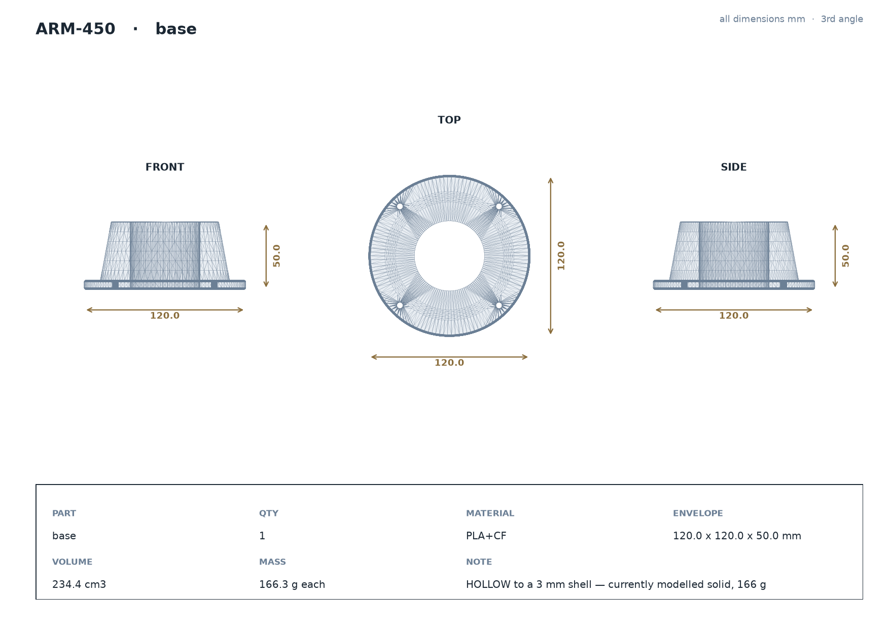
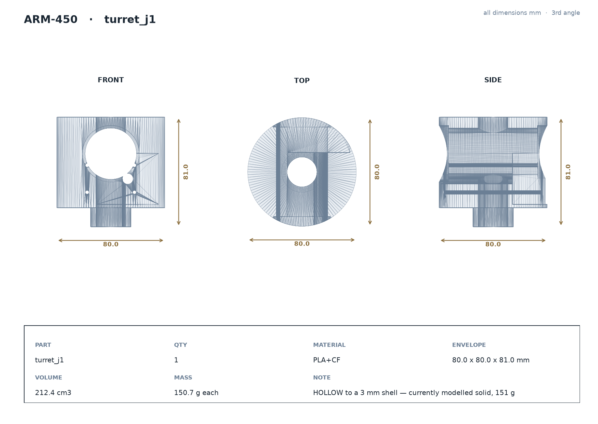
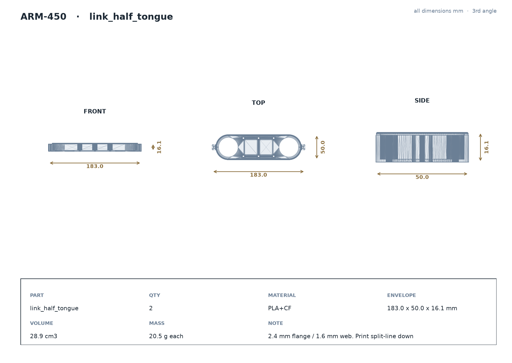
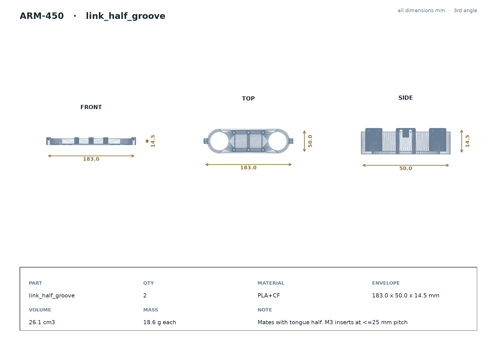
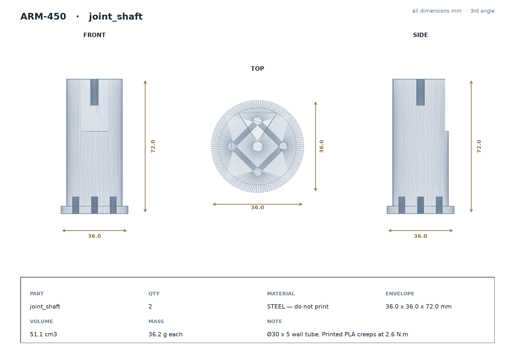
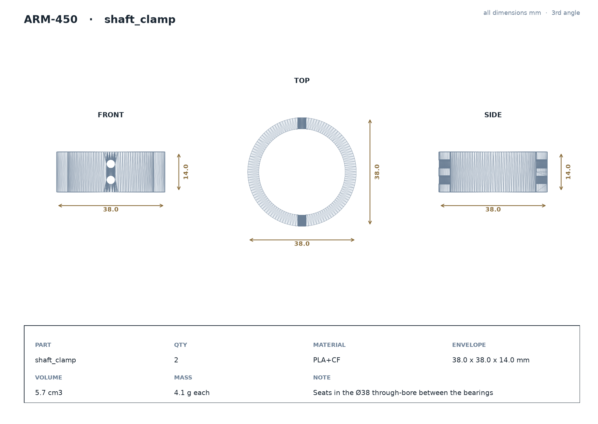
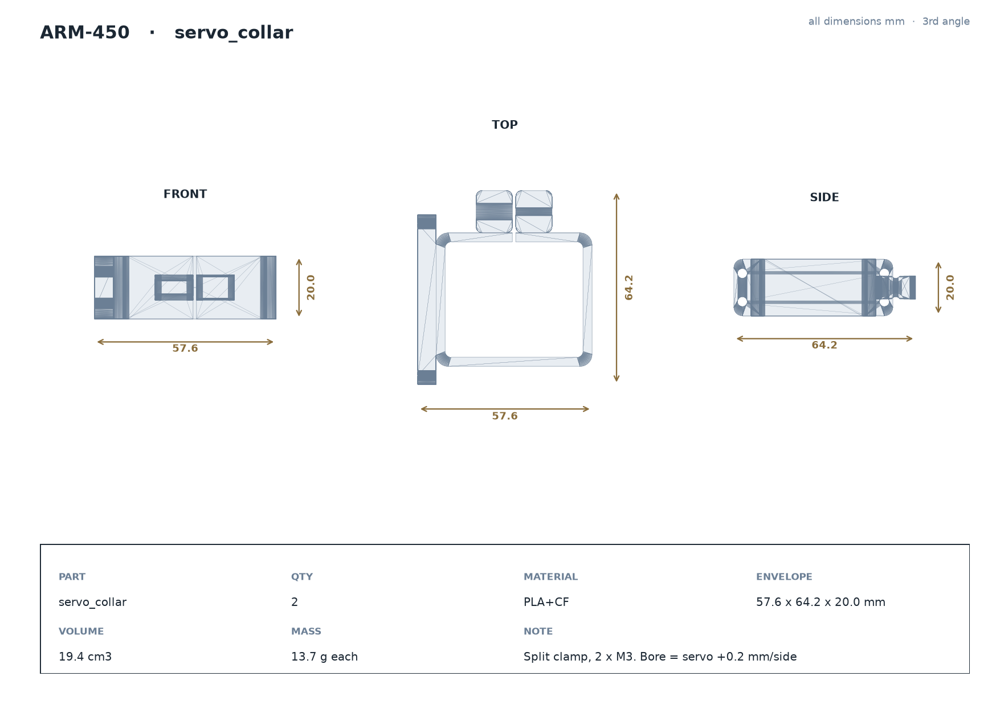
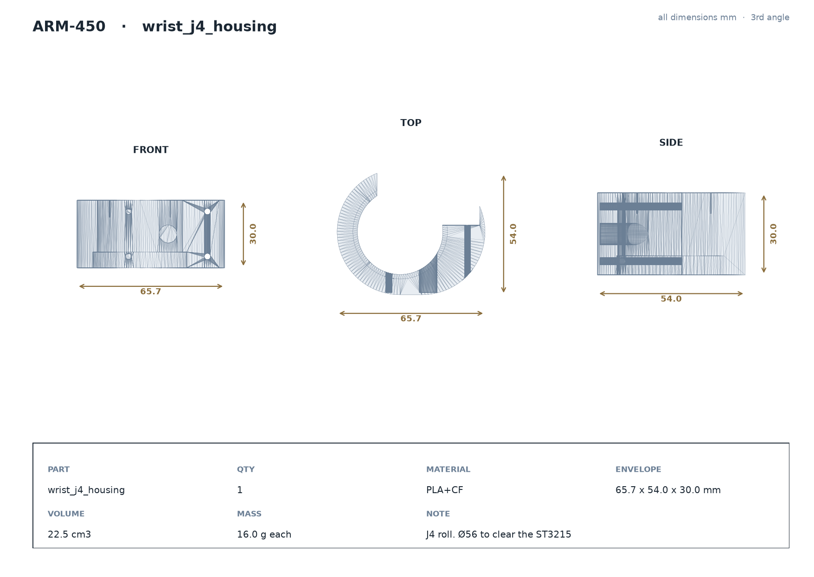
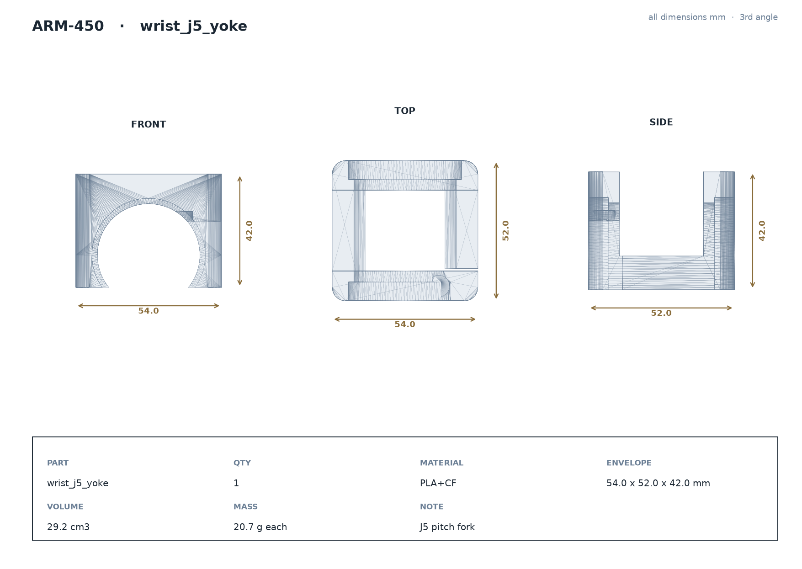
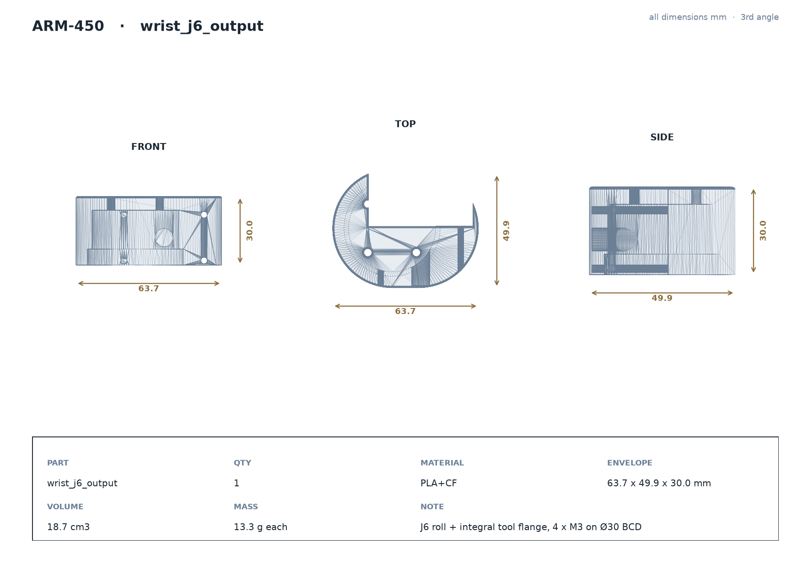

# ARM-450 — 2D Drawing Package

- **Project:** ARM-450, 6-DOF articulated arm, 450 mm overall
- **Date:** 2026-08-19
- **Units:** millimetres. Third-angle projection.
- **Source:** every view is projected from the exported CAD solid, not sketched.

---

## 1. Assembly specification

| parameter | value |
| --- | --- |
| Degrees of freedom | 6, all revolute |
| Overall length, fully extended | **450.0 mm** |
| Horizontal reach from the J1 axis | **360.0 mm** |
| Workspace volume | 118 litres |
| Workspace dead zone | **none** (measured min radius 0.3 mm) |
| Task workspace, pen normal to a vertical board | **52.3 %** |
| Rated payload | 300 g at the TCP |
| Absolute accuracy (predicted) | 1.4 mm RMS, 2.1 mm at 95 % |
| Repeatability, unidirectional approach | 0.70 mm RMS |
| Structural material | PLA+CF, 2.4 mm flange / 1.6 mm web |
| Assembled mass | **1297 g — see §5, over the 1200 g budget** |

### Actuator — Waveshare ST3215 (datasheet values)

| parameter | value |
| --- | --- |
| Case | 45.22 × 24.72 × 37.25 mm |
| **Output axis position** | **10.11 mm from one end — NOT centred** |
| Horn disc | Ø19.2 mm |
| **Horn bolt circle** | **Ø14.0 mm, 4 holes** |
| Stall torque | 30 kgf·cm = 2.942 N·m @ 12 V |
| Locked-rotor current | 2.7 A → 32.4 W, all heat |
| Torque constant kt | 11 kgf·cm/A = 1.079 N·m/A |
| Encoder | 360° magnetic, 4096 counts = **0.0879°** |
| Gear | metal; **no backlash figure published** |

**The off-centre output axis is the single most consequential number here.** Every
servo pocket was originally cut centred on its joint axis, which would have placed
every servo **12.50 mm out of position** with the horn nowhere near the bearing bore.

Applying the shift then exposed a second problem: the displaced pocket **overhung the
round housings** — by 7.3 mm on the J4 housing and 9.3 mm on the J6 output — so the
servo would have stuck out through the wall. Both housings are now **racetrack-shaped**:
a circle at the bearing axis extended along +X to swallow the servo. That costs nothing
in the 450 mm chain because it grows perpendicular to it.

| housing | was | now | servo containment |
| --- | --- | --- | --- |
| `wrist_j4_housing` | Ø56 circle | 65.7 × 54.0 racetrack | 2.39 mm margin |
| `wrist_j6_output` | Ø52 circle | 63.7 × 49.9 racetrack | 2.40 mm margin |
| `turret_j1` | Ø80 circle | unchanged | 4.69 mm margin |

### Common joint interface

Every joint uses the same three components, so a fit validated on one is valid on all six:

| item | specification |
| --- | --- |
| Bearing pocket | **Ø42.00 mm** modelled — gives 0.02 mm interference on a 0.02 mm-shrink printer |
| Bearing | **6806-2RS** deep groove, 30 × 42 × 7 — **12 off**, C2 preferred |
| Seat shoulder | Ø38.0 mm, outer race lands on it |
| Pocket chamfer | 0.5 × 45° at the mouth |
| Shaft | **Ø30 mm, steel tube, 5 mm wall** |
| Bearing spacing | 22 mm centre-to-centre |
| Preload | M3 screw drawing the inner races together |

---

## 2. Joint definition

| joint | type | axis | range | servo | worst-case torque | % of stall |
| --- | --- | --- | --- | --- | --- | --- |
| **J1** | revolute | Z (vertical) | ±165° | ST3215 | 0.000 N·m | gravity cannot load it |
| **J2** | revolute | Y (pitch) | ±115° | ST3215 | 2.625 N·m | 89 % |
| **J3** | revolute | Y (pitch) | ±150° | ST3215 | 1.271 N·m | 43 % |
| **J4** | revolute | Z (roll) | ±165° | ST3215 | 0.296 N·m | 10 % |
| **J5** | revolute | Y (pitch) | ±110° | ST3215 | 0.297 N·m | 10 % |
| **J6** | revolute | Z (roll) | ±175° | ST3215 | 0.088 N·m | 3 % |

**All six joints take the same Waveshare ST3215 (30 kgf·cm).** The 89 % figure at J2 applies only to 300 g at full extension; with a pen it falls to 14–29 %.

### Link dimensions

| segment | length |
| --- | --- |
| Base height | 50 mm |
| Base top → J2 (shoulder rise) | 40 mm |
| J2 → J3 (upper arm) | 119 mm |
| J3 → J4 (forearm) | 119 mm |
| J4 → J5 | 62 mm |
| J5 → J6 | 30 mm |
| J6 → TCP | 30 mm |
| **TOTAL** | **450 mm** |

---

## 3. Fastener schedule

| location | fastener | qty | note |
| --- | --- | --- | --- |
| Link seam | M3 × 12 into heat-set inserts | 12 per link | pitch ≤ 25 mm |
| Link tip ears | M2.5 into heat-set inserts | 2 per link | closes the seam at the bearing |
| Servo collar clamp | M3 × 16 | 2 per collar | |
| Servo case mounting | M2.5 | 4 per servo | pitch not dimensioned on the outline sheet |
| Servo horn | M2 | 4 per joint | **Ø14.0 BCD, datasheet** |
| Wrist inter-part | M3 | 4 per interface | Ø34 bolt circle |
| Tool flange | M3 | 4 | Ø30 bolt circle |
| Base foot | M4 | 4 | Ø104 bolt circle |
| Bearing preload | M3 + spacer | 1 per joint | **the single most important fastener** |

Insert bosses: **Ø9.5 outer minimum**, Ø4.1 hole, 7.5 mm deep for a Ø4.6 × 5.8 insert.

---

## 4. Part drawings

Each sheet carries three orthographic views with overall dimensions and a title block.

---

## 5. Mass budget — currently over

This recheck found a problem that earlier estimates missed.

| item | qty | mass |
| --- | --- | --- |
| 6806 bearings | 12 | 384 g |
| ST3215 servos | 6 | 360 g |
| base | 1 | 166 g |
| turret_j1 | 1 | 151 g |
| link halves | 4 | 78 g |
| joint shafts | 2 | 72 g |
| wrist parts | 3 | 50 g |
| collars + clamps | 4 | 36 g |
| **TOTAL** | | **1297 g — 97 g OVER the 1200 g budget** |

### Three fixes

**1. Hollow the base and the turret — saves 206 g.** Both are currently modelled as solid cylinders. At a 3 mm shell they drop to roughly 35 % of their volume: base 166 → 58 g, turret 151 → 53 g. This is the obvious win and costs nothing.

**2. Smaller bearings at the wrist — saves 144 g.** J4, J5 and J6 carry only 0.30 N·m; a 6806 there is enormous overkill. A 6704 (20 × 27 × 4) is ~8 g against 32 g. *Cost: it breaks the one-bearing-part-number rule — two sizes instead of one.*

**3. The shaft must be steel, and that costs mass.** A printed Ø30 shaft creeps under 2.6 N·m. Solid steel would be ~400 g each, which is far worse; a **Ø30 × 5 mm wall tube is ~93 g each**, a net +114 g against the printed figure. This is the honest price of a real shaft.

**Net: 1297 − 206 − 144 + 114 = 1061 g**, inside budget with 139 g of margin.

---

## 6. Manufacturing notes

| | |
| --- | --- |
| Process | FDM, 0.4 mm nozzle (0.6 mm hardened for PLA+CF) |
| Layer height | 0.16 mm for mounts and brackets, 0.20 mm for shells |
| Perimeters | **6** on mounts, 4 on shells — walls matter far more than infill |
| Infill | 100 % on small brackets, 10–15 % gyroid on shells |
| Nozzle temperature | 225–230 °C PLA, 230–245 °C PLA+CF |
| Orientation, link halves | split line on the bed, open face up — support-free, flat mating face |
| Orientation, bearing bores | **axis vertical** — a bore built up in layers comes out oval |
| Printer calibration | measured 0.02 mm XY shrink, Z accurate |

---

## 6A. Print the fit coupon first

`fit_coupon.stl` — 150 × 65 × 12 mm, 27 g, under an hour. Three bearing pockets stepped
0.05 mm apart (Ø41.95 / **Ø42.00** / Ø42.05), three insert-boss hole sizes (Ø3.9 / 4.1 / 4.3)
and a tongue-and-groove seam sample.

One print settles all three fits on your machine before eight hours of parts are committed
to them. Full instructions in `ARM450_BUY.pdf` §6.

---

## 6B. Bought parts

Everything that is **not printed** is listed in `ARM450_BUY.pdf`. The headline: the joints
need **12 × 6806-2RS** deep-groove bearings (30 × 42 × 7). The Ø42 × 3.7 thrust washer
already on the Desktop shares the same outer diameter and will drop into the pocket looking
correct, but it has no inner race and zero moment capacity — it is what caused the 28.9 mm
wobble.

---

## 7. Open items

- **Horn bolt circle is now the datasheet Ø14.0 mm**, and every servo pocket is shifted 12.50 mm so the output axis lands on the joint axis. The four **case screw positions** are still estimated — the outline sheet dimensions the case and the horn but not those screws.
- **The base and turret are modelled solid** and must be hollowed before printing.
- **The shaft is drawn as a printed part** but must be procured as steel tube.
- **16 % of sampled poses collide with the base** at extreme joint angles. All are arm-vs-base, none arm-vs-arm; they bound the usable joint limits rather than indicating a design fault.
