# ARM-450 — Isometric Dimensioned Drawings

**12 sheets · every printed part, the bought shaft, and the fit coupon**

Pictorial isometric sheets in the conventional style: the part drawn in isometric with
hidden lines removed, aligned linear dimensions with extension lines and arrow
terminators, and leader callouts for every hole, radius, pocket and feature.

These are generated from the exported STL geometry by `draw_iso.py`, and every number is
read from `cad/params.py`. A drawing here therefore **cannot** disagree with the part it
describes — if a parameter changes, the drawing changes with it.

---

## How to read these sheets

**Projection.** True isometric, viewed along (1, 1, 1). +Z is up the page, +X runs down to
the right, +Y down to the left. All three axes are equally foreshortened, so a dimension
measured along any axis is directly comparable to any other.

**Hidden lines are removed, not dashed.** Only edges actually visible from the viewpoint
are drawn. Where you see a broken line it is a genuine feature edge, not a hidden one.

**Colour carries meaning:**

| | |
| --- | --- |
| **Dark navy** | the part outline |
| **Blue** | linear dimensions — extension lines, dimension line, arrows both ends |
| **Brown** | leader callouts — holes, radii, pockets, notes |

**Units** are millimetres throughout, to two decimals. **Ø** is a diameter, **R** a radius,
**DP** a depth, **THRU** a through feature, **BCD** a bolt circle diameter.

**Tolerance, unless stated otherwise on the sheet:** general ±0.2, bearing bores ±0.05.
The 0.02 mm XY shrinkage measured on your printer is already allowed for in the modelled
dimension — **print to the number shown, do not compensate again.**

**Every bearing bore prints with its axis VERTICAL.** Each title block repeats this. It is
the single most consequential instruction on any of these sheets: your printer shrinks
0.02 mm in XY and nothing in Z, so a vertical bore comes out uniformly 0.02 mm under —
which *is* the intended light press fit. Printed on its side the same bore shrinks in XY
but not in Z and comes out **oval**, which reintroduces exactly the tilt and wobble the
paired-bearing design exists to remove.

---

## 1. Link half — tongue side

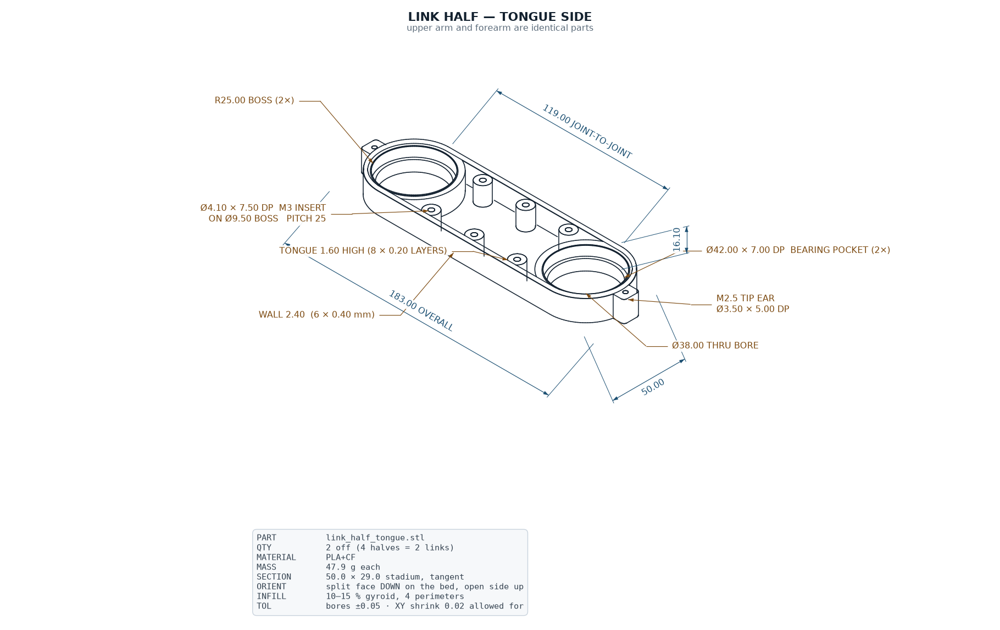

The two links are identical parts, so this drawing and the next cover all four halves.
**119.00 joint-to-joint is the dimension that sets the kinematics** — it appears in the
URDF as `L2` and `L4_SPLIT`, and `generate_urdf.py` asserts the two agree.

The section is a 50.0 × 29.0 stadium, and the R25.00 end boss is **tangent** to the
straight flank. That tangency was the fix for the seam misalignment on your first print:
with a half-height of 23.75 against a 25.0 boss radius the circle bulged past the
rectangle and left a shallow 18.2° vertex, where any offset is amplified by 1/sin θ and
0.15 mm became 0.48 mm.

## 2. Link half — groove side

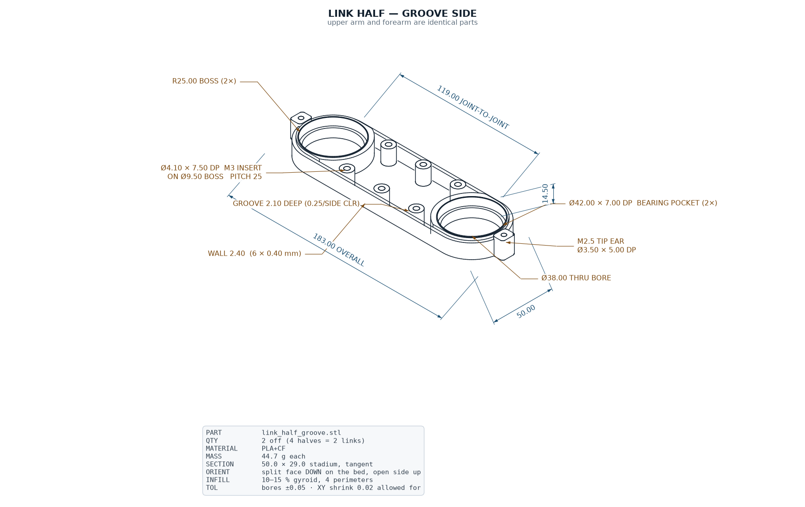

Identical to the tongue half except at the seam. The groove is cut **0.50 deeper** than the
tongue is tall, with 0.25 clearance per side. Both numbers exist because of the first
print: a 1.5 mm tongue is 7.5 layers, which rounds to 1.60 and exactly equalled the groove
depth, so the tongue bottomed out and held the halves apart. The tongue is now specified
as **8 × 0.20 = 1.60**, an integer number of layers by construction.

## 3. Shaft clamp

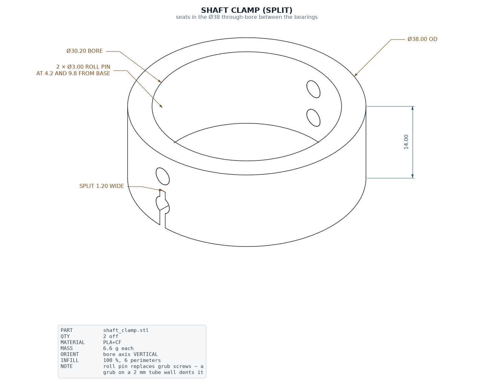

Seats in the Ø38.00 through-bore **between** the two bearings — not in the Ø42 pocket,
which is only 7 mm deep and would leave 5 mm of the clamp hanging out.

Note the **roll pin**, not grub screws. The shaft is now a 2 mm wall aluminium tube, and an
M3 grub tightened onto it puts about 170 MPa on the wall and simply dents it. A Ø3.00 roll
pin works in double shear — 4241 N capacity against the 196 N the joint torque demands.

## 4. Servo collar

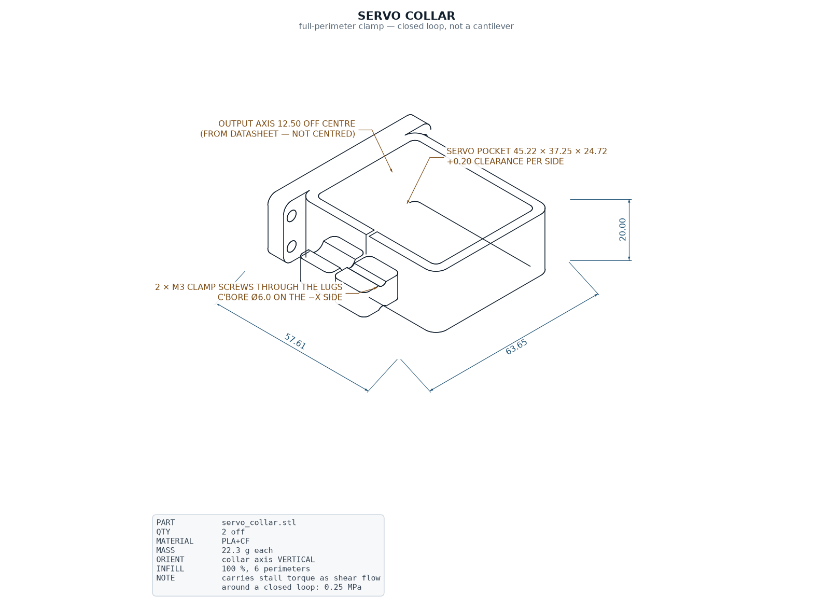

A **full-perimeter** clamp: a closed loop, not a cantilever bracket. This is the part that
replaced the mount that snapped. Sized against the servo's **stall** torque rather than its
gravity load, it carries that torque as shear flow around a closed section at 0.25 MPa,
against the 94 MPa the original cantilevered stub saw.

The servo output axis is **12.50 off centre** — from the datasheet, not assumed. Every
pocket in this design was originally drawn centred, which was wrong.

## 5. J4 roll housing

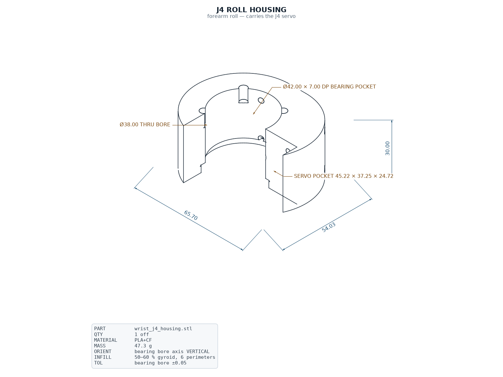

## 6. J5 pitch yoke

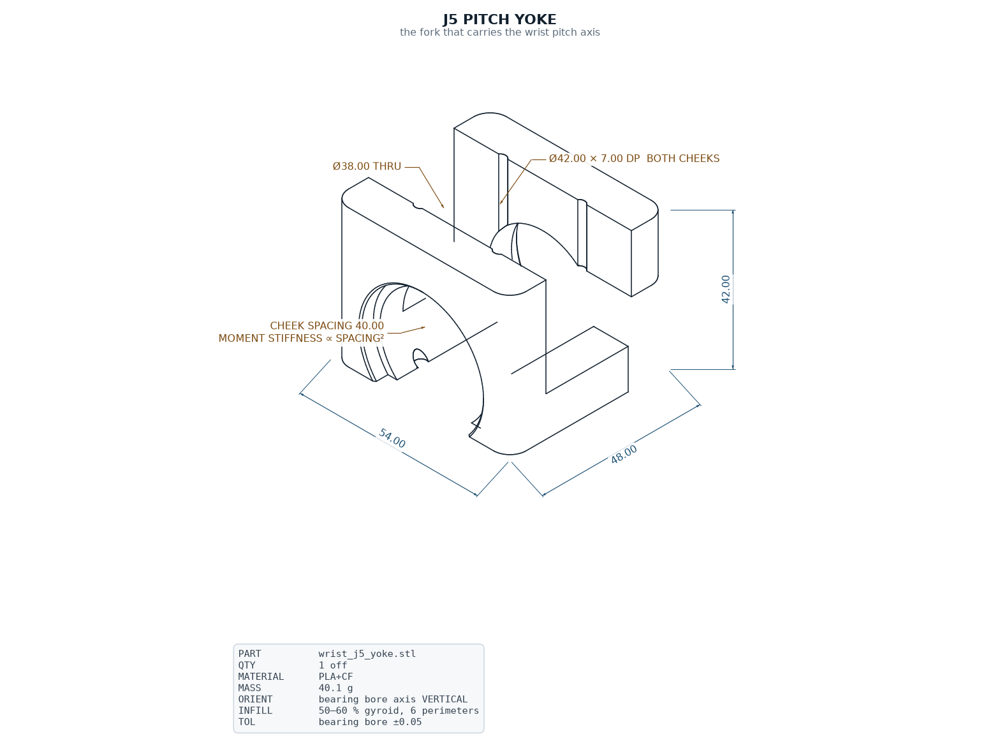

**Cheek spacing 40.00 is a stiffness dimension, not a packaging one.** Moment stiffness
goes as the square of bearing spacing, so this single number is worth more than any amount
of extra wall thickness. It is what takes joint wobble from 28.9 mm at the tool down to
0.65 mm.

## 7. J6 output / tool flange

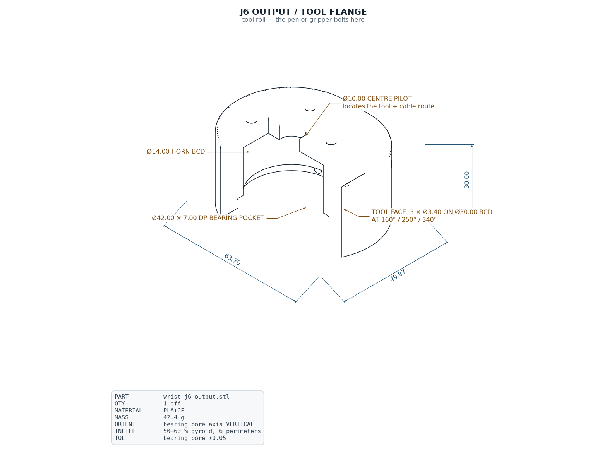

The tool face is the standard mounting interface: 4 × M3 on a Ø30.00 bolt circle with a
Ø10.00 centre pilot. The pen holder for the sine trace, and later the docking
hardware, both bolt here.

## 8. J1 turret

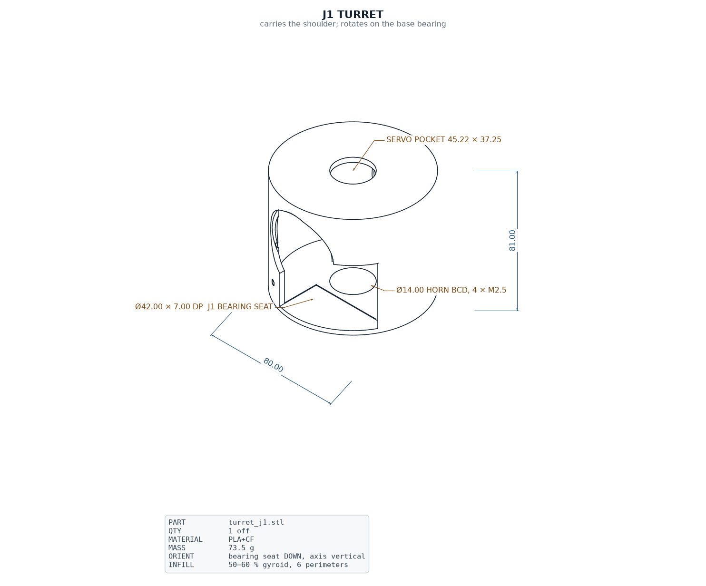

## 9. Base pedestal

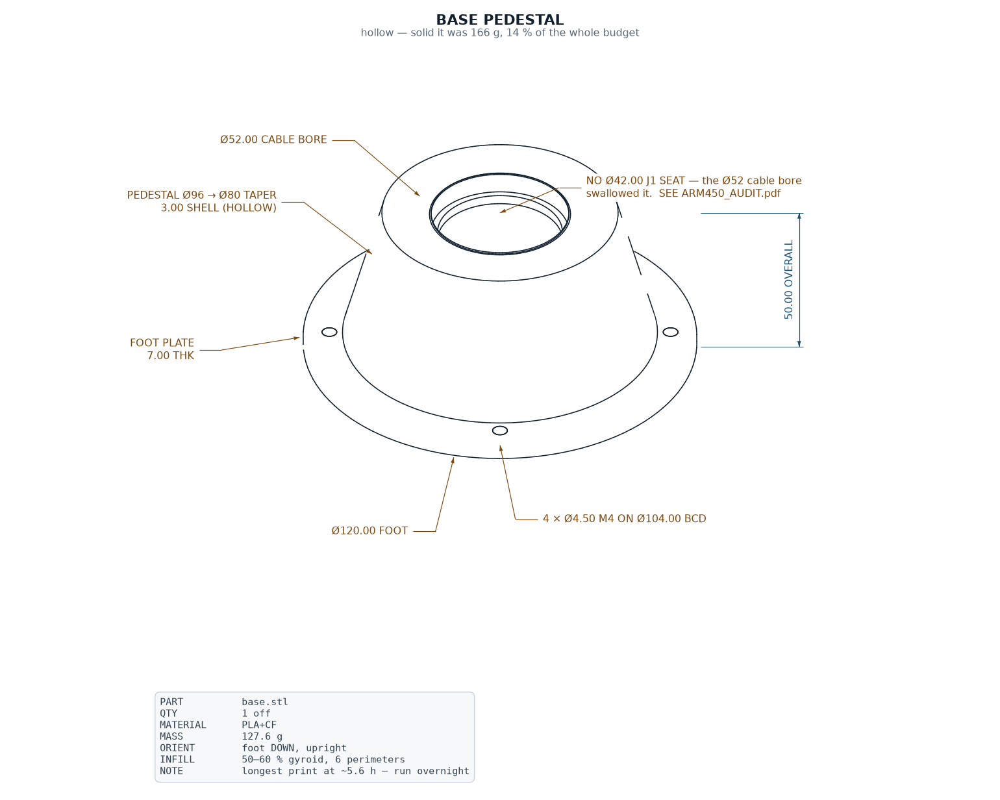

Hollow, with a 3.00 shell. Modelled solid this part was 234 cm³ = 166 g — the single
largest printed item and 14 % of the whole mass budget for something that just sits on the
table. The shell keeps the same outside and the same bearing seat.

At ~5.6 h it is also the longest single print, and the least critical to joint fit, which
is why it goes last and runs overnight.

## 10. Servo horn adapter

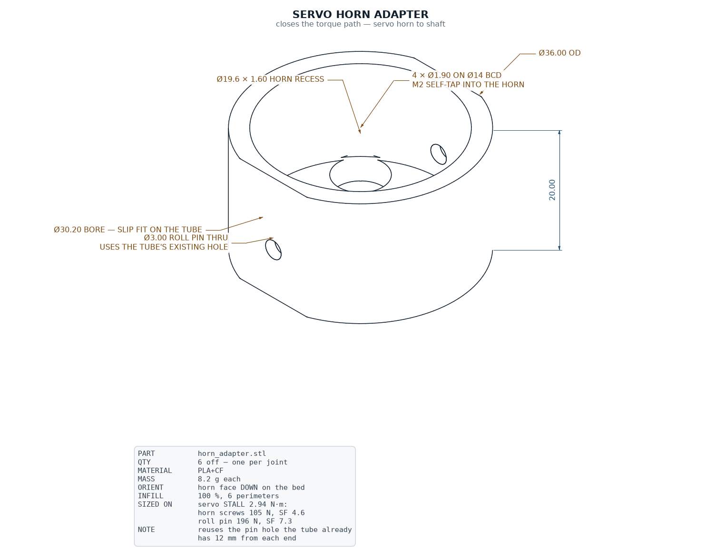

**The part that closes the torque path.** Servo horn → adapter → roll pin → tube → clamp →
link. Before it existed there was none, and nothing in the CAD flagged that: the old solid
`joint_shaft` carried a Ø20 bolt circle on its own shoulder, and when the shaft became a
bought tube the shoulder went with it. Separately, `horn_pattern()` was being called on
three wrist parts but cutting at r = 7.0 — inside the Ø38 bore, so a silent no-op. The
geometry audit found both at once.

It reuses the roll-pin hole the tube already has 12 mm from each end, so the tube needs no
extra machining: one pin drives the clamp at one end, one drives this at the other.

Sized against servo **stall**, 2.94 N·m — horn screws 105 N each (bearing 13.1 MPa, SF 4.6,
which is why the face is 4 mm and not thinner), roll pin 196 N (SF 7.3), hub torsion SF 40.

---

## 11. Joint shaft — aluminium tube

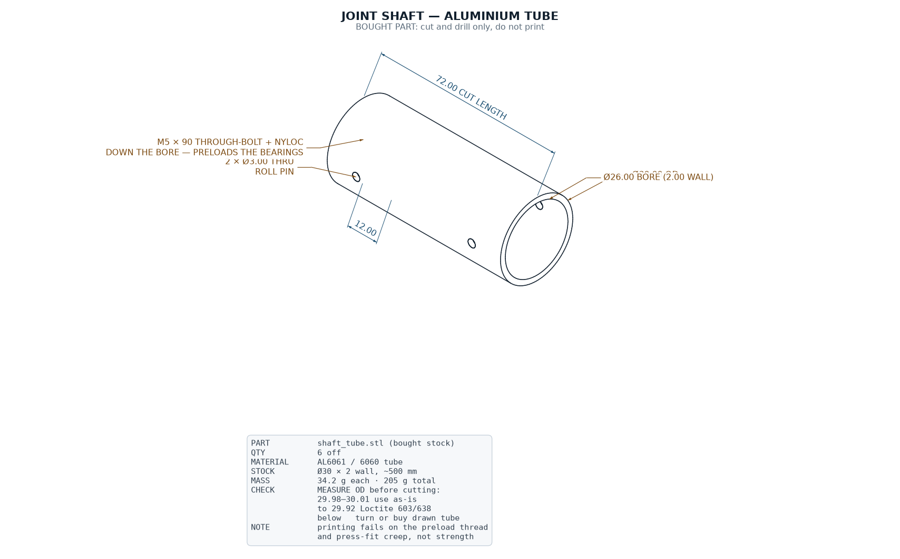

**This is a bought part.** Cut to length and drill two cross holes; do not print it.

Printing is not excluded by strength — at servo stall a printed Ø30 shaft sees 0.55 MPa
shear (SF 32) and 0.57 MPa bending (SF 104). It is excluded by two *local* effects: the M5
preload thread strips, and the press fit creeps away as the plastic relaxes. So metal goes
only where metal is needed — the tube provides the bearing seats, a steel M5 through-bolt
carries the preload down the Ø26.00 bore, and a roll pin handles torque.

**Measure the OD before cutting.** Extruded tube is held to about ±0.10–0.20 on OD; a
bearing seat wants roughly +0.011/+0.002. That is 10–20× looser than needed, and the title
block on the sheet gives the decision table.

## 12. Fit-test coupon


**Print this first.** It carries three bearing pockets (Ø41.95 / Ø42.00 / Ø42.05), three
insert-boss hole sizes and a seam sample, in 27 g and about 0.9 h.

It is a hard gate. If Ø42.00 turns out wrong, `BRG_FIT` changes and every part with a
bearing pocket is scrapped — roughly 19 of the 21 total print hours. Spending 0.9 h to
protect 19 h is the entire argument for it.

---

# End effectors

The six quick-change parts. Full description, the coupling concept and the docking
sequence are in **ARM450_END_EFFECTORS.pdf**; these are the shop sheets.

## 13. Tool adapter — the arm side

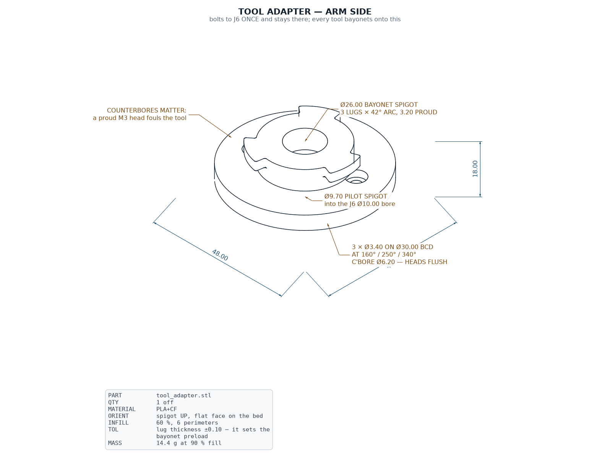

Bolts to J6 **once** and stays there. Three M3 on the Ø30.00 circle at 160 / 250 / 340° —
the same three the J6 face has, because the servo pocket eats the fourth quadrant. The
counterbores are not cosmetic: a proud M3 head fouls the tool sliding over it.

## 14. Gripper body

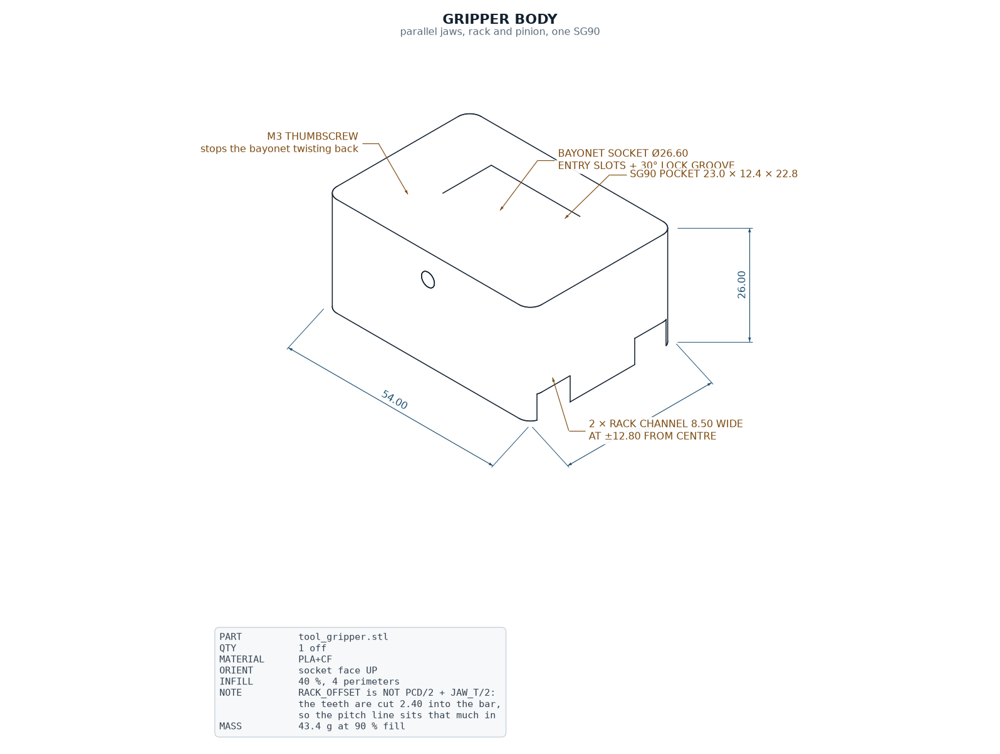

One SG90 in a 23.0 × 12.4 × 22.8 pocket, driving a Ø20 pinion between two rack channels at
±12.80 from the centre. That offset is **not** simply PCD/2 + JAW_T/2: the teeth are cut
2.40 into the bar, so the pitch line sits that much inside the bar face.

## 15. Gripper jaw

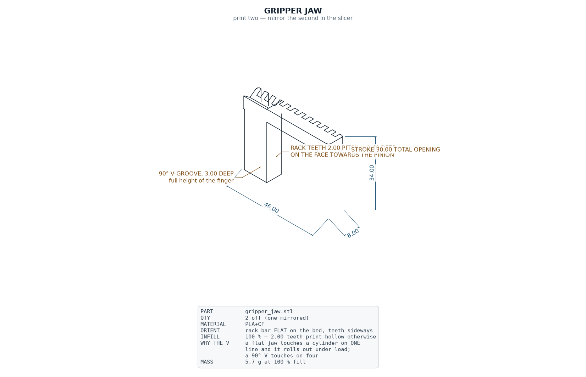

Print two, the second mirrored in the slicer. **100 % infill** — the teeth are 2 mm and
sparse infill leaves them hollow. The 90° V in the gripping face is what stops a cylinder
rolling out sideways under load: a flat jaw touches a round part on one line, a V touches
on two per jaw and locates it on its own axis whatever the diameter.

## 16. Gripper pinion

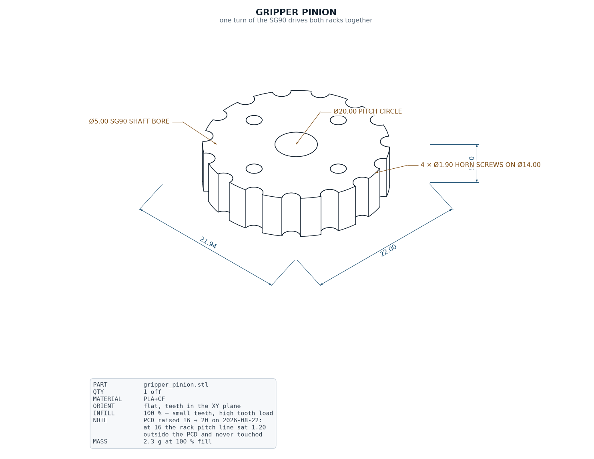

Ø20 pitch circle, Ø5 SG90 shaft bore, four Ø1.90 horn screws on Ø14. **100 % infill.**

## 17. docking probe

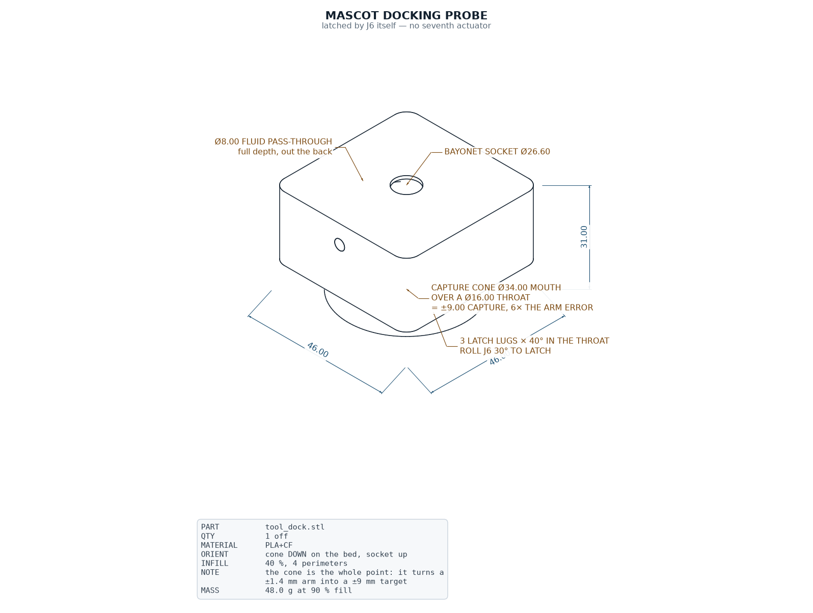

Ø34 mouth funnelling to a Ø16 throat, with three latch lugs standing inward from the
throat wall. **No seventh actuator** — J6 is the tool roll axis and rolling it 30° turns
the latch.

## 18. Docking target port

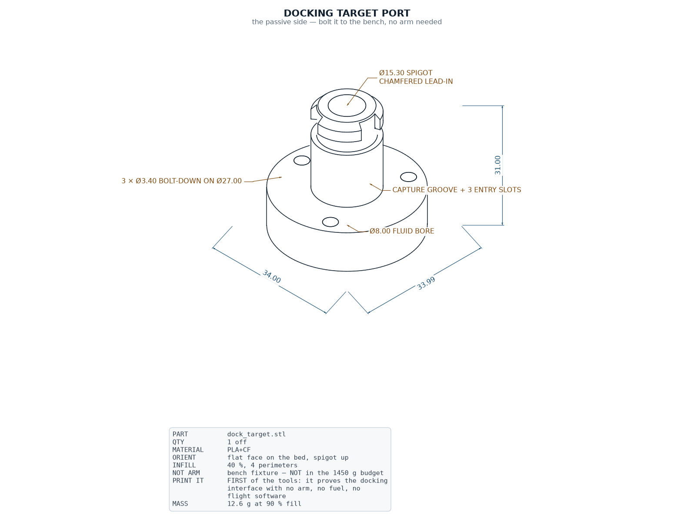

The passive half, bolted to the bench. A 21 mm spigot — deliberately longer than the 9 mm
cone is deep, so the post reaches the latch before the cone can ground on the flange — with
the capture groove cut 1.20 mm into its outer face and three entry slots for the lugs.


---

## 19. Docking target port — SEALED

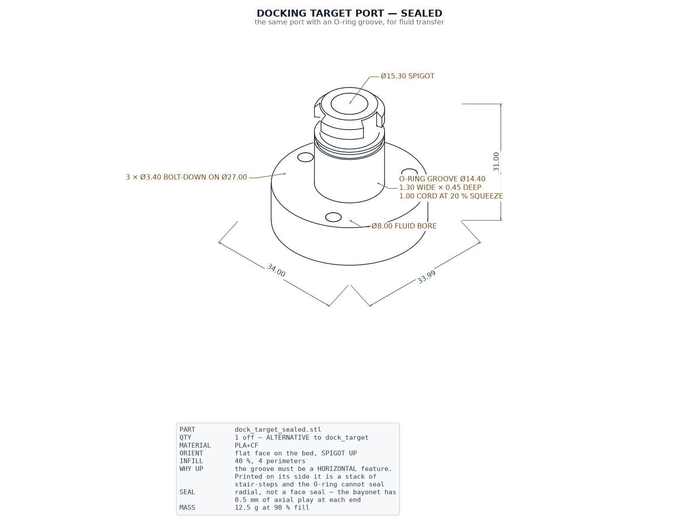

The same port with a **Ø14.40 × 1.30 × 0.45 deep O-ring groove** in the spigot, for fluid
transfer. An alternative to `dock_target`, not an addition — print whichever the
demonstration needs.

The seal is **radial, not a face seal**, and that is not a stylistic choice: the bayonet has
0.5 mm of axial play at each end of the capture groove, so a face seal would be fully loaded
at one extreme of that play and completely unloaded at the other. A radial seal's squeeze is
set by diameters and does not care where the spigot sits.

**Print spigot UP.** The groove has to be a horizontal feature; on its side it becomes a
stack of stair-steps that an O-ring cannot seal against.


---

## Regenerating these sheets

```bash
cd ~/ros2_ws/arm450_design
python3 draw_iso.py                 # rewrites figures/iso/*.png
python3 build_pdf.py DRAWINGS_ISO.md
```

Change anything in `cad/params.py`, rebuild the CAD, and re-run — the dimensions follow
automatically. There are no hand-typed numbers on these sheets to fall out of date.
