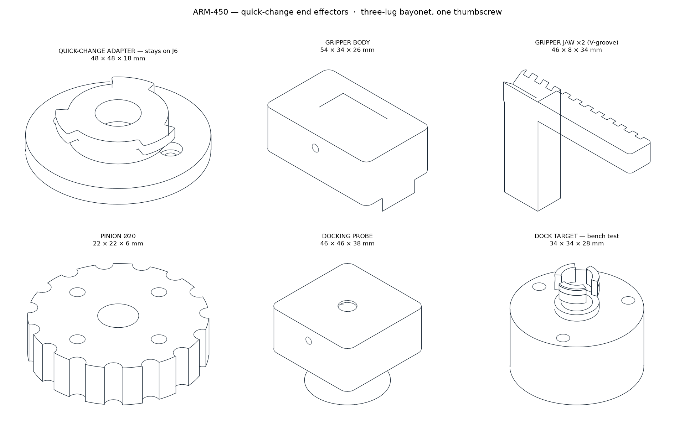

# ARM-450 — Quick-Change End Effectors

**Two tools, one coupling · 15/15 interface checks pass · preflight stage 8**



---

## The coupling

A **three-lug bayonet plus one M3 thumbscrew.** Push on, twist 30°, nip the screw. Off in
about five seconds with no tools.

**Why not bolts.** The J6 face has only **three** bolt holes — the servo pocket occupies
the fourth quadrant, which the geometry audit established. Asking you to start three blind
M3 screws under a wrist every time the tool changes is the wrong answer to a tool-change
problem. The three bolts are used **once**, to fix the adapter, and never touched again.

| part | size | mass | stays / changes |
| --- | --- | --- | --- |
| `tool_adapter` | 48 × 48 × 18 | 14.4 g | bolts to J6 **once** |
| `tool_gripper` + 2 jaws + pinion | 54 × 34 × 26 | 49 g + 9 g SG90 | changes |
| `tool_dock` | 46 × 46 × 31 | 48.0 g | changes |
| `dock_target` | 34 × 34 × 31 | 12.6 g | bench test, not on the arm |
| `dock_target_sealed` | 34 × 34 × 31 | 12.5 g | the same port with an O-ring groove, for **fluid transfer** |

**Verified against the real J6 face:** bolt angles **160 / 250 / 340°** match exactly,
Ø30.00 bolt circle matches, pilot spigot 0.30 mm total clearance in the Ø10 bore, and both
tool sockets take the male spigot at **0.30 mm per side**.

---

## Mass — a tool is payload, not arm

The arm is **1365 g against a 1450 g hard ceiling**, with 85 g spare. Neither tool fits in
that, and neither needs to. Every load analysis in this project assumed **300 g at the
TCP**, so a tool is payload.

Heaviest configuration — adapter + gripper + servo — is **75 g**, a quarter of the
allowance. Only one tool is fitted at a time.

---

## Tool 1 — parallel-jaw gripper

One **SG90** (9 g) drives a Ø20 pinion between two racks. **31.4 mm of opening per jaw**
over half a servo turn.

**Parallel, not scissor.** A scissor jaw grips a cylinder at two points that migrate as it
closes — which is how small parts get squeezed out of one. Parallel faces stay square
through the whole stroke.

**The jaws carry a 90° V-groove.** A flat jaw touches a cylinder on one line per side, so
the part is free to roll out sideways under load. A V touches on two lines per jaw, four in
total, and locates a round part on its own axis whatever its diameter.

> **Two defects the interface check caught here, that a render would not have.**
> At the original Ø16 pinion the rack pitch line sat **1.20 mm outside the pinion PCD** —
> the teeth never touched — and the half-turn stroke was 25.1 mm against a 30 mm design
> opening. Both are now correct: pitch line **+0.00 mm** on the PCD, stroke **31.4 mm**.
> A gear mesh is exactly the thing that looks fine in a picture and does nothing in plastic.

---

## Tool 2 — docking probe

**No seventh actuator.** The latch is a bayonet and **J6 turns it.** Insert the probe, roll
J6 by 30°, the lugs are captured. Reverse to undock. J6 has ±175° of travel and does
nothing during a docking approach, so the motion is free.

**Capture tolerance is the number that matters.** The cone is a **Ø34 mouth over a Ø16
throat**, and the measured envelope — probe and target as exported meshes, swept sideways
until they foul — is **±9.75 mm** at the mouth. Expected end-to-end arm precision is
around **1.4 mm** once servo backlash is included, so the cone carries about **7× the
error the arm can actually make.** That margin is deliberate: docking is the one task
where a miss is expensive.

A **Ø8 fluid pass-through** runs the full length of both probe and target, for the
refuelling line.


The latch is the one feature here that no isometric can show — it is inside a bore. That is
a large part of why it was wrong for as long as it was. Read left to right: the cone
catches the spigot, the lugs pass down through the entry slots, and rolling J6 by 30° puts
each lug under a shoulder of target material. Pull now and it catches.

### What was wrong with the first docking design

Three defects, all found on 2026-08-22 by asking the geometry instead of looking at the
render. Every one of them would have survived to the print bed.

**1 — the latch did not exist.** The three latch lugs were placed inside the capture cone
at a height where the bore had already opened to Ø25.8, so they floated **5.5 mm clear of
any wall**. `tool_dock` came out of CadQuery as **four solids**: the probe, and three
loose 19 mm³ crumbs. A `.union()` of shapes that do not touch does not fail — it returns a
compound, and every downstream step (render, drawing, mass) treats it as one part.

**2 — the target's spigot was cut in half.** The capture groove was cut from r3.10 to
r6.40 through a wall that ran r4.00 to r5.65 — a **3.30 mm groove in a 1.65 mm wall**.
That is not a groove, it is a parting cut: it severed the tip from the flange, and the
three entry slots then chopped what remained into three loose arcs.

**3 — the cone was deeper than the spigot was long.** Even with both parts whole, they
could not have mated. The capture cone was 16 mm deep and the spigot 10 mm tall, so the
**cone mouth grounded on the Ø34 flange while the tip was still 6 mm short of the throat.**
Probe and target collided at *every* insertion depth and *every* roll angle.

The fixes: throat Ø12 → **Ø16** and mouth Ø30 → **Ø34** (which keeps the ±9 mm capture
while giving the spigot a **2.45 mm wall** at the groove root); cone 16 → **9 mm** deep;
spigot 10 → **21 mm**, so the post out-reaches the cone with **2 mm of standoff** when
latched; and the lugs now grow inward from the throat wall, overlapping it by 1 mm so the
union has real material to fuse to.

**The mate is now simulated, not asserted.** `check_tool_fit.py` drives the exported probe
mesh onto the exported target mesh and checks all five states:

| state | expected | result |
| --- | --- | --- |
| 6 mm short, slots aligned | clear | clear |
| seated, slots aligned | clear | clear |
| rolled 30° to latch | clear | clear |
| latched, pulled 2 mm | **must catch** | catches |
| rolled back, withdrawn | must release | releases |

> None of these three defects is visible in a render. Two of them look *right* in a render.
> The only reason they were found is that the parts were asked a question — how many
> solids are you, and do you actually mate — that a picture cannot answer.

`dock_target` is the passive port, printed so the interface can be tested on a bench
**before anything flies or floats**. Bolt it down, fit the probe, drive in by hand and roll
J6 30°. It should latch and release repeatably. That test needs no fuel, no float
hardware and no flight software.

---

## Printing

Not on the critical path for the arm — print these after it.

| order | part | qty | why this order |
| --- | --- | --- | --- |
| 1 | `tool_adapter` | 1 | small; fits to J6 and stays |
| 2 | `tool_dock` + `dock_target` | 1 + 1 | lets the docking interface be bench-tested without the arm |
| 3 | `tool_gripper`, `gripper_jaw` ×2, `gripper_pinion` | 1/2/1 | needs the SG90 to be useful |

Same PLA+CF spool as the arm. **Print the pinion and jaw racks at 100 % infill** — the
teeth are small and sparse infill leaves them hollow.

**To buy:** one **SG90 micro servo**, two M3 × 16 thumbscrews.

---

## Verifying

```bash
python3 cad/end_effector.py      # rebuild all six parts
python3 check_tool_fit.py        # 15 interface checks
python3 preflight.py             # full gate, tools are stage 8
```
