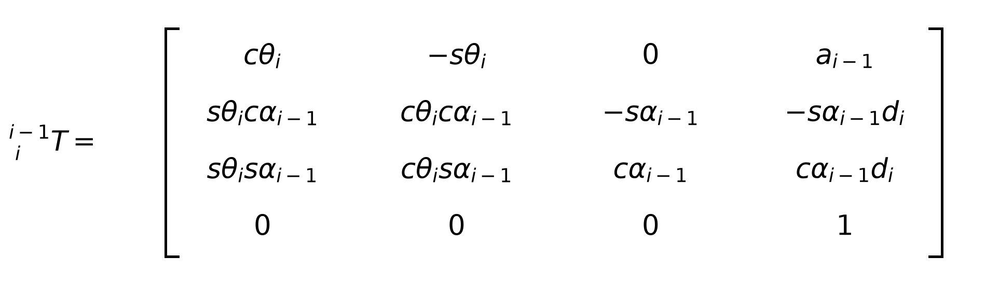
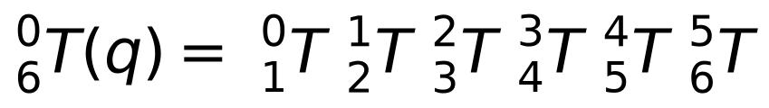
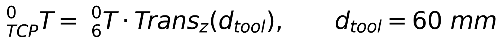
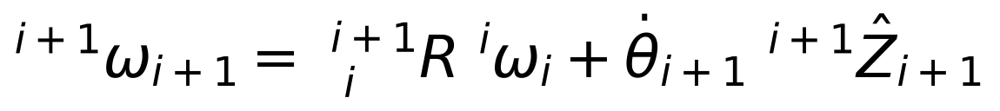
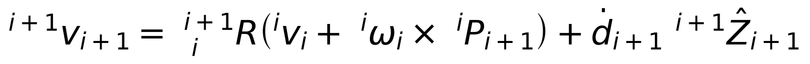
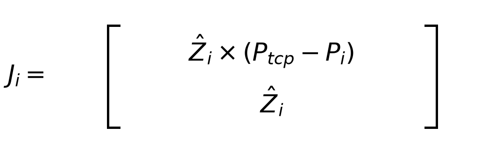
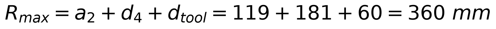
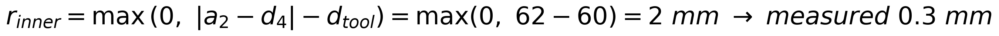

# ARM-450 — Kinematics, Workspace and Hardware Feasibility

- **Robot:** ARM-450, 6-DOF, 450 mm overall, 360 mm horizontal reach
- **Convention:** Modified (Craig) DH + velocity-propagation Jacobian — the user's own reference notation
- **Date:** 2026-08-19
- **Source of truth:** `arm450.urdf`, generated from the CAD parameters. Where the DH model and the URDF disagree, **the URDF is correct**.

---

## 1. Convention

Frame *i* is attached to link *i*. Parameters are (α<sub>i−1</sub>, a<sub>i−1</sub>, d<sub>i</sub>, θ<sub>i</sub>):

- **a<sub>i−1</sub>** (link length) — mutual-perpendicular distance between the two Z axes, measured along X<sub>i−1</sub>
- **α<sub>i−1</sub>** (link twist) — angle from Z<sub>i−1</sub> to Z<sub>i</sub>, measured about X<sub>i−1</sub>
- **d<sub>i</sub>** (link offset) — distance from X<sub>i−1</sub> to X<sub>i</sub>, measured along Z<sub>i</sub>
- **θ<sub>i</sub>** (joint angle) — angle from X<sub>i−1</sub> to X<sub>i</sub>, measured about Z<sub>i</sub>

The Modified-DH homogeneous transform:



---

## 2. DH table

**Verified against `arm450.urdf` to 0.000 nm over 5,000 random poses.**

| i | α<sub>i−1</sub> | a<sub>i−1</sub> (mm) | d<sub>i</sub> (mm) | θ<sub>i</sub> | joint |
| --- | --- | --- | --- | --- | --- |
| 1 | 0° | 0 | 90 | q₁ | base yaw |
| 2 | −90° | 0 | 0 | q₂ − 90° | shoulder pitch |
| 3 | 0° | 119 | 0 | q₃ − 90° | elbow pitch |
| 4 | −90° | 0 | 181 | q₄ | forearm roll |
| 5 | +90° | 0 | 0 | q₅ | wrist pitch |
| 6 | −90° | 0 | 0 | q₆ | tool roll |

Tool offset: **d<sub>tool</sub> = 60 mm** along Z₆.

Where the numbers come from:
- **d₁ = 90** = base height 50 + shoulder rise 40
- **a₂ = 119** = the upper-arm link, J2 → J3
- **d₄ = 181** = forearm shell 119 + J4→J5 offset 62
- **d<sub>tool</sub> = 60** = J5→J6 30 + J6→TCP 30

**A caution worth recording:** my first hand-derived twist column was wrong and produced a 650 mm position error. A constrained search over α ∈ {0, ±90°} and θ-offset ∈ {0, ±90°} found the table above. *Always verify a DH table numerically against the URDF — do not trust a hand derivation.*

---

## 3. Forward kinematics





### Verification

| check | result |
| --- | --- |
| Max position difference, DH vs URDF (5,000 poses) | **0.0000 µm** |
| Rotation difference | constant 180° about Z — a tool-frame labelling offset only |
| Home pose q = 0 | TCP at (0, 0, **450**) mm |
| q₂ = 90° | TCP at (**360**, 0, 90) mm |

The 180° rotation is a fixed relabelling of the tool frame's X/Y axes. Position is unaffected; applying it makes the two models identical in orientation as well.

---

## 4. Transform matrices at the home pose

With all q = 0:

```
0_1T = [ 1  0  0  0     ]      1_2T = [ 0  1  0  0     ]
       [ 0  1  0  0     ]             [ 0  0  1  0     ]
       [ 0  0  1  0.090 ]             [ 1  0  0  0     ]
       [ 0  0  0  1     ]             [ 0  0  0  1     ]

2_3T = [ 0  1  0  0.119 ]      0_6T = [-1  0  0  0     ]
       [-1  0  0  0     ]             [ 0 -1  0  0     ]
       [ 0  0  1  0     ]             [ 0  0  1  0.390 ]
       [ 0  0  0  1     ]             [ 0  0  0  1     ]
```

TCP = 0_6T · Trans<sub>z</sub>(0.060) → **(0, 0, 0.450) m**, which is the 450 mm requirement met exactly.

---

## 5. Jacobian by velocity propagation

Propagating frame by frame from base to tip:





For a revolute joint the ḋ term drops; for a prismatic joint the θ̇ term drops. Expressed in the base frame, each column becomes:



**Verification:** compared against numerical differentiation of the FK over 400 random poses — max column error **1.85 × 10⁻⁸ m/rad**, which is finite-difference noise.

---

## 6. Real workspace

Computed from the verified DH model over the true joint limits, 250,000 samples.



| quantity | value |
| --- | --- |
| Chain length, fully extended | 450.0 mm |
| Max distance from the base origin | **450.0 mm** |
| Max horizontal reach from the J1 axis | **360.0 mm** |
| Min horizontal radius (dead zone) | **0.3 mm** |
| Height range | −200 … +450 mm |
| Poses below the mounting plane | 23.4 % |
| Reachable volume (10 mm voxels) | **118 litres** |
| Fill fraction of a 360 mm sphere | 60.4 % |

### The dead zone is effectively zero



The naive two-link formula |a₂ − d₄| = 62 mm **over-reports**, because it ignores that the 60 mm wrist can point inward. The measured minimum radius over 250k poses is **0.3 mm**.

### Task-constrained workspace — the number that matters

Reachability alone is not enough; the pen must also be **normal to the surface**.


On a grid of 260 points over a vertical board:

| | result |
| --- | --- |
| **Drawable with the pen normal** | **136/260 = 52.3 %** |
| Best radial band | **x = 240 … 300 mm** (13–15 of 20 heights) |
| Comparison: myCobot 280 (thesis) | 57.9 % |

**ARM-450 is essentially as capable as the myCobot for vertical surface tracing.**

---

## 7. Hardware feasibility

### Sine tracing — the immediate task

Run through Rsine's own `DrawingPlane` and `sine_waypoints`, imported unchanged from the frozen package with only the kinematics swapped:

| board distance | solved | position rms | pen tilt |
| --- | --- | --- | --- |
| 200 mm | 25/40 | 9.09 mm | 31.9° |
| **240 mm** | **40/40** | **0.028 mm** | **0.5°** |
| 280 mm | 39/40 | 0.445 mm | 3.1° |
| **300 mm** | **40/40** | **0.007 mm** | **0.2°** |

**Verdict: feasible.** Mount the board at 240–300 mm and the arm traces the sine with the pen effectively perpendicular.

### Horizontal table — not feasible as designed

0/40 at every height tested. J2, J4 and J5 reach their limits **simultaneously**. Widening J5 from ±110° to ±150° cuts the pen-tilt error from 54° to 16° but still does not close it. This is a regression against the myCobot, which manages 63.5 % on horizontal.

### Actuation

| joint | worst-case torque | ST3215 (30 kgf·cm) | verdict |
| --- | --- | --- | --- |
| J1 | 0.000 N·m | — | gravity cannot load a vertical yaw axis |
| J2 | 2.625 N·m | 89 % of stall | too much to hold **with 300 g at full extension** |
| J3 | 1.271 N·m | 43 % | marginal |
| J4, J5 | 0.296 N·m | 10 % | fine |
| J6 | 0.088 N·m | 3 % | fine |

**With a pen instead of a 300 g payload, J2 falls to 14–29 % of stall** across the drawing band. A uniform ST3215 at every joint is therefore adequate for the sine-tracing task — and all six joints now physically accept the same servo.

### Accuracy budget

| source | contribution |
| --- | --- |
| Servo backlash, 0.5° over three joints | 4.82 mm |
| Joint bearing clearance, preloaded pair at 22 mm spacing | 0.65 mm |
| Unbolted clamshell seam (torsion) | 2.80 mm |
| Elastic droop, PLA+CF | 0.11 mm |

**Backlash dominates.** No amount of structural stiffening improves it — that requires either better servos or joint-side encoders.

---

## 8. Verdict

**Feasible for the immediate task**, with three conditions:

1. **Vertical board at 240–300 mm.** Horizontal-table tracing does not work without wider J2/J5 travel or a wrist redesign.
2. **Pen-scale payload.** The 300 g rating at full extension exceeds what an ST3215 holds continuously at J2.
3. **Expect ~5 mm absolute accuracy** from backlash. Adequate for drawing; **not** adequate for the docking precision that follows.

The kinematics, the 450 mm envelope, the zero dead zone and the 52.3 % task workspace are all confirmed. What remains unproven is everything mechanical: the 0.65 mm wobble figure is calculated and never measured, and four of the six joint parts are first-pass with no fit check against real hardware.

---

# Modified (Craig) DH — derived, and cross-checked three ways

Added 2026-08-25 at the user's request: build the DH table and the IK in **their**
convention — modified/Craig DH with a velocity-propagation Jacobian — then check it
against `ikpy`, an outside package.

## The table

| i | α<sub>i−1</sub> | a<sub>i−1</sub> (mm) | d<sub>i</sub> (mm) | θ<sub>i</sub> |
| --- | --- | --- | --- | --- |
| 1 | 0° | 0 | 90 | q₁ + 180° |
| 2 | 90° | 0 | 0 | q₂ + 90° |
| 3 | 0° | **119** | 0 | q₃ + 90° |
| 4 | 90° | 0 | **181** | q₄ + 180° |
| 5 | 90° | 0 | 0 | q₅ + 180° |
| 6 | 90° | 0 | 0 | q₆ |

Tool: **60 mm along Z₆** to the TCP.

## How it was obtained, and the two numbers that are not what they look like

The joint axes were taken from the URDF at q = 0 and the common normals computed
between consecutive axes:

```
J1  origin (0, 0,  50)   axis Z          Z1 ⊥ Z2   a = 0
J2  origin (0, 0,  90)   axis Y          Z2 ∥ Z3   a = 119   <- the only non-zero a
J3  origin (0, 0, 209)   axis Y          Z3 ⊥ Z4   a = 0
J4  origin (0, 0, 328)   axis Z          Z4 ⊥ Z5   a = 0
J5  origin (0, 0, 390)   axis Y          Z5 ⊥ Z6   a = 0
J6  origin (0, 0, 420)   axis Z
```

**Every axis passes through the base Z line**, so every `a` is zero except the one
between the two parallel pitch axes.

**d₄ = 181, not 119.** This is the trap. Frame 3's origin sits where X₃ meets Z₃
(z = 209) and frame 4's sits where Z₄ meets Z₅ (z = 390), so the offset along Z₄ is
119 + 62. Writing 119 — the "obvious" link length — puts the tool **193 mm** out, which
is exactly what the first version of this file did.

**a₂ = 119, not d₃.** Parallel axes have a real common perpendicular, and it goes in `a`.

## The Jacobian

Built by **velocity propagation**, base to tip, per the reference method:

```
i+1_ω_{i+1} = i+1_i R · i_ω_i  +  θ̇_{i+1} · Ẑ
i+1_v_{i+1} = i+1_i R · ( i_v_i + i_ω_i × i_P_{i+1} )
```

not by finite differencing. The prismatic branch is kept in the code even though
ARM-450 is all-revolute, because the reference method covers both.

## Cross-check — three implementations sharing no code

| check | result |
| --- | --- |
| FK: Craig DH == URDF chain | **1.96 × 10⁻¹³ mm** over 200 random poses |
| FK: Craig DH == ikpy | **2.17 × 10⁻¹³ mm** |
| FK: URDF chain == ikpy | **1.14 × 10⁻¹³ mm** |
| tool axis agrees | 8.95 × 10⁻¹⁶ |
| Jacobian: propagation == finite difference | 1.81 × 10⁻⁵ |
| IK (Craig DH + propagated Jacobian) | median **1.6 × 10⁻¹¹ mm** |
| IK (ikpy) | median 0.000 mm |

**7 of 7 pass.** Agreement between the first two proves the DH table; agreement with
`ikpy` proves the first two do not share a mistake — which is the failure a
self-written cross-check cannot catch.

> **ikpy does not import cleanly on this machine and the reason is worth recording.**
> sympy stringifies numpy scalars; numpy 2 changed their repr to `np.float64(1.0)`;
> sympy then cannot parse its own input. ikpy converts numpy scalars internally, so it
> dies before doing any kinematics. `check_ikpy.py` routes the converter through
> `float()` instead of the string path. Nothing to do with the arm — but a check that
> cannot run is not a check, and it would have been easy to report "ikpy unavailable"
> and move on.

Run it: `python3 check_ikpy.py`

