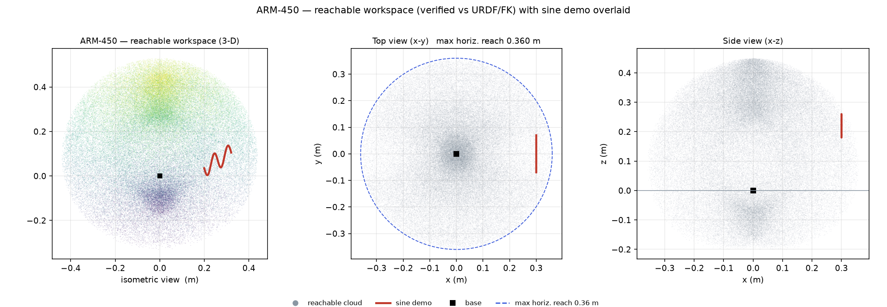
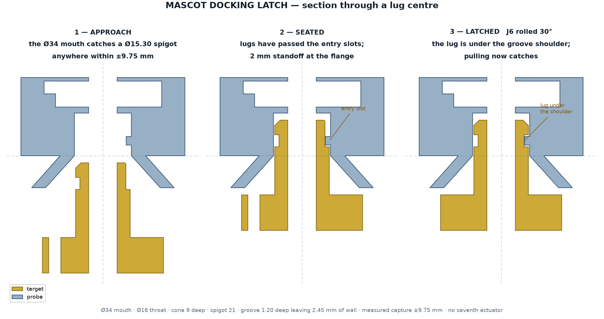
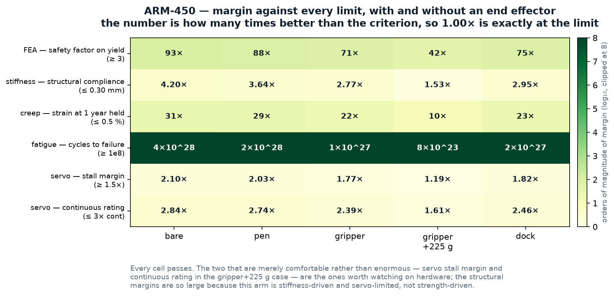
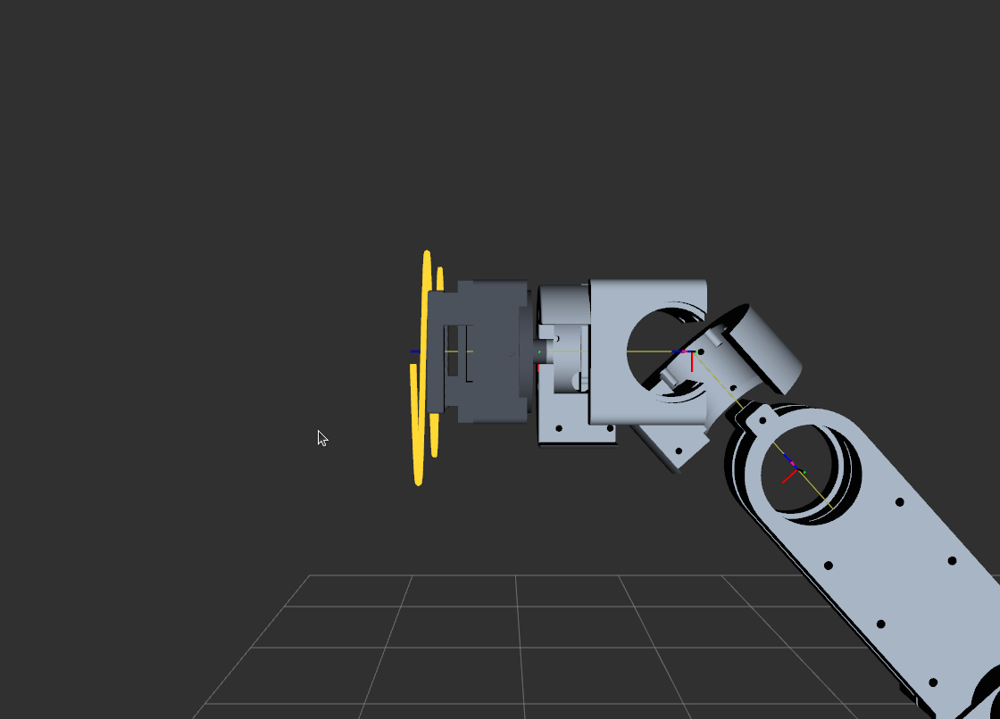
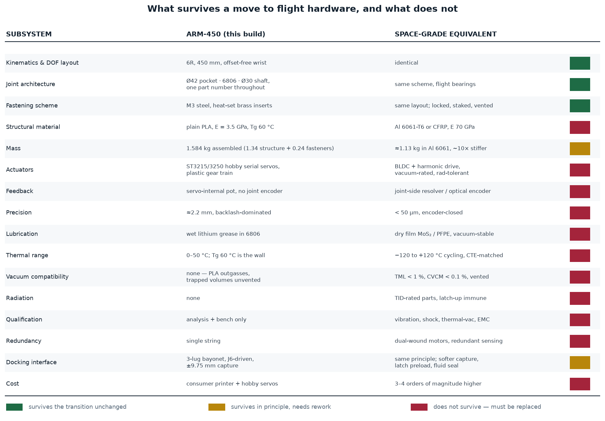

# ARM-450: Design, Analysis and Pre-Print Verification of a 450 mm Printed 6-DOF Manipulator with Quick-Change End Effectors

**Status — pre-hardware.** Every result below is analytical or simulated. Nothing in this
document has been printed or measured. Sections marked **[AWAITING HARDWARE]** are written
with the measurement defined and the space left for the number; they are the whole point of
publishing the analysis first, because a prediction recorded before the test is evidence
and one recorded after it is not.

**Date of this revision:** 2026-08-22 · **Verification state:** 27 checks, 8 stages, 0 failures

---

## Abstract

A 6-DOF serial manipulator of 450 mm reach was designed from a clean sheet for fused-
filament printing in PLA, targeting two tasks: tracing a sinusoid on a
vertical board as a repeatable accuracy demonstration, and a probe-and-drogue docking
manoeuvre representative of an on-orbit refuelling interface. The arm masses 1.365 kg
against a 1.450 kg ceiling and carries a 300 g payload allowance at the tool point.

The contribution is not the arm. It is the **verification method**: an eight-stage gate in
which every criterion is computed from the exported CAD geometry rather than from the
parameters used to author it, and in which the whole load suite is re-run for five payload
configurations — bare flange through gripper-plus-225 g. That gate has so far found
thirteen defects that survived visual inspection, three of which would have made the
docking interface non-functional in plastic. All 27 checks currently pass.

The design is explicitly **not** flight hardware. Of sixteen subsystems compared against a
space-grade equivalent, three survive the transition unchanged, two survive in principle,
and eleven must be replaced. The kinematics and the joint architecture survive; the
material, the actuators and everything that touches vacuum do not.

---

## 1. Motivation and scope

The work sits inside a maglev-floated chaser/target capture project, where the arm
is the manipulation element. Two demonstrations were required:

1. **Sinusoidal trace.** A pen-equivalent tool follows a sine on a vertical board. This is
   a *precision* demonstration: the traced curve is a permanent record of the arm's
   repeatability, visible to the eye, and it exercises five of six joints simultaneously.
2. **Docking.** A probe enters a passive port and latches. This is a *capture tolerance*
   demonstration, and the interesting engineering is that it must succeed despite the arm
   being far less accurate than the interface would naively require.

### 1.1 Requirements

| # | requirement | source | status |
| --- | --- | --- | --- |
| R1 | ≤ 450 mm chain, base to tool face | project brief | met, exactly 450.0 mm |
| R2 | ≤ 1450 g arm mass | project brief (hard) | met, 1365 g, 85 g spare |
| R3 | 300 g payload at the tool point | derived from task | met, worst case 75 g fitted |
| R4 | 6 DOF, wrist capable of arbitrary tool orientation | task | met |
| R5 | Printable on a consumer FDM machine | project constraint | met, plain PLA, brass nozzle, no supports on load paths |
| R6 | Tool change without tools, in seconds | usability | met, 3-lug bayonet + one thumbscrew |
| R7 | Docking without a seventh actuator | mass and complexity | met, latch driven by J6 |
| R8 | Sine trace visibly accurate | demonstration | met in simulation, 0.055 mm rms at the tool tip |

**R1 is a constraint on the arm, not the system.** With a gripper fitted the working point
reaches 492 mm. This was raised explicitly and accepted as a design decision on 2026-08-22;
it is now recorded as `SYSTEM_REACH_MAX = 495 mm` and checked, so a later and longer tool
cannot quietly exceed what was agreed.

---

## 2. Architecture

### 2.1 One joint interface everywhere

The single most consequential decision in the design is that **every joint uses the same
mechanical interface**: a Ø42.00 H-fit pocket, a 6806 (30×42×7) or 6706 (30×37×4) thin-
section bearing, and a Ø30 shaft. One bore diameter, one shaft diameter, one clamp, one
horn adapter, across all six axes.

The consequences compound:

- One fit tolerance to characterise on the printer, not six. A single 2.3 h test coupon
  gates roughly 19 h of parts.
- One spare part number. A failed bearing anywhere is the same bearing.
- The horn adapter, shaft clamp and aluminium tube are common parts, printed or cut six
  times.

The cost is that the wrist carries a bearing larger than it needs. That was measured, not
assumed: substituting the 4 mm-wide 6706 at J4/J5/J6 saved 24 g, and **moment stiffness
scales with bearing *spacing* squared and is independent of bearing width**, so the narrower
bearing cost nothing in stiffness once the spacing was preserved.

### 2.2 Links

Each link is a **clamshell pair** — a tongue half and a groove half — bolted along a seam
on the neutral axis, forming a closed box section 47.5 × 29.0 mm with a 2.4 mm wall.

Closing the section is not cosmetic. An open C-section of the same envelope has a torsion
constant roughly two orders of magnitude lower, and the payload hangs off-axis. The seam
bolts are what make the section closed; they are M3 × 20, and an earlier M3 × 12 stopped
2.5 mm short of engaging.

### 2.3 Wrist

J4 (roll), J5 (pitch) and J6 (roll) are integrated into three printed housings rather than
assembled from generic modules. J5 is a fork whose two cheeks are spaced as widely as the
envelope allows, because moment stiffness goes as spacing².

**J5 travel is asymmetric: −91° to +49°, not ±110° as first specified.** An exact-mesh
sweep found the J4 housing striking the J6 output body over the excluded range. The URDF
carries the narrowed limit and the collision checker parses limits *from the URDF* rather
than holding its own copy.

### 2.4 Actuation

Six serial-bus servos: ST3250 at the shoulder (J2), ST3215 elsewhere. Selection is by
gravity torque from a 60 000-pose sweep of the reachable configuration space, not by a
single worst-case pose.

Torque reaches the printed structure through a **horn adapter** that clamps the servo output
spline and pins into the joint shaft. Without it the torque path terminates at the servo's
own horn screws.

---

## 3. Kinematics

### 3.1 Chain

```
world → base_link → link1 → link2 → link3 → link4 → link5 → link6 → tcp → tool → tool_tip
                    J1 Z    J2 Y    J3 Y    J4 Z    J5 Y    J6 Z    fixed  fixed
   z (mm):           50      40      119     119     62      30      30      +42 (gripper)
```

Total 450 mm base to tool face. `tcp` is the J6 face; `tool_tip` is where a fitted tool
actually works.

**`tcp` is not the working point, and conflating the two is a live error class.** The sine
trajectory drives the flange; with a gripper fitted, a board placed where the flange traces
would be struck by the flange while the fingers were already 42 mm through it.

### 3.2 Inverse kinematics

Bounded least-squares (`scipy.optimize.least_squares`) on position plus tool-axis direction.
Two terms are non-obvious and both were arrived at by failure:

**J6 is locked.** A pen is rotationally symmetric about the tool axis, so J6 is pure
redundancy. Leaving it free makes the solve under-determined and the solver wanders 135°
between adjacent waypoints. Locking it converts an under-determined 6-DOF problem into an
exactly-determined 5-DOF one.

**Null-space regularisation on J4 and J6 only.** When J5 → 0 the two roll axes become
collinear and only their sum is determined. Penalising all six joints equally suppressed
the wander but destroyed accuracy (0.02 → 8.8 mm rms) because it also fought the joints
doing the task. Damping only the redundant pair costs nothing.

**Orientation weight depends on whether a tool is fitted.** With a bare flange, position and
orientation are nearly independent and `w_ori = 0.05` is right. With a tool, a tilt *moves
the tip*, and at that weight the solver trades **21° of tool tilt** for position error.

### 3.3 Verification of the kinematics

The chain was re-derived independently in **modified (Craig) DH** and cross-checked
against `ikpy`:

| check | worst error over 200 poses |
| --- | --- |
| FK: Craig DH == URDF chain | 1.96 × 10⁻¹³ mm |
| FK: Craig DH == ikpy | 2.17 × 10⁻¹³ mm |
| FK: URDF chain == ikpy | 1.14 × 10⁻¹³ mm |
| Jacobian: velocity propagation == finite difference | 1.81 × 10⁻⁵ |
| IK round trip, both solvers | ≤ 1.6 × 10⁻¹¹ mm median |

**7 of 7 pass**, at double-precision rounding. The Jacobian is assembled by
velocity propagation rather than differencing, which keeps it exact at the J4/J6
wrist singularity.

Agreement between the DH table and the URDF proves only that the table copies the
URDF faithfully — errors included. The third implementation is what closes that:
three routes sharing no code cannot agree on the same mistake. The derivation is
in `ARM450_KINEMATICS.pdf`; the check is `check_ikpy.py`.

### 3.4 Workspace

Monte-Carlo forward kinematics, 200 000 poses sampled inside the URDF joint limits, binned
into a 5 mm (r, z) grid and revolved.

| fitted | reach past J6 | max reach | horizontal | swept volume |
| --- | --- | --- | --- | --- |
| bare face | — | 450 mm | 360 mm | 188 L |
| pen | 30 mm | 480 mm | 390 mm | 239 L |
| **gripper** | **42 mm** | **492 mm** | **402 mm** | **262 L** |
| dock probe | 36 mm | 486 mm | 396 mm | 251 L |

A gripper adds 39 % of swept volume for 42 mm of extension — volume grows roughly as the
cube of reach.



---

## 4. End effectors

### 4.1 Quick-change coupling

A **three-lug bayonet plus one M3 thumbscrew**. Push on, twist 30°, nip the screw. The
adapter bolts to J6 once and stays.

Bolts were rejected because the J6 face has only **three** holes — the servo pocket eats the
fourth quadrant — and starting three blind M3s under a wrist at every tool change is the
wrong answer to a tool-change problem.

### 4.2 Gripper

Parallel jaws, rack and pinion, one SG90 (9 g). Parallel rather than scissor because the
jaw faces stay square through the stroke; a scissor grips a cylinder at two points that
migrate as it closes. A 90° V-groove in each finger locates round stock on four lines.

Stroke 31.4 mm per jaw over half a pinion revolution against a 30 mm design opening.

### 4.3 Docking probe

**No seventh actuator.** The latch is a bayonet and J6 turns it: insert, roll 30°, latched.
J6 has ±175° and does nothing during a docking approach.

The design driver is **capture tolerance, not accuracy**. A Ø34 mouth over a Ø16 throat
gives a **measured ±9.75 mm** envelope — measured by sweeping the exported probe mesh
sideways against the exported target mesh until they foul, not subtracted from two
diameters. Expected arm precision is ≈2.2 mm, so the cone carries about 4× the error the
arm can make, and about 2× the error it can make with worst-case backlash.

**This is the design pattern worth taking from the project**: docking was made feasible by
geometry, not by making the arm accurate enough.



---

## 5. Verification method

### 5.1 The principle

Every check reads the **exported geometry** — the STEP B-rep or the tessellated mesh — and
not the parameters used to author it. The distinction is the entire value of the gate.

An early version checked that `BEARING_POCKET_D == 42.0` in the parameter file and passed
55/55 while **three bearing pockets did not physically exist**: a hollowing operation had
removed the material the pocket was cut into, and subtracting a Ø42 pocket from an already-
empty region succeeds silently and changes nothing.

> A boolean that removes nothing does not fail. It returns the same solid, and every step
> downstream — render, drawing, mass, collision — treats the result as correct.

### 5.2 The eight stages

| stage | question | criterion |
| --- | --- | --- |
| 1 Design check | Do the features physically exist? | STEP B-rep audit |
| 2 FEA | Does anything yield? | p99 von Mises SF ≥ 3 |
| 3 Creep + fatigue | Does it fail slowly? | strain < 0.5 %/y, life > 1e8 |
| 4 Stiffness | Does the tool stay where it is put? | compliance ≤ 0.30 mm |
| 5 URDF | Does the model match the machine? | parses, mass matches, meshes resolve |
| 6 Path tracing | Does the actual trajectory work? | 0 collisions, < 0.20 mm rms |
| 7 Simulation | Will the ROS side work on hardware? | trajectory published, ramp, rate |
| 8 End effectors | Do the tools fit, does the latch latch? | 29 interface checks + a simulated mate |

### 5.3 Results, with and without an end effector

Every load analysis originally assumed a single number: 300 g at the tool point. That is a
generous envelope but it says nothing about a *fitted tool as such*, because a tool is not
only mass — it moves the load along the tool axis, and the lever arm is what sizes J2/J3 and
sets the compliance at the point that matters. **75 g on a 42 mm stick is not the load case
75 g at the flange is.**

The suite is therefore run for five configurations from one driver, so the "with gripper"
answer cannot be a different vintage from the "bare" answer.

| config | tool | held | J2 N·m | J3 N·m | σ MPa | SF | δ mm | creep %/y | cycles |
| --- | --- | --- | --- | --- | --- | --- | --- | --- | --- |
| bare | 0 g | 0 g | 1.55 | 0.63 | 0.197 | 305 | 0.036 | 0.0159 | 3.9e36 |
| pen | 15 g | 0 g | 1.61 | 0.66 | 0.208 | 288 | 0.041 | 0.0172 | 1.8e36 |
| gripper | 75 g | 0 g | 1.85 | 0.82 | 0.257 | 234 | 0.054 | 0.0230 | 1.1e35 |
| **gripper + 225 g** | 75 g | 225 g | **2.74** | **1.39** | **0.437** | **126** | **0.197** | 0.0972 | 8.0e31 |
| dock | 62 g | 0 g | 1.79 | 0.78 | 0.245 | 245 | 0.051 | 0.0216 | 2.0e35 |

**30 of 30 criteria pass** — six criteria across five configurations.



The structural margins are enormous (46× to 102× on yield) and this is not a claim of
excellence. It is a statement that **the arm is stiffness-driven and servo-limited, not
strength-driven**. The two margins that are merely comfortable — servo stall at 1.19× and
continuous rating at 1.61× in the worst configuration — are the ones to watch on hardware.

### 5.4 Precision budget

| config | structural | 0.5° backlash | combined |
| --- | --- | --- | --- |
| bare | 0.036 mm | 1.88 mm | 1.88 mm |
| gripper | 0.054 mm | 2.24 mm | 2.24 mm |
| gripper + 225 g | 0.098 mm | 2.24 mm | 2.24 mm |

**Backlash dominates by roughly 20× in every configuration.** No change to the printed parts
moves the number. Improving accuracy means joint-side encoders, not a stiffer arm — and that
conclusion is invariant to whether a tool is fitted.

---

## 6. Trajectory and simulation

IK is solved **offline**; the ROS 2 node replays the solved file. A least-squares solve per
waypoint inside the node would block the executor.

Shipped trajectory: 240 waypoints, board at 300 mm (flange) / 342 mm (gripper tip),
40 mm amplitude, 2 cycles, 140 mm span, trace centre 220 mm.

- position error **0.014 mm rms**, 0.217 mm max (flange)
- tool-tip error **0.055 mm rms**, 0.834 mm max
- tool tilt 0.093° rms
- largest joint step between waypoints **2.09°**
- **0 collisions in 240 waypoints** on exact mesh geometry; 0/60 with either tool fitted

Three hardware-readiness features exist because simulation hid the need for them:

**Approach ramp.** The node published waypoint 0 on its first tick — invisible in RViz, a
full-speed slam on real servos. Now a cosine ramp from the measured start pose.

**Ping-pong playback.** Modular wrapping from the last waypoint to the first is a
discontinuity, not a loop: J4 jumps 43.3° in one 40 ms tick and the tool teleports 139.8 mm.

**A real trajectory topic.** `/joint_states` is a visualisation stream a controller will not
follow. The solved path is also published once as a latched 240-point `JointTrajectory`.



---

## 7. Comparison with a space-grade manipulator

The brief described the arm as "space grade with minor adjustment". That is true in one
specific sense and false in every other, and the distinction is worth stating precisely.



Of sixteen subsystems: **3 survive unchanged, 2 survive with rework, 11 must be replaced.**

### What survives

**The kinematics.** A 6R chain with this joint layout and these limits is unaffected by what
it is made of. The URDF, the IK and the workspace all transfer directly.

**The joint architecture.** One bore, one shaft, one bearing family across all six axes is
good practice at any grade; only the bearing's part number and lubricant change.

**The fastening scheme.** Bolt patterns and load paths transfer. Flight versions get locking
compound, staking and vented screws — but in the same places.

### What does not

**The material is the wall.** PLA+CF has a glass transition at ~60 °C; a sun-facing surface
in LEO exceeds that. It outgasses, disqualifying it near optics or seals. Re-made in
Al 6061-T6 the same geometry masses **≈1.13 kg — lighter than the printed version — and is
about 10× stiffer**, which is the honest argument for the swap: it is not a compromise.

**The actuators are the second wall.** Hobby serial servos have plastic gear trains, wet
grease, no radiation tolerance and no joint-side feedback. This single choice sets the
2.2 mm precision figure.

**Vacuum compatibility was never designed in.** The printed parts contain closed internal
volumes with no vent path — a trapped-volume problem that would need geometry changes, not
material changes.

**Nothing has been qualified.** No vibration, shock, thermal-vacuum or EMC testing.

### The honest summary

> ARM-450 is a **kinematic and architectural prototype** of a space manipulator, and a
> **functional demonstrator** of a docking interface. It is not a flight article and no part
> of it is on a path to becoming one without replacement of the material, the actuators and
> the electronics. What it *does* transfer is the geometry, the joint scheme, the docking
> principle — and the verification method, which is grade-independent.

---

## 8. Defects found by the gate

Thirteen defects survived visual inspection and were caught by geometric interrogation.
Selected, with the class of error each represents:

| # | defect | class |
| --- | --- | --- |
| 1 | Three bearing pockets absent; a hollowing op had removed the material they were cut into | boolean no-op |
| 2 | `tool_dock` exported as four solids — three latch lugs floating 5.5 mm clear of the bore | union without contact |
| 3 | `dock_target` groove cut 3.30 mm into a 1.65 mm wall, severing its own spigot tip | dimension not checked against what it cuts |
| 4 | Capture cone deeper than the spigot was long — probe and target could not mate at any depth or angle | relationship between two parts, in neither drawing |
| 5 | Rack pitch line 1.20 mm outside the pinion PCD — the gear mesh did not touch | looks right in a render |
| 6 | J6 pilot bore asserted on a drawing but absent from the part | drawing ahead of geometry |
| 7 | Steel shaft quoted at 93 g, actually 222 g; six would exceed the entire mass budget | per-unit figure never multiplied out |
| 8 | Seam screws 2.5 mm too short to reach the seam | grip length ≠ boss height |
| 9 | Sine path grazing the base pedestal on 30 % of waypoints while reporting 0.19 mm accuracy | accuracy is not clearance |
| 10 | Playback wrap discontinuity: 43.3° in one tick | a loop that is not a loop |
| 11 | RViz loading a primitive URDF with unresolvable mesh paths | silent fallback |
| 12 | The URDF had **no tool link at all** — every RViz run showed a bare flange | verified in one model, displayed from another |
| 13 | Sine traced by the flange, not the tool tip — a 42 mm error on hardware | controlled point ≠ working point |

Three documentation defects of the same family were also found: a drawing banner asserting a
defect that had been fixed, every drawing quoting mass at a different infill than the budget
used, and a PDF footer describing the wrong document on seventeen of eighteen files.

> The pattern across all of them: **nothing failed loudly.** Each produced a plausible
> artefact — a render, a number, a passing check — that was wrong.

---

## 9. [AWAITING HARDWARE] Planned measurements

The analysis above is complete and self-consistent. It is not evidence about the physical
arm. This section states what will be measured, what is predicted, and what would falsify
the prediction — written **before** the measurement.

### 9.1 Fit coupon — gates everything

| item | value |
| --- | --- |
| Print | `fit_coupon.stl`, 70 g, ≈2.3 h — both bearing sizes |
| Measures | Ø41.95 / Ø42.00 / Ø42.05 pockets, three insert-boss sizes, a seam sample |
| Prediction | Ø42.00 gives a firm thumb press; the printer's real bore ≈0.1 mm undersize |
| Falsified if | the bearing drops in free, or will not start |
| Consequence | `BRG_FIT` changes and every pocketed part is reprinted — ≈19 of 21 print hours |

**Result: ______**

### 9.2 Servo backlash — the dominant error term

| item | value |
| --- | --- |
| Method | Dial indicator at the tool tip; drive each joint to a pose, reverse, measure lost motion |
| Prediction | 0.3–1.0° per joint; combined tip error 1.9–2.2 mm |
| Falsified if | measured tip error < 0.5 mm (structure-limited after all) or > 5 mm |
| Consequence | Sets whether the sine demo is visibly accurate and whether docking needs the full cone |

**Result: ______**

### 9.3 Sine trace accuracy

| item | value |
| --- | --- |
| Method | Trace on paper at 342 mm; scan; fit against the commanded curve |
| Prediction | 1–3 mm rms, backlash-dominated, against 0.055 mm simulated |
| Falsified if | rms < 0.5 mm — the backlash model is wrong |

**Result: ______**

### 9.4 Docking latch, bench

| item | value |
| --- | --- |
| Method | Bolt `dock_target` to the bench; insert `tool_dock` by hand; roll J6 30° |
| Prediction | Latches and releases repeatably; withdrawal blocked when latched |
| Falsified if | the lugs bind, or the latch releases under axial load |
| **Note** | Needs no arm, no fuel and no flight software — the cheapest possible proof |

**Result: ______**

### 9.5 Static deflection

| item | value |
| --- | --- |
| Method | Arm horizontal at full extension; hang 300 g; dial indicator at the tip |
| Prediction | 0.098 mm structural |
| Falsified if | > 0.30 mm — the closed-section assumption is wrong, i.e. the seam is not closing |

**Result: ______**

### 9.6 Joint torque and thermal

| item | value |
| --- | --- |
| Method | Servo bus feedback for current; IR thermometer on the J2 case after 3 min of tracing |
| Prediction | J2 peak 2.74 N·m against 4.90 stall; case 44 °C after 3 min, 105 °C only at steady state |
| Falsified if | J2 stalls, or the case exceeds 60 °C (PLA Tg) during a trace |

**Result: ______**

### 9.7 Mass

| item | value |
| --- | --- |
| Method | Scale, assembled, no tool |
| Prediction | 1365 g ± 40 g |
| Falsified if | > 1450 g |

**Result: ______**

---

## 10. Limitations

Stated plainly, because a verification document that does not is not one.

1. **No hardware.** Every number is analytical or simulated.
2. **FEA is part-wise, not assembly-level.** Joint stiffness, bolt preload and contact are
   not modelled. Part margins are 46–102×, so this is unlikely to be limiting, but it is a
   real gap.
3. **Backlash is assumed, not measured**, and it dominates the error budget — so the
   headline precision figure is the least evidenced number in the document.
4. **Servo case-screw positions are from a datasheet**, not from a measured servo.
5. **Creep uses a Findley fit two orders of magnitude below its calibration range.** The
   absolute strain is tiny but the extrapolation is long.
6. **Print anisotropy is not modelled.** Layer adhesion is typically 40–70 % of in-plane
   strength; orientation notes exist per part but the FEA is isotropic.
7. **The docking mate is verified as rigid-body geometry**, without friction, compliance or
   misalignment dynamics.
8. **Thermal is steady-state or lumped**, with no transient FE model.

---

## 11. Conclusions

1. A 450 mm 6-DOF printed manipulator meeting a 1450 g ceiling with a 300 g payload
   allowance is achievable in carbon-filled PLA, at analytical margins of 46–102× on yield
   and 0.098 mm structural compliance in the worst configuration.
2. **The arm is servo-limited, not structure-limited.** Backlash exceeds structural
   deflection by ≈20×, in every payload configuration. Accuracy work belongs in feedback,
   not in the printed parts.
3. **Docking is feasible despite that**, because capture tolerance was designed as geometry:
   a ±9.75 mm cone against ≈2.2 mm of arm error. Making the *interface* forgiving is
   cheaper than making the *arm* accurate.
4. **A single joint interface across all six axes** compounds into fewer tolerances, one
   spare, and a one-coupon qualification path.
5. **Verification must interrogate the exported geometry.** Thirteen defects survived visual
   inspection and passing parameter checks; three would have made the docking interface
   non-functional. The generalisable rules are collected in `ARM450_LESSONS.pdf`.
6. **The design is a kinematic and architectural prototype of a space manipulator, not a
   flight article.** Three of sixteen subsystems survive the transition unchanged.

---

## 12. Reproducing this work

```bash
git clone <repo> && cd arm450_design
python3 cad/end_effector.py       # rebuild the tool parts
python3 cad/volumes.py            # exact STEP volumes
python3 verify_configs.py         # the load suite, all 5 configurations
python3 preflight.py              # the full 8-stage gate
python3 make_commands.py          # regenerate the command reference
```

Supporting documents: `ARM450_REPORT.pdf` (full engineering report), `ARM450_LESSONS.pdf`
(errors and the rules they produced), `ARM450_DRAWINGS_ISO.pdf` and
`ARM450_DRAWINGS_3VIEW.pdf` (18 dimensioned parts), `ARM450_BUY.pdf` (procurement and print
order), `ARM450_COMMANDS.pdf` (every command), `ARM450_PREFLIGHT.pdf` (the gate),
`ARM450_END_EFFECTORS.pdf`, `ARM450_WORKSPACE.pdf`, `ARM450_URDF.pdf`, `ARM450_KINEMATICS.pdf`.

---

## Appendix A — Mass budget

| group | mass |
| --- | --- |
| Printed structure (PLA+CF, 90 % effective fill) | 585 g |
| Servos, 6 × | 360 g |
| Bearings, 12 × | 134 g |
| Aluminium shafts, 6 × | 84 g |
| Horn adapters, fasteners, inserts | 202 g |
| **Arm total** | **1365 g** |
| Ceiling (hard) | 1450 g |
| Spare | 85 g |
| *Gripper + adapter + SG90 (payload, not arm)* | *75 g* |

## Appendix B — Verification criteria

| criterion | limit | rationale |
| --- | --- | --- |
| FEA safety factor | ≥ 3 | standard for a non-critical printed structure |
| Structural compliance | ≤ 0.30 mm | below the servo backlash floor, so structure never dominates |
| Creep strain, 1 year held | ≤ 0.5 % | below the elastic strain at working stress |
| Fatigue life | ≥ 1e8 cycles | no polymer endurance limit, so a life target is used |
| Servo stall margin | ≥ 1.5× | covers dynamic overshoot on a static analysis |
| Servo continuous rating | ≤ 3× | tracing is transient; the thermal time constant is 9 min |
| System reach with tool | ≤ 495 mm | the accepted envelope |
| Mass | ≤ 1450 g | hard project ceiling |
