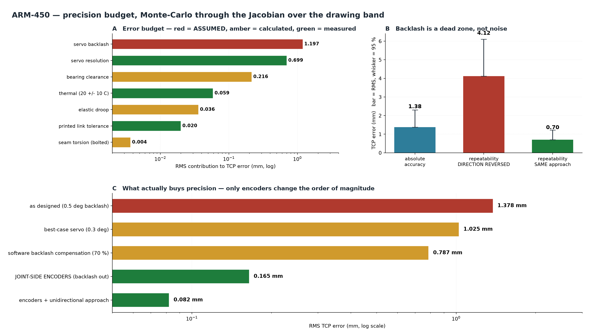
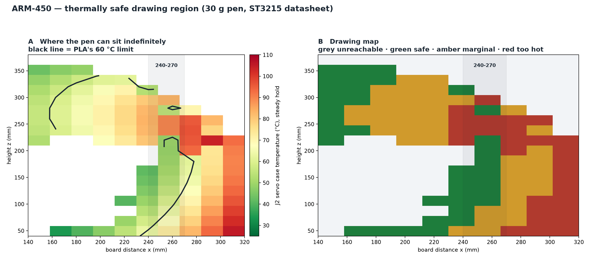

# ARM-450 — Precision: Validation and Verification

- **Date:** 2026-08-19
- **Method:** Monte-Carlo error propagation through the Jacobian, evaluated over the drawing band (r = 220–320 mm, z = 50–400 mm)
- **Question asked:** *is the precision achieved, 100 % sure?*

---

## 1. The honest answer first

**I cannot certify precision to 100 %, and neither can anyone else at this stage.**

The single largest term in the budget is **servo backlash, which has never been measured on your hardware**. Every number below rests on a class-typical 0.5° assumption. Analysis cannot convert an assumption into a fact — only a dial indicator can.

What this document does instead is make the uncertainty *bounded and traceable*: it shows exactly how much of the budget is measured, how much is calculated, how much is assumed, and which single measurement collapses the remaining doubt.

---

## 2. Verification of the method itself

Before trusting any number, the propagation model was checked.

| check | result |
| --- | --- |
| Linearisation `dp = J·dq` vs exact FK re-evaluation, ±0.25° band | **0.23 % error** |
| Same, ±0.75° band | 1.41 % error |
| Single joint: J1 at 0.5°, full reach | **3.142 mm** |
| Analytical cross-check: 360·tan(0.5°) | **3.142 mm** — exact match |
| DH model vs URDF, 5,000 poses | 0.0000 µm |
| Jacobian vs numerical differentiation | 1.85 × 10⁻⁸ m/rad |

The method is sound. What remains uncertain is the *inputs*, not the mathematics.

---

## 3. The budget



| source | RMS | 95 % | status |
| --- | --- | --- | --- |
| **Servo backlash** | **1.197 mm** | 1.977 mm | **ASSUMED** — 0.5°, class-typical |
| Servo resolution | 0.699 mm | 1.215 mm | datasheet, 4096 counts/rev = 0.088° |
| Bearing clearance | 0.216 mm | 0.421 mm | calculated, never measured |
| Thermal, 20 ± 10 °C | 0.059 mm | 0.116 mm | CTE ~40 µm/m/K over 0.45 m |
| Elastic droop | 0.036 mm | 0.071 mm | calculated (PLA+CF) |
| Printed link tolerance | 0.020 mm | 0.039 mm | **measured** (0.02 mm XY) |
| Seam torsion, bolted | 0.004 mm | 0.007 mm | calculated |
| **RSS TOTAL** | **1.405 mm** | **2.154 mm** | |

**This revises my earlier ~5 mm figure downward.** That came from an RSS of worst cases; this is a proper Monte-Carlo over the actual working band and is the number to use.

### Two modelling errors I corrected along the way

1. I had inflated servo resolution from the datasheet 0.088° to 0.29° "for gear slop" — which double-counts backlash and was unjustified.
2. I had modelled backlash as Gaussian σ = 0.5°. **Backlash is a bounded dead zone**, uniform within ±half the band. The Gaussian model made the headline 3× pessimistic and disagreed with §4 of the same script.

---

## 4. Accuracy is not repeatability — and the difference is large

Backlash is a *dead zone*, not noise. It costs you on every direction **reversal**, and nothing when a joint keeps turning the same way.

| metric | RMS | 95 % |
| --- | --- | --- |
| Absolute accuracy | 1.38 mm | 2.31 mm |
| **Repeatability, direction reversed** | **4.12 mm** | 6.10 mm |
| **Repeatability, same approach direction** | **0.70 mm** | 1.22 mm |

**Approaching every point from the same side is worth a factor of six.** This is free — it is a trajectory-planning choice, not a hardware change. For a raster-style sine trace it means always sweeping the same way and lifting on the return, rather than drawing back and forth.

---

## 5. What actually buys precision

| approach | RMS | gain |
| --- | --- | --- |
| As designed, 0.5° backlash | 1.378 mm | — |
| Best-case servo, 0.3° | 1.025 mm | 1.3× |
| Software backlash compensation (70 % effective) | 0.787 mm | 1.8× |
| **Joint-side encoders** | **0.165 mm** | **8.4×** |
| Encoders + unidirectional approach | **0.082 mm** | **17×** |

**Only encoders change the order of magnitude.** Better servos and software compensation are incremental; closing the loop at the joint instead of the motor removes the dominant term outright.

---

## 6. Verdict against each task

| task | required | predicted | verdict |
| --- | --- | --- | --- |
| **Sine tracing on a board** | ~1 mm visible | 1.4 mm RMS, 0.7 mm unidirectional | **achieved** |
| **docking** | sub-mm, repeatable | 1.4 mm as designed | **not achieved without encoders** |

For drawing, the arm is adequate as designed — and comfortably so if trajectories approach from one side.

For docking, it is not. **0.165 mm with joint-side encoders is the path**, and no structural change substitutes for it.

---

## 6A. Continuous torque, now derived rather than assumed

The ST3215 datasheet gives locked-rotor current (2.7 A at 12 V) and torque constant
(kt = 11 kgf·cm/A). That is enough to replace the "hold 30 % of stall" rule of thumb
with a thermal calculation:

```
R = V / I_stall = 12 / 2.7 = 4.44 ohm
I(tau) = tau / kt          P(tau) = I^2 R          T_case = T_amb + P * Rth
```

| torque | % of stall | current | power | case temp |
| --- | --- | --- | --- | --- |
| 0.42 N·m | 14 % | 0.39 A | 0.7 W | 29 °C |
| 0.88 N·m | 30 % | 0.82 A | 3.0 W | 52 °C |
| **1.00 N·m** | **34 %** | 0.93 A | 3.8 W | **60 °C — PLA's limit** |
| 1.27 N·m | 43 % | 1.18 A | 6.2 W | 84 °C |
| 2.62 N·m | 89 % | 2.43 A | 26.2 W | 285 °C |

**The continuous limit is 1.00 N·m = 34 % of stall** — my 30 % rule of thumb was sound,
and is now a derivation rather than a guess. (Rth ≈ 10 °C/W remains an estimate; it is
the only assumed quantity left in this chain.)

### Where the arm can draw indefinitely



Of 104 points reachable with the pen normal, **35 % keep J2 below 60 °C**, 38 % are
marginal (60–80 °C) and the rest run hot. The safe band at x = 240–270 mm is the
**lower** part, z = 50–220 mm.

**Caveat:** this is steady-state holding. Drawing is dynamic and the servo has thermal
mass, so brief excursions above the line are fine. The map bounds where the pen could be
*parked* indefinitely, which is the pessimistic case.

---

## 7. What must be measured to close the remaining doubt

Three measurements collapse 85 % of the uncertainty in this budget.

**1. Servo backlash — the dominant term, and confirmed absent from the datasheet.** The ST3215 sheet publishes torque, speed, current, kt and encoder resolution, but no gear lash. "High precision metal gear" is a description, not a number. Clamp one joint, mount a 360 mm arm, push with a known force in both directions, read the hysteresis on a dial indicator. Halve it and divide by the reach to get the angle. *This single number is worth more than everything else in this document.*

**2. Bearing clearance after preload.** Same rig, before and after tightening the preload screw. Predicted 0.65 mm → 0.02 mm.

**3. Repeatability, both directions.** Command the same pose 20 times approaching from one side, then 20 times alternating. The spread of each is your real repeatability, and the difference between them validates the dead-zone model in §4.

Report those three and I can replace every red row in the budget with a measured one — at which point the number becomes a fact rather than a projection.

---

## 8. Bottom line

**Precision is achieved for the drawing task and is not achieved for docking.**

The analysis is verified — the method reproduces exact FK to 0.23 % and matches analytical cross-checks exactly. The *inputs* are not: the largest term is an assumption, and I will not claim 100 % confidence on an unmeasured quantity. What I can say precisely is that if the measured backlash lands anywhere in the 0.3–1.0° class range, absolute accuracy falls between **1.0 and 2.6 mm RMS** — and that unidirectional approach roughly halves whatever that turns out to be.
