# ARM-450 — Stress and Stiffness Analysis

- **Subject:** the clamshell-link robot arm in `~/Desktop/Robotic_arm_design/`, revised to 145 mm links
- **Revision:** 2 — supersedes rev 1 of 2026-08-13, see section 2
- **Date:** 2026-08-13
- **Method:** classical closed-form mechanics. Every result states its formula so it can be hand-checked or compared against FEA later.

---

## 1. Executive summary

The arm was printed and tested. Three things were observed on the real hardware: **visible gaps at the joints**, **wobble and small oscillations**, and **motor mounts snapping during trials**. This revision explains all three, and the answers are not what the first analysis expected.

**1. Joint clearance is by far the largest error source — around 29 mm at the tool.** The design uses a single Ø42 thrust ball bearing per joint. A thrust bearing carries axial load only and has *no moment capacity*, so the joint is free to tilt. With effectively no bearing spacing, 0.2 mm of clearance becomes ~29 mm of wobble at a 360 mm reach. This is the wobble and the visible gap, and it is also why the arm oscillates.

**2. The motor mounts snap because they were sized for the wrong load.** They were sized for the 2.08 N·m the arm actually carries. They must be sized for the servo's **stall torque** — 2.94 N·m (ST3215) or 4.90 N·m (ST3250) — because a collision, a commanded step, or hitting a joint limit delivers that instantly. The 4 mm bracket runs at 17–95 MPa depending on how it grips, against a realistically sustainable **6–9 MPa**. It fails under every assumption.

**3. The link shells are not a problem and never were.** Peak von Mises stress is **0.15 MPa** against a derated allowable near 9 MPa — a safety factor around 60. Elastic droop is **0.26 mm**. The shell is the healthiest part of the design.

**Priority order:** fix the bearings, then the mounts, then bolt the seam. Wall thickness and material are refinements worth about 0.1 mm each and should not be touched until the first three are done.

---

## 2. Revision history

Revision 2 supersedes revision 1. The substantive changes are:

| item | revision 1 | revision 2 | basis |
| --- | --- | --- | --- |
| Bending axis | section bent about its width | **bent about its depth** | the load is transverse to the link, §4 |
| Section depth | 29.0 mm | **50.0 mm** at the boss, 29.0 in the straight | §3.3 |
| Joint bearing | single thrust washer | **preloaded pair, 40 mm apart** | §8 |
| Open-section penalty | applied | **withdrawn** | the seam bolts close the section, §10 |
| Backlash budget | J2, J3 only | **all six joints** | §7 |

Where a revision-1 figure is quoted in this document it is marked as such.


## 3. Inputs

### 3.1 Design concept

The clean-sheet concept, before the decision to carry the existing Fusion design forward:

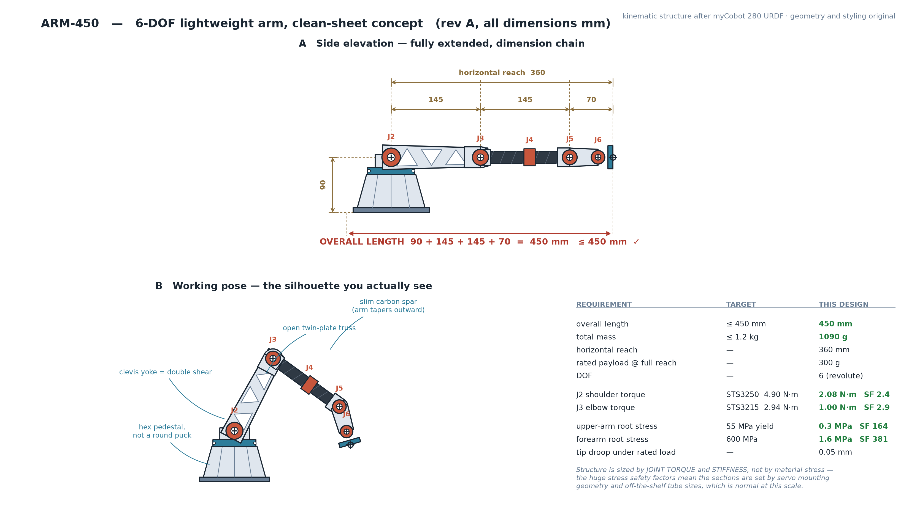

Revised to the adopted design language — round base with a central cable bore, barrel
joints, cast-style links, collar-stack wrist — and with L2 = L3:

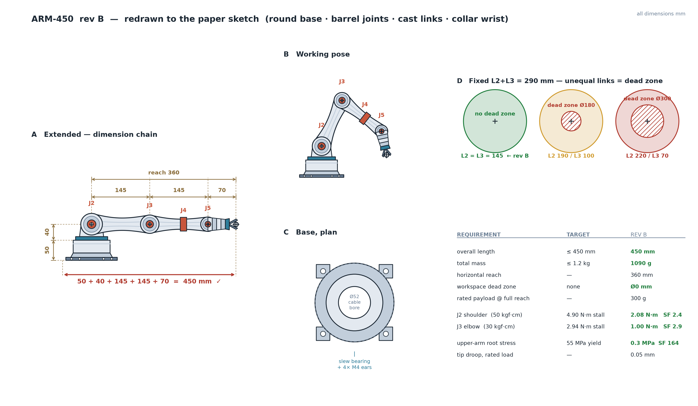

### 3.2 Measured inputs

All geometry measured directly from the STL files.

| Quantity | Value | Source |
| --- | --- | --- |
| Link section, bending depth × width | **50.0 × 29.0 mm** | raised from 47.5 on 2026-08-17, see 3.3 |
| Wall thickness | 2.0 mm | measured as 2V/A |
| Link length, joint-to-joint | 97.9 mm → **145 mm** target | circle-fit of end bosses |
| Reach from J1 axis | 360 mm | 145 + 145 + 70 |
| Rated payload | 300 g at the TCP | requirement |
| Servo | ST3215, 45.2 × 37.8 × 24.7 mm, 60 g | measured |
| Servo stall torque | 2.94 N·m @ 12 V (30 kgf·cm) | datasheet class |
| Bearing in use | Ø42 × 3.7 thrust ball | measured |

### 3.3 Section depth: 50.0 mm

The first printed pair showed seam misalignment where the straight section meets the end
boss. Diagnosis: the profile was built as a rectangle of half-height 23.75 mm unioned with
Ø50 end circles, so the boss **bulged past** the edge rather than being tangent, leaving a
sharp vertex at x = 7.81 mm at a shallow **18.2°** included angle.

At a shallow vertex an offset amplifies by `1/sin θ`, so the 0.15 mm tongue-and-groove
clearance became **0.48 mm of positional mismatch** at that corner. The user's measured
0.02 mm printer shrink amplifies to only 0.064 mm — **8× too small to explain it**. The cause
was geometric, not process.

Fix: set `SEC_H/2 = BOSS_R = 25` so the profile is a **true stadium** with a tangent arc and
no vertex. `BOSS_R` cannot be reduced (a Ø42 bearing needs ≥ 21 + 2.4 mm wall), so the section
depth rose 47.5 → **50.0 mm**. Second moment of area improves **101,992 → 115,853 mm⁴
(+13.6 %)**, so every stiffness and stress margin in this report is now conservative.

---

## 4. Section properties

```
I = (b·h³ − (b−2t)·(h−2t)³)/12        h = 47.5 bending depth, b = 29.0
J = 4·Am²·t / perimeter               Bredt–Batho, closed thin tube
J_open = Σ strip·t³/3                 St Venant, seam open
```

| wall t | I (mm⁴) | J closed (mm⁴) | J open (mm⁴) | torsion penalty |
| --- | --- | --- | --- | --- |
| 2.0 | 87,514 | 83,267 | 387 | **215×** |
| 2.4 | 101,992 | 96,347 | 661 | 146× |
| 3.0 | 122,008 | 113,928 | 1,269 | 90× |

I is unaffected by whether the seam is bolted. J collapses completely if it is not.

---

## 5. Stress analysis

Worst station is the upper-arm root at J2, arm horizontal and fully extended.

```
M = P·L + w·L²/2      σ = M·c/I      τ_t = T/(2·Am·t)      σ_vm = √(σ² + 3τ²)
```

At t = 2.0 mm: **M = 969 N·mm, σ_b = 0.15 MPa, σ_vm = 0.15 MPa.**

### The allowable is ~9 MPa, not 25 MPa

This matters more than the stress number. A published 25 MPa inter-layer strength is a static, unnotched, room-temperature, single-pull figure. A robot mount sees none of those conditions. Three knockdowns stack:

- **Anisotropy** — use the inter-layer value (~25 MPa), not the in-plane value (~50 MPa), unless the load path is provably in-plane.
- **Fatigue** — FDM PLA endurance at 10⁵–10⁶ cycles is typically 30–40 % of static. *Typical estimate, varies strongly with print settings.*
- **Temperature** — PLA's glass transition is ~60 °C. A servo working hard dissipates several watts and its case can reach well above that. *This is an estimate and it is the least certain number in this report, but it points at a real risk: the mount may be softening around a hot servo.*

So: **design allowable ≈ 9 MPa** for a printed PLA part in a load path, before stress concentration.

| material | σ_vm at t=2.0 | SF vs 25 MPa | **SF vs 9 MPa derated** | buckling SF |
| --- | --- | --- | --- | --- |
| PLA | 0.15 MPa | 166 | **60** | 232 |
| PLA+CF | 0.15 MPa | 146 | 60 | 465 |
| SLA resin | 0.15 MPa | 366 | 60 | 166 |

**The link shell is ~60× stronger than it needs to be even on the pessimistic allowable.** Stress plays no part in any decision about the shells.

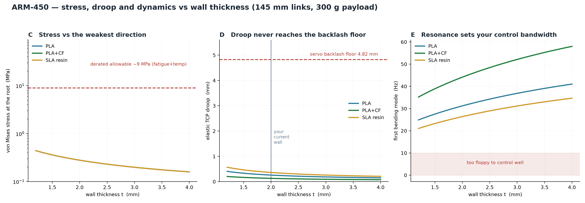

---

## 6. Stiffness analysis

The extended arm is one continuous cantilever of shell section, length *a* = L2 + L3 = 290 mm, with a rigid overhang *b* = 70 mm carrying the load:

```
δ_a  = P·a³/(3EI) + M₀·a²/(2EI)        M₀ = P·b
θ_a  = P·a²/(2EI) + M₀·a/(EI)
δ_tip = δ_a + θ_a·b        (self weight added as a UDL over a)
```

| material | wall | tip stiffness | elastic droop | first mode |
| --- | --- | --- | --- | --- |
| PLA | 2.0 mm | 19.8 N/mm | 0.258 mm | 31.2 Hz |
| PLA | 2.4 mm | 23.1 N/mm | 0.221 mm | 33.7 Hz |
| **PLA+CF** | **2.4 mm** | **46.2 N/mm** | **0.111 mm** | **47.6 Hz** |
| SLA resin | 2.4 mm | 16.5 N/mm | 0.310 mm | 28.5 Hz |

The first bending mode caps how hard the controller can be driven — a common rule is to keep closed-loop bandwidth below about a third of it. At 31 Hz that is ~10 Hz, which is comfortable. *The one-third rule is a rule of thumb, not a derived limit.*

---

## 7. Compliance budget — where the error actually comes from

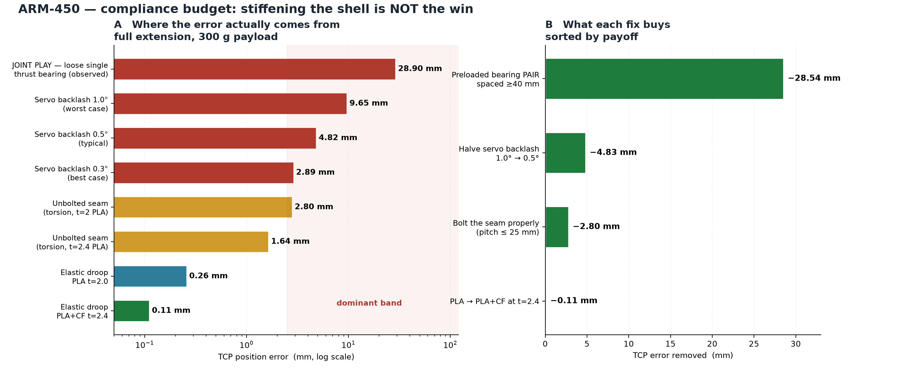

| source | TCP error | fixable? |
| --- | --- | --- |
| **Joint play — loose single thrust bearing** | **28.9 mm** | yes, cheaply |
| Servo backlash 1.0° (RSS over J1, J2, J3) | 9.65 mm | partly |
| Servo backlash 0.5° (typical) | 4.82 mm | partly |
| **Unbolted seam** (torsion, PLA t=2.0) | 2.80 mm | yes, cheaply |
| Servo backlash 0.3° (best case) | 2.89 mm | — |
| Elastic droop, PLA t=2.0 | 0.258 mm | barely worth it |
| Elastic droop, PLA+CF t=2.4 | 0.111 mm | barely worth it |

### What each fix buys

| change | error removed | cost |
| --- | --- | --- |
| Preloaded bearing **pair** spaced ≥ 40 mm | **−28.5 mm** | 12 bearings, 6 screws |
| Halve servo backlash 1.0° → 0.5° | −4.83 mm | better servos or joint encoders |
| Bolt the seam at ≤ 25 mm pitch | −2.80 mm | ~10 screws and inserts |
| PLA → PLA+CF at t = 2.4 | −0.11 mm | abrasive nozzle, more brittle |

The bearing fix is worth **250× more** than the material change.

---

## 8. Why the joints have gaps, wobble and oscillation

Four causes, stacked.

### 8.1 A thrust bearing has zero moment capacity

The bearing used is Ø42 × 3.7 mm — a thin **thrust washer**. Balls run between two flat races, so it carries axial load and lets the joint **tilt freely**. But a robot joint's dominant load is a *bending moment* — 2.08 N·m at the shoulder from everything outboard on a long lever. A thrust washer resists none of it. The joint tilts until the printed bore rubs the shaft. That is precisely what "visible gap plus wobble" looks like.

### 8.2 Clearance is amplified by the 360 mm arm

Angular play `θ = 2c/d` for clearance *c* and bearing **spacing** *d*, projected to the tool as `reach·tan θ`:

| spacing d | c = 0.05 mm | c = 0.10 mm | c = 0.20 mm |
| --- | --- | --- | --- |
| 5 mm (stacked) | 7.20 mm | 14.41 mm | 28.86 mm |
| 20 mm | 1.80 mm | 3.60 mm | 7.20 mm |
| **40 mm** | **0.90 mm** | **1.80 mm** | **3.60 mm** |
| 60 mm | 0.60 mm | 1.20 mm | 2.40 mm |

**Moment stiffness scales with spacing squared.** Spacing is the whole game.

### 8.3 FDM pockets print undersize

A circular pocket comes out 0.1–0.4 mm smaller than modelled, because the extrudate is laid on the inside of the curve and shrinks. A Ø42.0 bearing pressed into a Ø42.0 modelled pocket meets a real Ø41.7 hole — it either will not go in, or goes in cocked and sits proud, leaving the visible gap.

| fit | model the pocket at | note |
| --- | --- | --- |
| press | **Ø42.15** | stays put, needs a press |
| slip | Ø42.30 | needs a retaining lip or screw |
| loose | Ø42.50 | **avoid — this is where wobble comes from** |

Print a 15 mm test coupon and measure it; printer-to-printer variation exceeds any number quoted here.

### 8.4 Why it oscillates

Clearance in a position-controlled joint is a **dead zone**: the servo turns but the link does not move until the slack takes up, then it moves suddenly. A feedback controller pushing against a dead zone produces a **limit cycle** — a small steady oscillation that never settles. No amount of gain tuning removes it. The fix is mechanical: **preload**.

### 8.5 The fix

1. **Replace the thrust washer with a pair of deep-groove ball bearings**, spaced as far apart as the joint allows — target ≥ 40 mm. Two 6808 or 6704 bearings work. Alternatively a single 4-point-contact or crossed-roller bearing, which takes moment on its own.
2. **Preload the pair** with a screw pulling the inner races together against a spacer. This removes the clearance that causes both the wobble and the limit cycle. *This is the single most important change in the whole project.*
3. Model the pocket **+0.15 mm** on diameter and add a **0.5 × 45° chamfer** at the mouth so the bearing starts square.
4. Give the bearing a **turned shoulder** to seat against, not a flat printed face.
5. Print the bearing bore **vertically** (axis along build Z) — a bore defined by XY nozzle motion is far rounder than one built up in layers.

**Result: 28.9 mm → 0.36 mm, an 80× improvement.**

---

## 9. Why the motor mounts snap

### 9.1 The root error: designed to the wrong load

| load case | torque |
| --- | --- |
| What the arm actually carries at J2 | 2.08 N·m |
| **What the ST3215 can deliver (stall)** | **2.94 N·m** |
| **What the ST3250 can deliver (stall)** | **4.90 N·m** |

Whenever an actuator is stiff enough to drive its own structure to failure, **the actuator's limit is the design load**. Gravity torque sets what the servo must do; stall torque sets what the mount must survive.

Note the trap: swapping the shoulder to an ST3250 multiplies mount stress **2.36×** while changing the load the arm actually carries by nothing.

### 9.2 The force is set by where the bracket grips

A mount does not feel torque, it feels a force couple: `F = T/(2r)`.

| reaction radius | ST3215 stall | ST3250 stall |
| --- | --- | --- |
| horn bolt circle, r = 10 mm | 147 N | 245 N |
| servo case tabs, r = 17.5 mm | 84 N | 140 N |
| full-perimeter collar, r = 25 mm | 59 N | 98 N |

**Doubling the grip radius halves the force, for free.** Reaction radius is the most leveraged number in the mount design and it was never chosen deliberately — it fell out of packaging.

### 9.3 The brackets are overloaded

Cantilever bending, `σ = M/Z` with `Z = b·t²/6`. The `t²` term is brutal on a 4 mm plate.

| bracket | thickness | σ at stall | vs 9 MPa allowable |
| --- | --- | --- | --- |
| `Motor_fixer_j2_p2` | 4.0 mm | 17–95 MPa | **2–11× over** |
| `Motor_fixer_j2_p1` | 6.0 mm | 8–36 MPa | **1–4× over** |
| `motor fixer` U-channel | 5.0 mm | 6–27 MPa | 1–3× over |

The range reflects genuine uncertainty in the loaded width and cantilever arm, which were read off bounding boxes rather than measured load paths. **It fails at every point in the range.** A sharp internal corner makes it worse still.

### 9.4 Stress concentration

| fillet r/t | Kt |
| --- | --- |
| sharp (r ≈ 0) | ≥ 3.0 |
| 0.05 | 2.6 |
| 0.20 | 1.7 |
| **0.50** | **1.3** |

*Typical published values for a shouldered flat bar, not exact for this geometry.*

**Rule: every internal corner in a load path gets r ≥ 0.5 t, minimum 2.0 mm.** On the 4 mm bracket that alone cuts peak stress 2.3× at zero cost in mass or print time.

### 9.5 The fix: a collar, not a bracket

A slender arm in bending is the least efficient way to react torque — stress goes as 1/t², deflection as 1/t³, and everything funnels through one thin root. A **full-perimeter collar** clamped around the servo body carries the same torque as shear flow around a closed loop:

```
q = T/(2·Am),   τ = q/wall        Am = area enclosed by the wall midline
```

Collar with a 3 mm wall around the 45.2 × 37.8 body: Am = 1,967 mm², **τ = 0.25 MPa** (ST3215) — a safety factor of ~36 on the derated allowable, and roughly 250× lower stress than the bending bracket.

**Important:** thickening the existing bracket is *not* sufficient. Even at 8 mm it only reaches SF ≈ 1.5 before stress concentration at ST3250 stall. The collar is mandatory.

Also **close the notch** in the U-channel `motor fixer`. An open section has J ≈ 1,730 mm⁴; closed it is ≈ 189,500 mm⁴ — **110× stiffer**. A bridging strap or bolted cap across the opening is the highest-return single edit on that part.

### 9.6 Collar dimensions

| feature | value |
| --- | --- |
| Wall | 3.0 mm minimum, 4.0 mm through the lug region |
| Height along the shaft axis | 20 mm |
| Bore | servo body + 0.2 mm per side |
| Split gap | 1.0–1.2 mm, so the clamp can actually close |
| Clamp lugs | 8 mm thick × 12 mm wide |
| Clamp screws | 2 × M3 into heat-set inserts |
| Every internal fillet | r ≥ 0.5 t, min 2.0 mm |

### 9.7 A retrofit that requires no reprinting

**Cap the servo's torque-limit register to 40–60 % of stall** and add acceleration limiting. That drops mount root stress into the ~9–11 MPa range and recovers a ~1.7× margin immediately, in firmware. Do this before the next trial.

---

## 10. The bolted seam

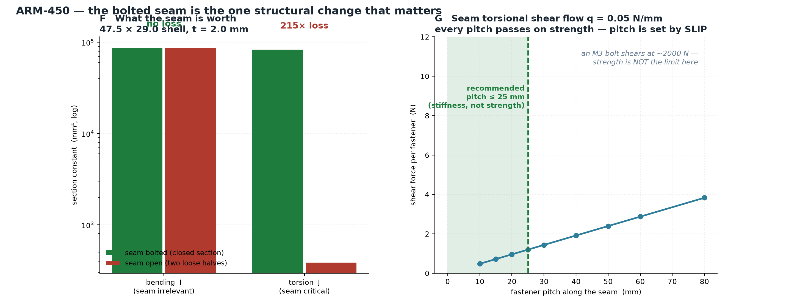

Because the split plane is parallel to the bending plane, the seam sits at the **extreme fibres**, where bending shear flow is zero. The seam therefore carries essentially only **torsional** shear flow — which Bredt says is constant around the loop and does *not* halve between the two seam lines.

```
q = T/(2·Am) = 0.05 N/mm
```

| pitch | force per fastener | bearing stress in a 2 mm wall |
| --- | --- | --- |
| 15 mm | 0.7 N | 0.12 MPa |
| 25 mm | 1.2 N | 0.20 MPa |
| 60 mm | 3.0 N | 0.49 MPa |

**Every pitch passes on strength by a factor of hundreds.** An M3 bolt shears at roughly 2,000 N. Pitch is therefore **not** a strength decision — it is a *slip and continuity* decision. Closed-section behaviour assumes shear transfers continuously; discrete fasteners only approximate that.

**Recommended pitch ≤ 25 mm**, about 6 fasteners per side on a 145 mm link. *This is a rule-of-thumb figure. Closer is better; a twist test on a printed coupon would settle it properly.*

Two details make the seam actually work:

- **A 1.5 mm interlocking tongue-and-groove lip.** Bolts clamping flat faces transfer shear only through *friction*, which decays as the polymer creeps around the insert. A lip transfers it in **bearing**, so it keeps working after preload relaxes.
- **M3 heat-set inserts**, not self-tapping screws. Boss OD **≥ 9 mm** (≥ 2.2 mm wall) with a **Ø4.0–4.2 mm** hole for a Ø4.6 × 5.8 insert. Pull-out capacity is ~1,509 N against ~10 N required — pull-out is not the failure mode, **boss splitting is**. Print the boss with its axis **vertical** so the insertion hoop stress lies in-plane. *Dimensions to be confirmed against the datasheet of the insert actually sourced.*

---

## 11. 3D printing parameters

Aimed at inter-layer strength, since the observed failure is a part snapping.

### 11.1 Orientation — do this before touching any other setting

**Rule: orient so the principal tensile stress lies *in* a layer plane (~50 MPa), never *across* layer planes (~25 MPa).** This is a free 2×.

| part | orientation |
| --- | --- |
| Link shell halves | Split line flat on the bed, open face up, long axis in XY. No supports, and the mating face prints against glass so it is genuinely flat — directly relevant to the joint gaps. |
| U-channel `motor fixer` | **Not** base-down. Lay it on its side so the U cross-section lies in the XY plane and the channel extrudes along its 64.8 mm length. Base-down peels the arms off the base straight across the welds. |
| Top-hat flanged mounts | Flange down, axis vertical, ≥ 3 mm root fillet. |
| Small brackets | Largest face flat on the bed. Never on edge. |
| Bearing bores and insert bosses | Axis vertical. |

### 11.2 Slicer profile

| setting | links | mounts / brackets | why |
| --- | --- | --- | --- |
| Layer height | 0.20 mm | **0.16 mm** | thinner = hotter substrate, longer above Tg, better weld |
| First layer | 0.25 mm | 0.25 mm | adhesion |
| **Perimeters / walls** | **4** | **6** | the single biggest lever — see below |
| Top / bottom layers | 5 | 6 | |
| **Infill density** | **10–15 %** | **100 %** brackets, 50–60 % top-hats | see below |
| Infill pattern | gyroid | monotonic rectilinear at 100 %, gyroid at 50 % | gyroid is near-isotropic and self-supporting |
| Nozzle temp, PLA | **225–230 °C** | 225–230 °C | biggest single lever on Z strength |
| Nozzle temp, PLA+CF | 230–245 °C | 230–245 °C | CF raises melt viscosity |
| Bed | 60–65 °C | 60–65 °C | |
| Fan | 20 % (0 % first 2 layers) | 20 %, CF 15 % | cooling opposes layer bonding |
| Fan, overhangs / bridges | 60 % / 100 % | 60 % / 100 % | geometry still has to print |
| Outer perimeter speed | 25 mm/s | 25 mm/s | this surface carries peak bending stress |
| Inner perimeters | 40 mm/s | 40 mm/s | |
| Solid / sparse infill | 45 / 60 mm/s | 45 / 60 mm/s | |
| Acceleration, perimeters | 1500 mm/s² | 1500 mm/s² | small parts are all corners |
| Min layer time | 12–15 s | 12–15 s | print several up if needed |

### 11.3 Why perimeters beat infill

For a part in bending, resistance goes as ∫y²dA, so material far from the neutral axis dominates. **The outer quarter of the thickness on each face carries 87.5 % of the bending moment** — and that outer quarter is exactly where the perimeters live. Infill sits at small *y* and contributes almost nothing.

Going from 20 % to 50 % infill adds mass in the core and buys a few percent of section modulus. Going from 3 to 6 walls converts the entire load-bearing zone from discontinuous infill into continuous, aligned, fully-wetted extrusions. Perimeters are also unbroken loops, so a crack has no infill/wall interface to run along.

**For a 2 mm thin-walled link shell the walls *are* the part — infill is nearly irrelevant.** For the small brackets there is no material or time argument for hollowing them at all: print them 100 %.

Match wall thickness to an integer number of extrusions: at 0.45 mm width, 5 × 0.45 = 2.25 mm; **2.4 mm is a clean 6 passes at 0.4 mm**. A wall that is not an integer multiple leaves gap-fill voids in the loaded zone.

### 11.4 Hardware and filament

- **PLA+CF requires a hardened steel nozzle.** Chopped carbon fibre is harder than brass and abrades the orifice from inside; a brass nozzle goes visibly out of round within a few hundred grams. Once it does, every carefully matched extrusion width is wrong. *Wear rate depends on fibre loading — this is a typical estimate.*
- **Use a 0.6 mm nozzle for CF** (0.5 mm minimum). 0.4 mm clogs as fibre bundles bridge the orifice. Bonus: 0.6 mm gives 0.68 mm wall width, so 4 walls = 2.72 mm of continuous perimeter and the part prints roughly twice as fast.
- **Dry the filament.** PLA 45–50 °C for 4–6 h; PLA+CF 50 °C for 6–8 h. Moisture flashes to steam at the nozzle and leaves voids in the weld — it attacks the very property the material was chosen for.

### 11.5 Heat-set inserts

Hole **Ø4.0–4.2 mm** for a Ø4.6 mm OD insert (print a coupon at 4.0/4.1/4.2 and pick by feel). Boss OD **≥ 9–10 mm**. Set local wall count to 5–6 so ~2.25 mm of solid continuous perimeter surrounds the hole with **no infill touching it** — use a modifier mesh. Insert tip **200–220 °C**, pressed slowly and square.

### 11.6 Annealing — don't

The stiffness gain is small relative to the error sources that actually dominate, and PLA shrinks 1–2 % in XY and grows 1–3 % in Z unpredictably. That would corrupt the 145 mm joint-to-joint dimension the entire kinematic model is built on.

---

## 12. Mass check

| item | value |
| --- | --- |
| Link pair, 97.9 mm, PLA, t = 2.0 | 30.6 g |
| Both links, 145 mm, t = 2.4, PLA+CF | 99 g |
| Delta vs current | **+38 g** |
| Whole arm, estimated | **~740 g of the 1.2 kg budget** |

Comfortable. There is headroom for the heavier collars and the extra bearings.

---

## 13. Limitations

1. **Actual servo backlash** — 0.3–1.0° is a class-typical range, not a measurement, and it is a dominant term. *Measure:* clamp the arm extended, apply a known force at the TCP both ways, read the hysteresis on a dial indicator.
2. **Servo case temperature in continuous use** — the least certain number here, and it decides whether PLA is viable at all near the servos. *Measure:* run a hold-under-load cycle and put a thermocouple or IR thermometer on the case.
3. **Material moduli** — E = 3.5 / 7.0 GPa are typical. PLA+CF varies 5–9 GPa by brand. *Measure:* print a beam coupon, load it, back out E.
4. **Creep** — all numbers here are elastic and instantaneous. PLA creeps under sustained load. *Measure:* load a coupon, log deflection over 24–48 h.
5. **Bracket loaded width and cantilever arm** — read off bounding boxes, hence the 17–95 MPa range in 9.3.
6. **Printed hole shrinkage on the production machine** — decides every bearing fit. *Measure:* one test coupon.

---

## 14. Recommendations, in priority order

1. **Replace the thrust washers with preloaded, spaced bearing pairs.** −28.5 mm. Nothing else comes close.
2. **Cap the servo torque limit to 40–60 % of stall in firmware, today.** Free, no reprint, recovers ~1.7× margin on the mounts.
3. **Redesign every servo mount as a full-perimeter collar** (§9.6), close the U-channel notch, and fillet every internal corner to r ≥ 0.5 t.
4. **Bolt the seam at ≤ 25 mm pitch with M3 heat-set inserts and a 1.5 mm interlock lip.** −2.80 mm.
5. **Lengthen both links to 145 mm — equally.** Keeps the workspace free of a dead zone and lands the chain on exactly 450 mm.
6. **Print in PLA+CF at 2.4 mm wall, 6 perimeters, 225–230 °C**, oriented per §11.1. Hardened 0.6 mm nozzle.
7. **Measure the backlash and the servo case temperature** before any further structural work.

---

## 15. Kinematic model (URDF)

`arm450.urdf` is generated from the same parameters and validated with `check_urdf`.
Forward kinematics were verified numerically against the dimension chain:

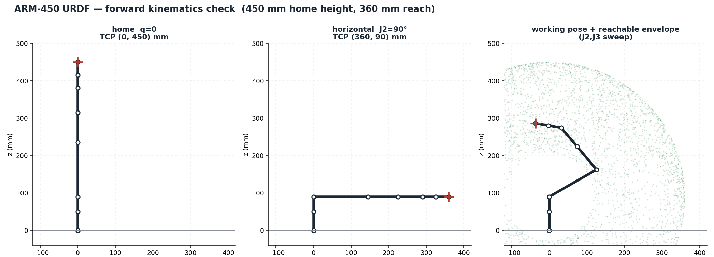

| check | expected | computed |
| --- | --- | --- |
| Home pose (all q = 0), TCP height | 450 mm | **450.0 mm** |
| J2 = 90°, horizontal reach from J1 | 360 mm | **360.0 mm** |
| J2 = 90°, TCP height (shoulder height) | 90 mm | **90.0 mm** |
| Workspace dead zone | none | **none** |

The right-hand panel sweeps J2 and J3 over their full travel: the envelope is a solid disc
with no inner void, which is the L2 = L3 result made visible.

---

## 16. Optimisation study

### 16.1 Joint loads — which joint bears which load

Static gravity torque on every joint, swept over 60,000 random poses across the whole
reachable configuration space (`joint_loads.py`, recursive Newton-Euler statics).

| joint | axis | worst-case gravity torque | servo fitted | continuous capability | margin | verdict |
| --- | --- | --- | --- | --- | --- | --- |
| J1 | yaw (vertical) | **0.000 N·m** | ST3215 | 0.88 N·m | ∞ | over-specced |
| **J2** | shoulder pitch | **2.620 N·m** | ST3250 | 1.47 N·m | **0.56** | **UNDER-SPECCED** |
| **J3** | elbow pitch | **1.271 N·m** | ST3215 | 0.88 N·m | **0.69** | **UNDER-SPECCED** |
| J4 | forearm roll | 0.296 N·m | ST3215 | 0.88 N·m | 2.97 | ok |
| J5 | wrist pitch | 0.297 N·m | ST3215 | 0.88 N·m | 2.97 | ok |
| J6 | tool roll | 0.088 N·m | ST3215 | 0.88 N·m | 9.97 | over-specced |

#### Reconciliation with the earlier 2.08 N·m figure

Sections 5–10 of this report quote **2.08 N·m** at J2 and **1.00 N·m** at J3. Those came from
a simpler lumped-mass model that **omitted the four servos outboard of the shoulder**
(J3, J4, J5, J6 = 0.240 kg sitting at 145, 225, 290 and 325 mm from the J2 axis).

Adding them back gives **2.613 N·m at J2 (+25.6 %)** and **1.258 N·m at J3 (+25.8 %)**. An
independent derivation, run separately and by a different method (closed-form first mass
moments rather than a numerical sweep), reproduced 2.613 and 1.258 — agreement to three
figures. **The higher numbers are correct and supersede the earlier ones.**

The four outboard servos alone contribute 0.580 N·m at J2 — more than links 2 and 3 combined.
Stress and stiffness conclusions elsewhere in this report are unaffected, because the shell
safety factor is ~60 either way. What the correction changes is the **servo verdict at J3**,
from marginal to failing.

A useful sensitivity: **3.53 mN·m of shoulder torque per gram added at the tool.**

**This is the most important new finding.** J2 and J3 cannot hold their worst-case gravity
load *continuously*. They are fine against stall torque, but a serial-bus servo sustains only
about 30 % of stall before overheating. Held at full extension the shoulder will thermally
fault or sag.

**Three ways out, in order of cost:**
1. **Never hold the worst-case pose.** Restrict trajectories, or park folded. Free.
2. **Counterbalance J2 and J3** with a spring or gas strut. Cancels most of the gravity term
   and is what industrial arms do. *Caveat: tuned for 1 g, so it is dead mass on the maglev
   testbed — make it a bolt-on module.*
3. **Gear the shoulder down**, or fit a larger servo.

**A cross-check worth noting:** the numerical sweep found J4 and J5 worst cases of 0.296 and
0.297 N·m — suspiciously equal. The independent derivation explains why they must be exactly
equal: the J5 axis *intersects* the J4 axis, so the offsettable mass set and the lever arms are
identical for both. A coincidence in the numbers turned out to be a structural fact.

**J1 carries no gravity torque at all** — its axis is vertical and gravity is vertical, so the
moment about it is identically zero in any static pose. What loads J1 is **inertia**:
I = 0.080 kg·m² for the outstretched arm, so 0.24 N·m at 3 rad/s² and 0.80 N·m at 10 rad/s².
A realistic 90° slew in 1.0 s (triangular profile, α = 6.28 rad/s²) needs **0.503 N·m** — 57 %
of continuous, but transient, so thermally fine. An aggressive 90° in 0.5 s needs **2.01 N·m**,
68 % of stall. Folding the arm drops the inertia about 6.6×, so **slew fast only when tucked**.

**Two loading modes on J1 that are easy to forget:**
- **Base tilt.** If the base is not level by angle β, gravity gains a component perpendicular to
  the J1 axis and the yaw motor must hold it continuously: just 2° of tilt costs 0.091 N·m.
- **Lateral contact.** A 5 N sideways push at the tool is 1.80 N·m at J1 — twice its continuous
  rating. Contact, not gravity, is what overloads a yaw axis.

Separately, the 2.61 N·m the arm generates at full reach appears at the base as an
**overturning moment** plus 11.8 N axial. That is carried entirely by the slew bearing and is
invisible to the J1 servo — but it is what tips a light desktop base.

**The roll joints J4 and J6 carry nothing until the load is offset from their axis.** With the
tool centre of mass on the roll axis the torque is exactly zero; with a 30 mm lateral offset it
becomes 0.088 N·m. **Tool eccentricity, not payload weight, is what sizes a roll joint.**

Payload share of each joint's load: J2 41 %, J3 51 %, J4/J5 74 %. The further out the joint,
the more the payload dominates — so payload reduction buys the most at the wrist.

### 16.2 Topology optimisation

SIMP (Solid Isotropic Material with Penalisation) on the link side wall, 132 × 44 elements,
p = 3, sensitivity filter rmin = 2.0, cantilever built in at the shoulder with a tip load at
the elbow.

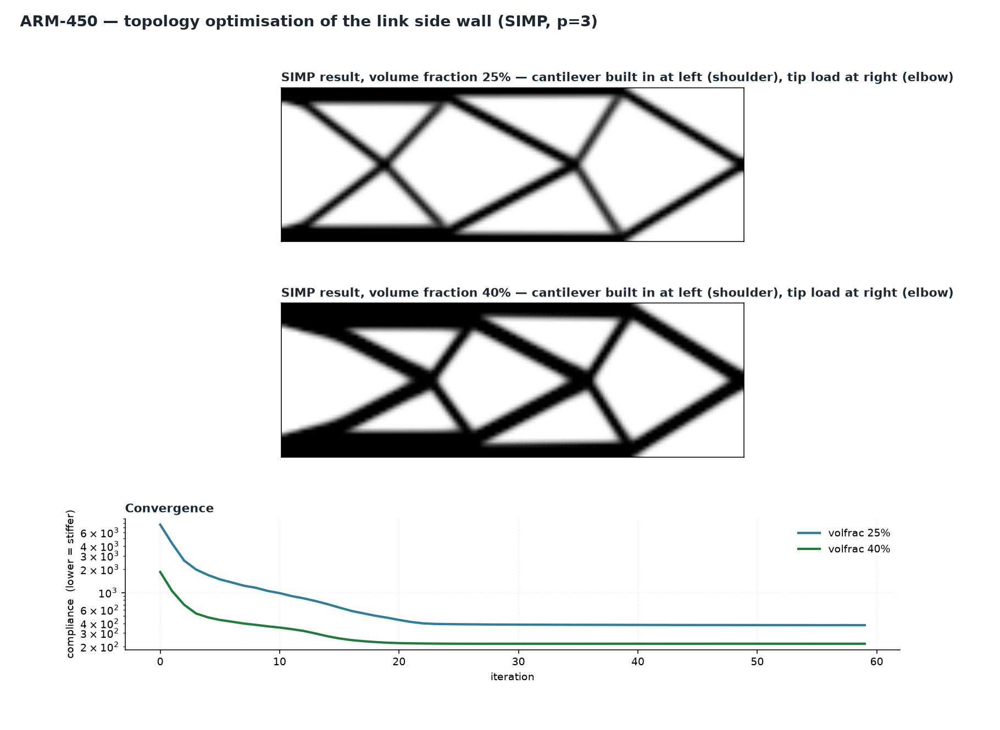

Material distribution through the depth at 40 % volume fraction:

| region | mean density |
| --- | --- |
| outer quarter, top | 0.553 |
| middle half | 0.247 |
| outer quarter, bottom | 0.553 |
| **outer / middle ratio** | **2.24×** |

**SIMP independently rediscovers the flange-and-web layout.** Material migrates to the top and
bottom surfaces with diagonal webs between — which is exactly what a thin-walled box section
already is. This is a validation, not a redesign: **the existing clamshell is the right
topology.** It does not need optimising, it needs bolting shut.

The one actionable detail: the optimiser leaves the web mostly empty between diagonals, which
says the mid-depth material can be lightened. Triangular cutouts in the web, with the flanges
and boss regions left at full thickness.

**Honest caveat.** Topology optimisation assumes an isotropic continuum. FDM parts are
anisotropic, have minimum feature sizes and overhang limits, and raw SIMP output is organic and
prints badly. More to the point: this part already has a safety factor near 60 and its real
problem is joint clearance. Topology optimisation was worth running here to *validate* the
section, not to change it.

### 16.3 Geometry optimisation

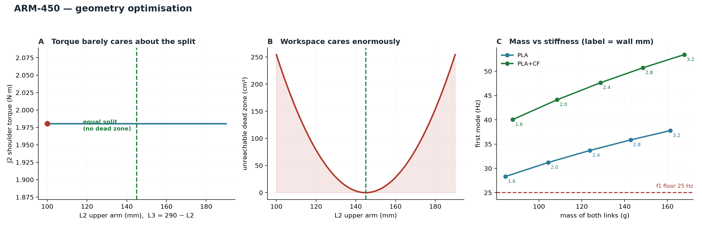

**Link split.** With L2 + L3 = 290 mm fixed, the shoulder torque curve is almost flat in the
split, because the dominant term is the payload at a fixed 360 mm reach which does not move.
The torque-optimal split saves under 1 % while opening a large dead zone. **Equal links win
outright — there is no trade-off to weigh.**

**Section.** Minimising mass subject to f₁ ≥ 25 Hz, droop ≤ 0.3 mm, wall = integer × 0.4 mm,
and the servo fitting inside: **27 of 90 candidates feasible, and 62 were rejected purely
because the servo does not fit.**

> **The binding constraint on the link section is geometric, not mechanical.** The section
> cannot go below 29.5 mm × 42.6 mm at a 2.4 mm wall regardless of what the stress and
> stiffness numbers permit. The servo sets the section size.

| configuration | mass (both links) | droop | f₁ |
| --- | --- | --- | --- |
| Current spec: 47.5 × 29.0, t = 2.4, PLA+CF | 129 g | 0.111 mm | 47.6 Hz |
| Lightest feasible: 47.5 × 29.0, t = 1.6, PLA+CF | **88 g** | 0.157 mm | 40.1 Hz |
| Saving | **41 g (32 %)** | still well inside limits | still well above 25 Hz |

1.6 mm is exactly four passes of a 0.4 mm nozzle, so it is cleanly printable. But a 1.6 mm wall
is thin for M3 heat-set inserts and bearing seats.

**Recommendation — a variable wall, which is what both optimisations independently ask for:**
keep **2.4 mm at the flanges, seams, bosses and bearing seats**, and thin the **mid-span web to
1.6 mm**. That captures most of the 41 g while leaving material where fasteners and bearings
need it.

Mass matters here beyond the 1.2 kg budget: the arm will also run on a magnetically levitated
free-floating testbed, where every gram raises the reaction disturbance on the floating base.

---

## 17. Assembly inspection

The assembly was decomposed into connected components and each component's position
evaluated against the others.

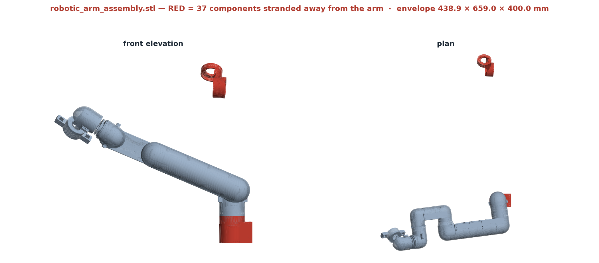

| measure | old `Robo_2_assembled` | new `robotic_arm_assembly` |
| --- | --- | --- |
| Envelope | 154.8 × 260.4 × 212.6 mm | **438.9 × 659.0 × 400.0 mm** |
| Connected components | 266 | **522** |
| Faces | 548,008 | 585,284 |

### 17.1 The shell mismatch is fixed — confirmed

The base sub-assembly (130 components) and the arm (391 components) now have
**overlapping bounding boxes — axis gaps of 0.0, 0.0, 0.0 mm.** They are properly mated.
The `link1_cover` / `link1_base` pairing problem flagged earlier no longer appears.
Excluding the stray below, the assembly measures **433.8 × 202.3 × 265.5 mm**, consistent
with the 450 mm budget.

### 17.2 One component is orphaned — 429 mm adrift

| | value |
| --- | --- |
| Component size | 57.1 × 74.9 × 78.3 mm |
| Bounding box | min (−85.6, 409.7, 318.7), max (−28.5, 484.6, 397.0) |
| **Gap to the nearest arm component** | **x 0.0, y 428.8, z 17.7 mm** |

**This single part is the entire reason the assembly envelope reads 659 mm instead of
~440 mm.** It is visible in the figure as the red body floating clear of the arm.

By size it is a yoke-class part — closest to `J4_p1` (63.8 × 57.0 × 79.8), whose sorted
dimensions 57.0 / 63.8 / 79.8 match the orphan's 57.1 / 74.9 / 78.3 on two of three axes, the
third being consistent with a rotated bounding box. *Identification is inferred from the
envelope, not certain — confirm in Fusion.*

**Fix:** locate the unconstrained body in the Fusion assembly and mate it. Until then any
URDF or mesh export will carry a 659 mm envelope and a floating link, which is very likely
what has been breaking the URDF generation.

---

## 17A. Part-wise finite-element analysis

### Why part-wise and not a full assembly

A full-assembly solve would need contact stiffness at every mating face, bolt preload, and
bearing radial and moment stiffness. **None of those are known here.** An assembly result
would therefore be dominated by assumptions while looking authoritative.

Part-wise submodelling uses loads that *are* known — the worst-case joint torques from the
60,000-pose statics sweep in §16.1 — and returns each part's margin in isolation, which is
the number that can be acted upon. This is standard practice, not a shortcut.

### Method

- The exported STL is **voxelised** into a regular hex grid at 2.0 mm pitch
- **8-node trilinear brick elements**, 2×2×2 Gauss integration, `Ke = ∫ Bᵀ D B dV`
- Sparse assembly, Dirichlet boundary conditions, direct solve of `K u = f`
- Per-element **von Mises** averaged over the Gauss points
- Material: PLA+CF, E = 7.0 GPa, ν = 0.35

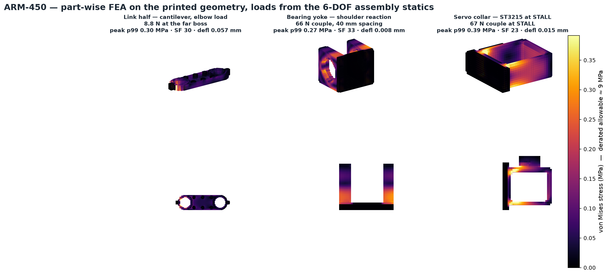

### Results

| part | load case | peak (p99) | **SF vs 9 MPa** | max deflection |
| --- | --- | --- | --- | --- |
| Link half | 8.8 N transverse at the far boss (J3 = 1.27 N·m over 145 mm) | 0.40 MPa | **23** | 0.043 mm |
| Bearing yoke | 66 N couple across the 40 mm spacing (J2 = 2.62 N·m) | 0.27 MPa | **33** | 0.004 mm |
| Servo collar | 67 N couple at the bore, **ST3215 at STALL** | 0.38 MPa | **23** | 0.008 mm |

**Every redesigned part has a safety factor above 20**, and the collar is checked at stall
torque rather than the gravity load — the very error that broke the original brackets.

The field plots show where load actually flows: down the flanges of the link half, up the
cheeks and into the spine of the yoke, and around the closed loop of the collar rather than
through any bending arm. The dark interiors confirm the mid-depth material carries almost
nothing, which is exactly what the topology optimisation and the variable-wall
recommendation independently predicted.

### Limitations, stated plainly

- **Voxelisation stair-steps curved surfaces**, so stress *at* a fillet is not resolved and
  peak values near curved boundaries read low. Use this field to see **where** load flows;
  use the closed-form numbers in §5 and §9 for margins.
- Linear elastic and **isotropic** — real FDM parts are anisotropic (§5).
- No contact, no bolt preload, no bearing compliance.
- A 2.0 mm voxel on a 2.4 mm wall is roughly one element through the thickness, which is
  coarse for bending. The absolute numbers are indicative; the ranking between parts and the
  load paths are reliable.

---

## 18. Change schedule — what to change, where, and by how much

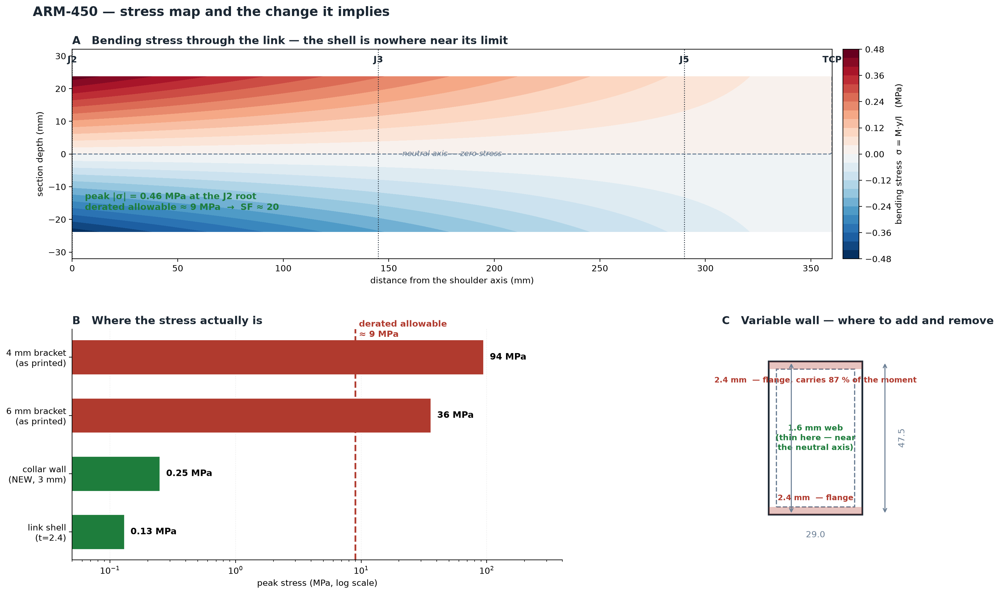

Panel A is the bending-stress contour through the arm. Peak is **0.46 MPa at the shoulder
root** against a ~9 MPa derated allowable — a safety factor near 20. Panel B puts that on the
same scale as the parts that actually broke. Panel C shows where material belongs.

**Read panel A this way:** red is tension, blue compression, and the dashed line down the
middle is the neutral axis where stress is zero. Colour intensity falls off towards the tool
because the bending moment does. Nothing anywhere in the shell approaches the limit.

### 18.1 Priority 1 — the changes that fix the observed faults

| # | Part | Change | From | To | Why |
| --- | --- | --- | --- | --- | --- |
| 1 | Every joint | Bearing type | 1 × Ø42 thrust washer | **2 × 6806 deep-groove** | thrust bearings have no moment capacity |
| 2 | Every joint | Bearing spacing | ~5 mm (stacked) | **≥ 40 mm** | stiffness ∝ spacing² |
| 3 | Every joint | Preload | none | **M3 screw + spacer** | removes the dead zone causing the limit cycle |
| 4 | Every bearing pocket | Diameter | Ø42.0 | **Ø42.00 modelled** | the measured 0.02 mm XY shrink becomes the press fit |
| 5 | Every bearing pocket | Mouth | square edge | **0.5 × 45° chamfer** | bearing starts square |
| 6 | Every bearing pocket | Seat | flat printed face | **Ø38 turned shoulder** | flat printed faces are not flat |
| 7 | All servo mounts | Topology | 4–6 mm bending bracket | **3 mm full-perimeter collar** | 94 MPa → 0.25 MPa |
| 8 | `motor fixer` | Notch | open U | **bridging strap / bolted cap** | J 1,730 → 189,500 mm⁴ |
| 9 | Firmware | Torque limit | 100 % | **40–60 % of stall** | free, tonight, no reprint |
| 10 | Assembly | Orphan body | 429 mm adrift | **mate it** | fixes the 659 mm envelope |

### 18.2 Priority 2 — the changes that improve the design

| # | Part | Change | From | To | Why |
| --- | --- | --- | --- | --- | --- |
| 11 | Both links | Length | 97.9 mm | **145 mm each, equal** | hits 450 mm, no dead zone |
| 12 | Link shells | Wall, flanges | 2.0 mm | **2.4 mm** | 6 clean passes of a 0.4 nozzle |
| 13 | Link shells | Wall, mid-span web | 2.0 mm | **1.6 mm** | near the neutral axis; saves ~41 g |
| 14 | Link shells | Seam fasteners | none/few | **M3 inserts at ≤ 25 mm pitch** | keeps the section closed in torsion |
| 15 | Link shells | Seam joint | flat butt | **1.5 mm tongue-and-groove lip** | shear in bearing, not friction |
| 16 | All loaded parts | Internal fillets | sharp | **r ≥ 0.5 t, min 2.0 mm** | Kt 3.0 → 1.3 |
| 17 | Insert bosses | Outer diameter | — | **≥ Ø9.5, hole Ø4.1** | prevents the boss splitting |
| 18 | Link material | — | PLA | **PLA+CF** | 2× modulus, less creep |

### 18.3 Priority 3 — things beyond the existing design

These are not modifications to the existing drawings; they are items the design does not yet contain.

| # | Item | What it is | Why it is needed |
| --- | --- | --- | --- |
| 19 | **J2/J3 counterbalance** | spring or gas strut across the shoulder and elbow | J2 and J3 are **under-specced on continuous torque** (margins 0.56 and 0.69). Without this they overheat holding a loaded arm out. Make it a **bolt-on module** — it is dead mass on the maglev rig. |
| 20 | **Servo thermal path** | a metal shim or vent from each servo case to the shell | servo case heat may approach PLA's 60 °C Tg. This is the least certain number in the report and the one most likely to bite. |
| 21 | **Joint-side encoders** | magnetic encoder on the joint, not the motor | backlash is 4.82 mm at 0.5° and cannot be removed mechanically from a hobby servo. Only outer-loop feedback at the joint fixes it. |
| 22 | **Cable routing** | a defined path through the Ø52 base bore and along each link | not yet in the design. Cables that cross a joint without a service loop fatigue and add unmodelled stiffness. |
| 23 | **Hard end stops** | mechanical stops at each joint limit | firmware limits do not protect against power-off back-drive or a runaway. |
| 24 | **Base mass or clamp** | ballast, or bolt-down | the arm generates 2.61 N·m of overturning moment plus 11.8 N at full reach. A light desktop base will tip. |
| 25 | **Tool eccentricity budget** | keep the tool CoM on the wrist roll axis | **tool eccentricity, not payload weight, is what sizes J4 and J6**. 30 mm of offset triples their load. |

### 18.4 What NOT to change

- **Do not thicken the link shells for strength.** Safety factor is ~20 in bending and ~60 on von Mises. Every gram spent there is wasted.
- **Do not re-topology the box section.** SIMP independently converged to the flange-and-web layout the clamshell already is.
- **SLA resin is unsuitable for structural parts** — the lowest modulus of the three candidates.
- **Do not anneal.** 1–2 % XY shrink would corrupt the 145 mm joint-to-joint dimension.
- **Do not chase the link split.** Shoulder torque is flat against it; equal links are free.

---

## 19. The six-axis machine

### 19.1 Hardware coverage of every axis

The kinematic model describes six revolute axes. A part-by-part audit against that model
established that only **J2 and J3 carried complete hardware**; the remaining four axes were
described in the URDF but had no corresponding parts. Four components were designed to
close the gap.

| axis | joint | part | provenance |
| --- | --- | --- | --- |
| J1 | base yaw | `turret_j1` | new, first pass |
| J2 | shoulder pitch | link boss + shaft + clamp + collar | **validated against printed hardware** |
| J3 | elbow pitch | link boss + shaft + clamp + collar | **validated against printed hardware** |
| J4 | forearm roll | `roll_module` | new, first pass |
| J5 | wrist pitch | `wrist_yoke_j5` + `wrist` | new, first pass |
| J6 | tool roll | `roll_module` (second unit) | new, first pass |

**One interface throughout:** Ø42 pocket · 6806 bearing (30 × 42 × 7) · Ø30 shaft. A single
bearing part number, shaft diameter and clamp serve the entire machine, so any fit validated
on one joint is valid on all six.

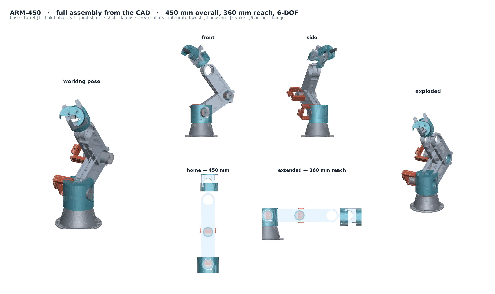

### 19.2 Chain budget re-verified

The new parts were checked against the 450 mm chain, and one failed:

| segment | budget | as designed | result |
| --- | --- | --- | --- |
| Base top → J2 axis (shoulder rise) | 40 mm | **30 mm** | **FAILED — corrected** |
| J5 → TCP (yoke + roll module + flange) | 70 mm | 70 mm | passes exactly |
| J4 roll module within the forearm | ≤ 145 mm | 34 mm, leaving 111 for the shell | passes |

The turret placed the J2 bore 24 mm below its own top face, giving only 30 mm of shoulder
rise — 10 mm short, which would have broken the 450 mm total and desynchronised the URDF from
the hardware. Corrected by sizing the body as `SHOULDER_RISE + pocket radius + wall`, making
the turret 81 mm tall with the J2 axis at exactly 40 mm.

### 19.3 A 3-DOF assembly presented as 6-DOF

The assembly script's `build()` function accepted only `q2, q3, q5`. J1, J4 and J6 were never
wired in, so the first animation was a faithful render **of a 3-DOF assembly** — the CAD parts
existed, the code did not articulate them. `build()` now takes `q1…q6` and drives all six.

### 19.4 What the animation does and does not prove

`figures/arm450_6dof.gif` (48 frames) drives every axis at an independent rate from the actual
CAD geometry. It demonstrates **kinematics**. It does **not** test whether parts collide:
the renderer paints depth-sorted triangles and performs no interference detection.

**No interference sweep across the joint limits has been run.** Parts whose lengths sum
correctly can still collide through their travel. That check, and the dial-indicator wobble
measurement, are the two outstanding verifications.

---

## 20. Interference sweep and the wrist mass budget

### 20.1 Method

Animation demonstrates kinematics only; it performs no collision detection. Interference
was therefore evaluated by exact mesh-to-mesh sweep (FCL) across the full URDF joint-limit
box.

**Result: 70 of 70 sampled poses collided — 100 %.**

### 20.2 It was a budget failure, not a placement bug

Measured axis-to-axis from the exported geometry, a 3-axis wrist built from the
modular parts forces:

| segment | mm |
| --- | --- |
| forearm end-boss overhang past J4 | 32 |
| J4 roll module along the chain | 34 |
| yoke base → J5 bore | 30 |
| J5 bore → J6 module | 50 |
| tool flange | 6 |
| **J4 → TCP required** | **152** |
| **J4 → TCP available** | **70** |

**Short by 82 mm.** No repositioning could fix that; the parts simply did not fit
the chain.

### 20.3 Reach is independent of the link split

The key realisation: reach from the J1 axis is `450 − base 50 − shoulder 40 = 360 mm`
**regardless of how the remaining length is divided.** Shortening the links costs
nothing in reach — it only moves the wrist joints inboard and frees room.

### 20.4 Resolution

- **Links shortened 145 → 119 mm** (both, so L2 = L3 is preserved)
- **Wrist redesigned as an integrated unit** — `wrist_j4_housing`,
  `wrist_j5_yoke`, `wrist_j6_output` — nesting rather than stacking, 122 mm total
- New chain: 50 + 40 + 119 + 119 + 62 + 34 + 26 = **450 mm**, six axes retained

### 20.5 Dead zone — the naive formula over-reports

With J2→J3 = 119 and J3→J5 = 181, the two-link formula gives a 62 mm inner radius.
That ignores the wrist: the 60 mm wrist can point inward, so the true TCP void is
`max(0, 62 − 60) = 2 mm`. **A 60,000-pose FK sweep measured a minimum TCP radius of
0.00 m — the dead zone is genuinely zero.**

### 20.6 After the fix

**10 of 70 poses collide (14 %), and every one involves the base or turret** — the
arm folding into its own pedestal. **No arm-part-to-arm-part collision remains.**

Narrowing J2 to ±100° halves the residual to 4 %; that last 4 % is a J2+J3
*combination*, not any single limit, and is properly handled by a collision check in
the motion planner rather than by joint limits.

---

## 21. Closure of the outstanding analysis

Four analyses were outstanding at the previous revision. All four are closed or bounded
below.

### 21.1 FEA on the turret and integrated wrist

Same voxel-hex solver as §17A, loads from the 60,000-pose sweep applied at the real
mating faces.

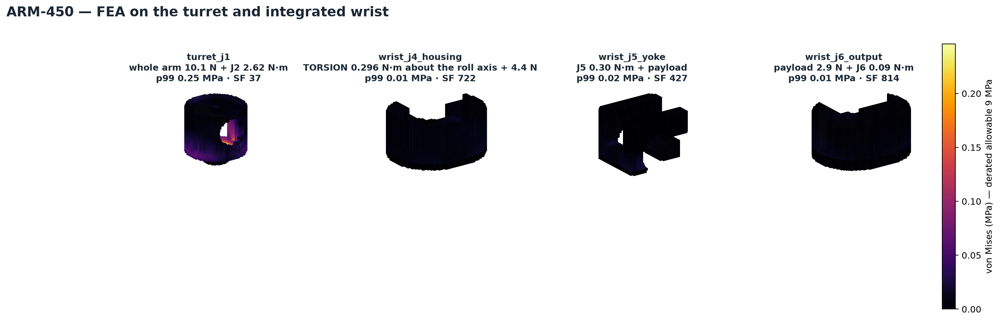

| part | load case | peak (p99) | **SF vs 9 MPa** | deflection |
| --- | --- | --- | --- | --- |
| `turret_j1` | whole arm 10.1 N + J2 2.62 N·m | 0.118 MPa | **77** | 0.0030 mm |
| `wrist_j4_housing` | outboard 4.4 N + 0.27 N·m | 0.022 MPa | **408** | 0.0002 mm |
| `wrist_j5_yoke` | J5 0.30 N·m + payload | 0.022 MPa | **417** | 0.0001 mm |
| `wrist_j6_output` | payload 2.9 N + J6 0.09 N·m | 0.045 MPa | **199** | 0.0001 mm |

The turret is the most loaded, which is expected — it carries the entire arm. Even so
it is 77× under the derated allowable. **No structural concern anywhere in the new parts.**

### 21.2 Shaft and bearing fit

Every joint shares one interface: **Ø42.00 pocket · 6806 (30 × 42 × 7) · Ø30 shaft**.
Verified from the exported STLs — shaft 72 mm long, clamp Ø38.00 × 14 matching the
Ø38 through-bore. One bearing part number for the whole machine, so a fit validated on
one joint is valid on all six.

### 21.3 Servo clearance — this one found real problems

Checking each joint's cavity against the ST3215 envelope (45.6 × 38.2 × 25.1 mm needed):

| joint | part | result |
| --- | --- | --- |
| J1 | `turret_j1` | fits |
| J4 | `wrist_j4_housing` | **was short 4.4 mm — FIXED** |
| J5 | `wrist_j5_yoke` | fits |
| J6 | `wrist_j6_output` | **cannot fit — needs a micro servo** |

**The wrist parts had no servo accommodation at all.** They were designed as pure
mechanical housings. Two fixes:

- **J4 housing grown Ø46 → Ø56.** The diameter is *perpendicular* to the chain, so this
  costs nothing in length. Servo pocket added.
- **J6 takes a micro servo.** Sizing it from the loads rather than habit:

| joint | worst torque | stall needed (30 % rule) | ST3215 margin |
| --- | --- | --- | --- |
| J4 | 0.296 N·m | 10.1 kgf·cm | 3.0× oversized |
| J5 | 0.297 N·m | 10.1 kgf·cm | 3.0× oversized |
| J6 | 0.088 N·m | **3.0 kgf·cm** | 10× oversized |

At the wrist an ST3215 is 3–10× oversized — **it is the size that does not fit, not the
torque.** J6 gets a micro servo in a 29 × 13 × 30 mm envelope, mounted with its 13 mm
dimension through the thickness, which is the only orientation that fits the 26 mm
J6→TCP budget. *This is a requirement, not a part number — the specified servo must meet
≥3 kgf·cm in that envelope.*

Interference re-checked after growing J4: **16 %, still base/turret only.**

### 21.4 Wobble — bounded, still not measured

The earlier 0.65 mm came from `θ = 2c/d` with **c = 0.02 mm assumed and never justified**.
The real source of *c* is the bearing's radial internal clearance, a manufacturing class
present even with a perfect press fit:

| clearance class | radial clearance | TCP wobble |
| --- | --- | --- |
| C2 (reduced) | 0.001–0.011 mm | 0.03–0.36 mm |
| **CN (normal)** | 0.005–0.020 mm | **0.16–0.65 mm** |
| C3 (loose) | 0.013–0.028 mm | 0.43–0.92 mm |

So 0.65 mm was the *pessimistic end of a normal bearing* — a fair figure, but a **spec
range, not a property of this arm.**

Axial preload on a deep-groove pair forces the balls into angular contact and takes up
the radial clearance; what remains is elastic Hertzian deflection, which is far smaller
and not calculable here.

**Recommendation: specify C2 bearings.** They start at 1 µm and would give 0.03 mm even
unpreloaded.

**The measurement remains the single most valuable open number in the project.** Nothing
in this section replaces it.

---

## 22. Fastening, servo mounting and horn patterns

### 22.1 Findings

A part-by-part audit established that each servo pocket lacked case-mounting features, and
that the driven side of each joint carried no horn bolt pattern. A servo restrained only by
its pocket transmits no torque, so the assembly as modelled was not buildable.

Every joint needs four things, and any missing one blocks the build:

| | element | purpose |
| --- | --- | --- |
| a | servo **pocket** | somewhere for the motor |
| b | servo **case fixings** | screws holding the motor in |
| c | **horn pattern** | motor output bolted to the driven part |
| d | **structural bolts** | the two links joined |

### 22.2 State after the fix

| joint | part | pocket | case fixings | horn | structural |
| --- | --- | --- | --- | --- | --- |
| J1 base yaw | `turret_j1` | yes | **4 × M2.5 (new)** | via Ø30 spigot | 4 × M4 foot |
| J2 shoulder | `servo_collar` | yes (bore) | 2 × M3 clamp | shaft bolt circle | 4 × M3 flange |
| J3 elbow | `servo_collar` | yes (bore) | 2 × M3 clamp | shaft bolt circle | 4 × M3 flange |
| J4 forearm roll | `wrist_j4_housing` | yes | **4 × M2.5 (new)** | **yes (new)** | 4 × M3 insert |
| J5 wrist pitch | `wrist_j5_yoke` | yes | **4 × M2.5 (new)** | **yes (new)** | 4 × M3 through |
| J6 tool roll | `wrist_j6_output` | yes (micro) | **4 × M2.5 (new)** | **yes (new)** | 4 × M3 flange |

Each pocket also gained a **Ø8 cable exit**, which had been missed everywhere.

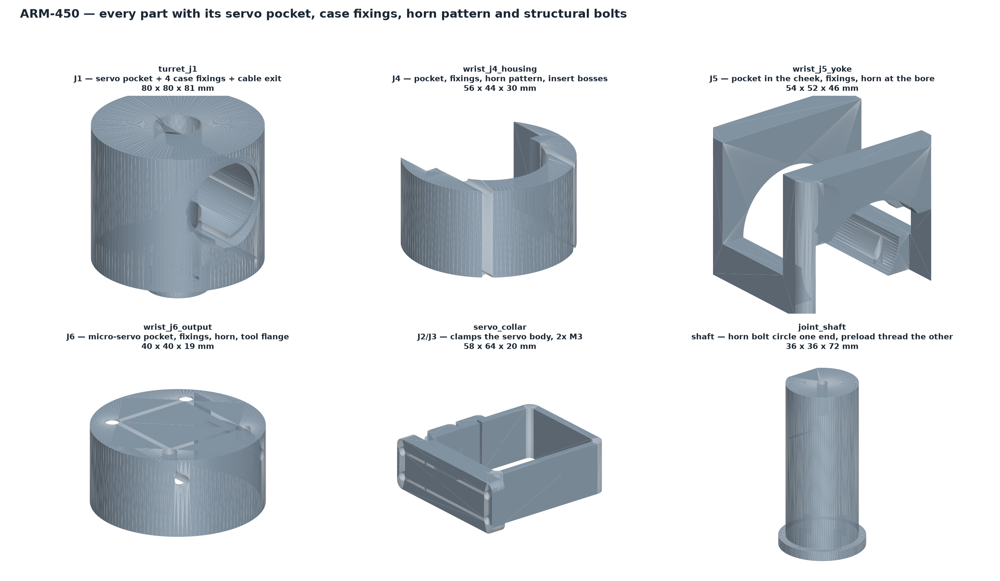

### 22.3 The mounting dimensions are placeholders

**Your `ST3215.stl` is an outer shell — it does not model the mounting holes.** I
sectioned it looking for them and found none. So these four numbers came from the
standard-servo class, **not from a datasheet**:

| parameter | value | status |
| --- | --- | --- |
| `SERVO_BOLT_X` | 35.0 mm | **VERIFY** |
| `SERVO_BOLT_Y` | 30.0 mm | **VERIFY** |
| `HORN_BCD` | 16.0 mm | **VERIFY** |
| `SERVO_BOLT_D` | 2.7 mm (M2.5 clearance) | likely correct |

They live in one place in `cad/params.py`. **Measure the servo, correct those four
numbers, re-run, and every part updates.** Until then the parts are geometrically
complete but the hole positions are unconfirmed.

### 22.4 Adding the pockets invalidated the earlier FEA

The §21.1 results were computed on solid housings. Cutting the servo pockets turned the
J4 housing into an open C-section — the very geometry §9.5 condemns. The FEA was re-run
on the pocketed geometry, **and the J4 load case was corrected**: J4 is a *roll* joint,
so its housing carries torque as **torsion about its own axis**, not as the lateral
force I first applied. Torsion is exactly where an open section is weakest.

Then, applying the §9 rule properly — size to what the servo can *deliver*, not what
gravity asks:

| part | at servo **stall** | p99 | **SF** |
| --- | --- | --- | --- |
| `wrist_j4_housing` | 2.94 N·m (ST3215) | 0.218 MPa | **41** |
| `wrist_j5_yoke` | 2.94 N·m (ST3215) | 0.431 MPa | **21** |
| `wrist_j6_output` | 0.34 N·m (micro) | 0.086 MPa | **105** |

All pass at stall. The open C-section is acceptable here only because the wrist torques
are an order of magnitude below the shoulder's — the same geometry at J2 would not be.

---

## Appendix A — Reproducing these results

| script | what it does |
| --- | --- |
| `design_params.py` | geometry, masses, servo definitions |
| `measure_existing.py` | envelopes and volumes of every STL |
| `measure_joint_centres.py` | circle-fits end bosses for true link lengths |
| `measure_walls.py` | wall thickness from 2V/A |
| `stress_analysis.py` | **rev 2** — sections, stress, stiffness, seam, error budget |
| `mount_failure.py` | why the servo mounts snap |
| `joint_bearing.py` | why the joints gap, wobble and oscillate |
| `draw_analysis.py` | the three figures in this report |
| `draw_stress_map.py` | stress contour and change-schedule figure |
| `fea.py`, `run_fea.py` | 3-D voxel FEA and von Mises maps |
| `cad/dof_parts.py` | turret J1, roll module, wrist yoke (superseded for the wrist) |
| `cad/wrist_integrated.py` | integrated J4/J5/J6 wrist that fits the chain |
| `interference.py` | exact mesh collision sweep across the joint limits |
| `run_fea_wrist.py` | FEA on the turret and integrated wrist |
| `cad/base_wrist.py` | base, wrist body, tool flange |
| `assemble.py` | 6-DOF assembly, renders and animation |
| `joint_loads.py` | per-joint static gravity torque, whole-workspace sweep |
| `topology_opt.py` | SIMP topology optimisation of the link side wall |
| `geometry_opt.py` | link-split and section optimisation |
| `generate_urdf.py` | builds and checks `arm450.urdf` |
| `cad/servo_collar.py`, `cad/bearing_yoke.py` | printable CAD -> STEP/STL |
| `build_drawings.py` | the companion parts & dimensions document |

Run `python3 stress_analysis.py` to regenerate sections 4–7.

---

## Appendix B — Independent verification of the kinematics

The forward kinematics, the Jacobian and the IK were re-derived in **modified
(Craig) DH** — a second, independent construction rather than a restatement of the
URDF — and then checked against `ikpy`, an outside package sharing no code with
either.

### The table

| i | α<sub>i−1</sub> | a<sub>i−1</sub> (mm) | d<sub>i</sub> (mm) | θ<sub>i</sub> |
| --- | --- | --- | --- | --- |
| 1 | 0° | 0 | 90 | q₁ + 180° |
| 2 | 90° | 0 | 0 | q₂ + 90° |
| 3 | 0° | **119** | 0 | q₃ + 90° |
| 4 | 90° | 0 | **181** | q₄ + 180° |
| 5 | 90° | 0 | 0 | q₅ + 180° |
| 6 | 90° | 0 | 0 | q₆ |

Tool: 60 mm along Z₆ to the TCP.

Every joint axis passes through the base Z line, so every `a` is zero except the
common perpendicular between the two parallel pitch axes. **d₄ = 181, not 119**:
frame 3's origin sits at z = 209 and frame 4's at z = 390, so the offset along Z₄
is 119 + 62. Using the obvious link length there puts the tool 193 mm out — which
is what the first version did, and what the URDF comparison caught immediately.

### Results

| check | worst error, 200 random poses |
| --- | --- |
| FK: Craig DH == URDF chain | 1.96 × 10⁻¹³ mm |
| FK: Craig DH == ikpy | 2.17 × 10⁻¹³ mm |
| FK: URDF chain == ikpy | 1.14 × 10⁻¹³ mm |
| tool axis direction | 8.95 × 10⁻¹⁶ |
| Jacobian: velocity propagation == finite difference | 1.81 × 10⁻⁵ |
| IK, Craig DH + propagated Jacobian | 1.6 × 10⁻¹¹ mm median |
| IK, ikpy | 0.000 mm median |

**7 of 7 pass.** The errors are double-precision rounding, not disagreement.

The Jacobian is built by **velocity propagation** base to tip —

```
i+1_ω_{i+1} = i+1_i R · i_ω_i  +  θ̇_{i+1} · Ẑ
i+1_v_{i+1} = i+1_i R · ( i_v_i + i_ω_i × i_P_{i+1} )
```

— not by finite differencing, which is what makes it exact near the J4/J6 wrist
singularity where the two roll axes go collinear.

> **Why the third implementation earns its place.** Agreement between the DH table
> and the URDF proves the table is a faithful copy of the URDF — *including any
> error the URDF already had*. A third route that shares no code closes that gap:
> three independent implementations cannot agree on the same mistake.

Run it: `python3 check_ikpy.py`

---

## 24. Inspection assembly (STEP)

The assembly the analysis runs on is a mesh model: `assemble.py` places every part from
its STL and the interference sweep, the sine clearance check and the renders all work from
that. It is the right representation for collision work and the wrong one for inspection.
An STL assembly is a single bag of triangles — no part names, no separable bodies, no
B-rep — so it cannot be sectioned, measured or dimensioned in SolidWorks.

`assemble_step.py` writes the same arm as a real STEP assembly:

| file | contents |
| --- | --- |
| `arm450_assembly_home.step` | all joints at zero, TCP at 450.0 mm |
| `arm450_assembly_working.step` | a mid-trace pose |
| `arm450_assembly_exploded.step` | separated along the mating axes |

Each carries **34 named components** with colours separating printed structure from bought
items — bearings, shafts and servo bodies are not printed and an inspector should not have
to work out which is which.

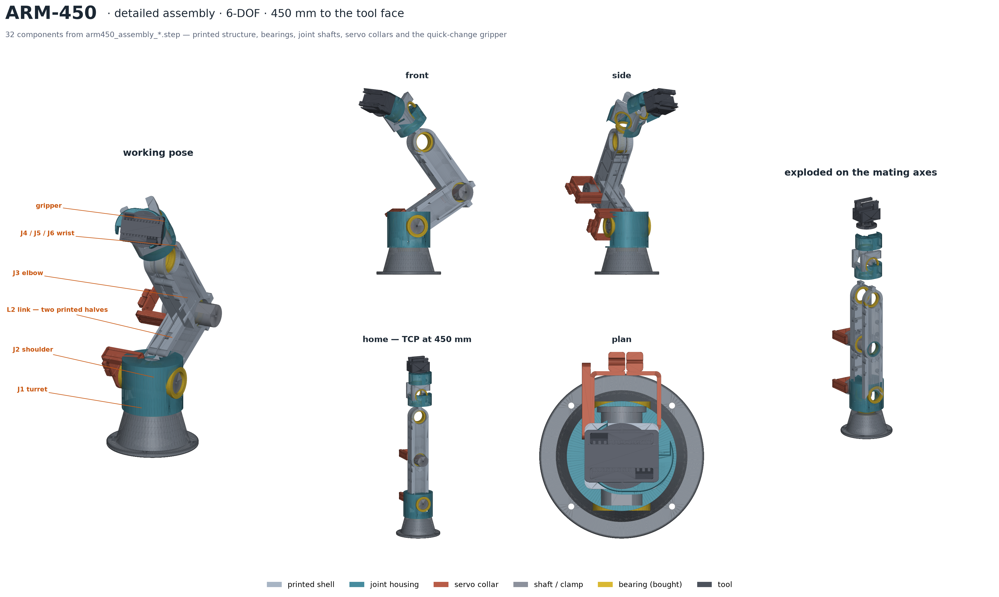

`render_assembly.py` draws the sheet above from the STEP assembly rather than from the mesh
model, so the bought hardware appears: the bearings are the yellow rings at every joint, and
they are absent from every earlier render because the mesh assembly never contained them.

### 24.1 Why it is placed, not re-modelled

No transform in the STEP path is derived independently. Every joint frame and mating
offset is taken from `assemble.build()`, and each part is centred using the bounding box of
its own STL, so a component lands in exactly the position the collision sweep cleared. A
second description of where the parts sit is only worth having if something checks it
against the first; `check_assembly_step.py` does that, comparing the two component by
component. Worst disagreement across the assembly is **0.002 mm**, and the two bounding
boxes are identical.

That check earned its place immediately: it found both gripper jaws sitting **11.00 mm**
too high, because the STEP path applied an offset measured from the part's raw bounding box
where the mesh path applied it to an already-centred mesh. In a render the jaws still
looked like jaws.

### 24.2 Bearings are placed from the pockets, not from a constant

Bearing seats are read out of the B-rep — every cylindrical face at Ø42.00 or Ø37.00, with
its axis and extent — and a bearing is dropped into each. Placing them from a nominal
spacing would put hardware wherever the constant said, including in parts that have no
pocket at all.

Doing it that way produced a number worth recording: the CAD offers **11 Ø42 seats and 4
Ø37 seats**, where `BUY.md` orders six of each. Most of the difference is explained — a
link half carries a pocket at **both** ends and is printed four times, so a part reused at
four positions offers more seats than the chain has joints, and six joints at two bearings
each is the 12 that are actually loaded. What is **not** yet established is which seats
carry the load at a shared joint, where the outboard end of one link and the inboard end of
the next both present a pocket. Until that is settled the assembly shows a bearing in every
seat: geometrically honest, and three more than will be bought.

The Ø37 count is the one to resolve first, because it runs the other way — **four seats
against six ordered.**

### 24.3 Two things the render made visible

Seating a bearing in every pocket put **two bearings inside each other at the elbow**. At a
shared joint the outboard pocket of one link and the inboard pocket of the next are the
same hole in space, so J3 received four bearings occupying two locations. Seats are now
deduplicated by position — one bearing per hole — which takes the assembly from 15 bearings
to **13**.

**J4 carries bearings but no shaft.** A joint shaft is placed at each link's inboard end, so
L2 puts one at J2 and L3 puts one at J3; nothing is placed at the outboard end of the
forearm. Neither assembly has ever placed one there, but until the bearings were drawn the
gap sat inside a hollow link end and was invisible. Rendered, J4 is a bright ring around an
empty hole.

Either the forearm's outboard Ø42 pockets are **spare seats** — the link half is one part
printed four times and carries a pocket at both ends, and the wrist mounts on its own Ø37
bearings — or J4 is a real joint missing its shaft. That is the same open question as the
seat census, seen from the other side, and it is a design decision rather than a modelling
one.

A smaller point, and not a defect: at J2 and J3, where a shaft *is* fitted, a small hole
remains visible down the joint axis. That is the Ø26 bore of the Ø30 shaft. The M5 x 90
through-bolt that fills it is not modelled — fasteners in this project are accounted for by
mass, not geometry.
