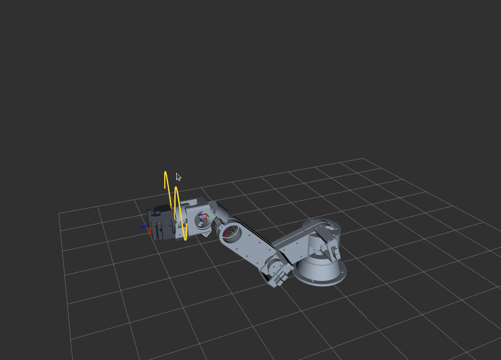
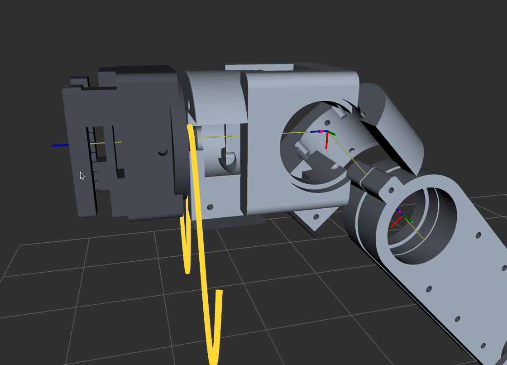
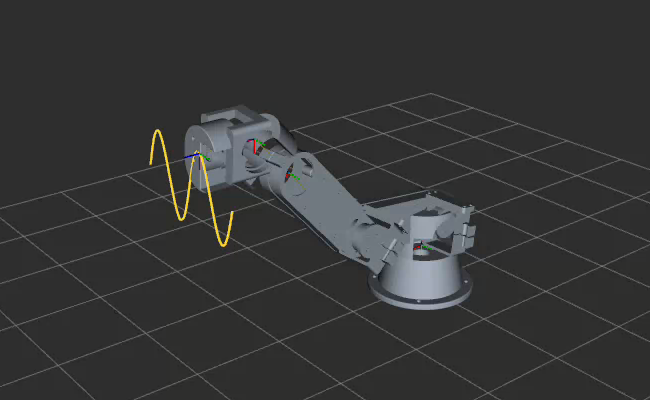

# ARM-450 — Running the Simulation

**ROS 2 Jazzy · workspace `~/ros2_ws` · packages `arm450_description`, `arm450_sine`**

Everything here is a terminal command. Copy them as they are.

---

## 1. One-time setup

Do this once per machine, or after any change to the CAD parameters, the URDF, or the
node source.

```bash
cd ~/ros2_ws
source /opt/ros/jazzy/setup.bash
colcon build --packages-select arm450_description arm450_sine
```

Expected output ends with:

```
Summary: 2 packages finished [1.20s]
```

The `R_sine` / `Rsine` naming warnings are harmless — those are other packages in the
workspace and are not being built here.

---

## 2. Source the workspace

**Every new terminal needs these two lines.** This is the single most common reason a
command "is not found".

```bash
source /opt/ros/jazzy/setup.bash
source ~/ros2_ws/install/setup.bash
```

To stop typing it, append both lines to `~/.bashrc`.

---

## 2A. Aliases — skip the typing

Install once:

```bash
echo 'source ~/ros2_ws/arm450_design/arm450_aliases.sh' >> ~/.bashrc
source ~/.bashrc
```

Then `a450help` prints the whole list at any time. 21 aliases and 6 functions — every one
of them run and checked on 2026-08-22.

**`ARM450_COMMANDS.pdf` is the full command reference** — every alias, every raw ROS 2
equivalent, and a troubleshooting table. It is generated from `arm450_aliases.sh` and
`plan_sine.py --help` by `make_commands.py`, so it cannot drift from what your shell
actually does. Rebuild it with:

```bash
python3 make_commands.py && python3 build_pdf.py COMMANDS.md
```

| alias | does |
| --- | --- |
| `a450src` | source ROS 2 Jazzy + this workspace |
| `a450build` | colcon build both packages, then source |
| `a450cd` | cd to the design directory |
| `a450run` | **launch the sine trace in RViz** |
| `a450jog` | RViz + joint sliders, no motion |
| `a450stop` | **stop all ARM-450 nodes** |
| `a450speed 60` | set playback to 60 Hz, live |
| `a450slow` / `a450normal` / `a450fast` | 8 / 25 / 75 Hz |
| `a450rate` | show current rate |
| `a450plan …` | re-solve the trajectory |
| `a450cycles4` / `a450cycles6` | re-solve at 4 / 6 cycles |
| `a450reset` | back to the shipped default |
| `a450joints` / `a450hz` | inspect the running sim |
| `a450tip` / `a450tcp` | live pose of the tool tip / the J6 flange |
| `a450tool gripper\|dock\|none` | swap the fitted end effector and rebuild |
| `a450wrist` | RViz with the camera on the wrist |
| `a450flight` | the full 8-stage pre-print check |
| `a450unsnap` | fix rviz2 in a VS Code snap terminal |
| `a450nodes` / `a450params` | list nodes / node parameters |
| `a450urdf` | regenerate the URDF from `cad/params.py` and install it |
| `a450gate` | run the 55-check pre-print gate |
| `a450cad` | rebuild every CAD part (STEP + STL) |
| `a450docs` / `a450open` | list the PDFs / open the output folder |

`a450stop` names each executable individually on purpose — see §4.


---

## 3. Run the sine simulation

```bash
ros2 launch arm450_sine sine.launch.py
```

That one command starts three nodes together:

| node | what it does |
| --- | --- |
| `robot_state_publisher` | reads the URDF, publishes the TF tree |
| `sine_node` | replays the 240 pre-solved waypoints on `/joint_states` |
| `rviz2` | opens the viewer with the saved ARM-450 config |

RViz opens showing the arm tracing the sine wave on a vertical board at x = 260 mm,
40 mm amplitude, 140 mm span. The traced path is drawn as a green marker line.

Expected console output:

```
[sine_node]: loaded 240 waypoints from /home/user/ros2_ws/src/arm450_sine/sine_traj.npz
[sine_node]: tracing: board x=260 mm, amplitude 40 mm, span 140 mm
```

### Changing what it traces

```bash
ros2 launch arm450_sine sine.launch.py traj_file:=/path/to/other.npz
```

Or run the node directly with parameters:

```bash
ros2 run arm450_sine sine_node --ros-args \
  -p traj_file:=$HOME/ros2_ws/src/arm450_sine/sine_traj.npz \
  -p rate:=25.0
```

| parameter | default | meaning |
| --- | --- | --- |
| `traj_file` | `~/ros2_ws/src/arm450_sine/sine_traj.npz` | pre-solved trajectory |
| `loop_mode` | `pingpong` | `pingpong` retraces back and forth; `wrap` jumps end-to-start |
| `approach_time` | 3.0 | seconds to ease from the start pose to waypoint 0 |
| `start_pose` | all zeros | where the arm is before the approach begins |
| `rate` | 25.0 | playback Hz |
| `board_x` | 0.26 | board distance, m (display only) |
| `amplitude` | 0.04 | sine amplitude, m (display only) |
| `length` | 0.14 | span, m (display only) |

`board_x`, `amplitude` and `length` label the display. To actually change the traced
shape, re-solve it:

```bash
cd ~/ros2_ws/arm450_design
python3 plan_sine.py
cp sine_traj.npz ../src/arm450_sine/
```

---

## 3A. Changing the SPEED — live, no restart

Playback rate is a live ROS parameter. Change it while the sim is running, from a
second terminal:

```bash
ros2 param set /arm450_sine rate 60.0     # or: a450speed 60
ros2 param get /arm450_sine rate          # or: a450rate
```

The node confirms in its own console:

```
[arm450_sine]: rate -> 60.0 Hz (4.0 s per pass)
```

| rate | one full pass | use for |
| --- | --- | --- |
| 8 Hz | 30 s | watching the wrist closely, `a450slow` |
| **25 Hz** | **9.6 s** | **the default**, `a450normal` |
| 60 Hz | 4.0 s | brisk demo |
| 75 Hz | 3.2 s | fastest still-smooth, `a450fast` |

Accepted range is 0.5–500 Hz; anything outside is rejected with a reason rather than
silently ignored.

Rate can also be set at launch:

```bash
ros2 run arm450_sine sine_node --ros-args \
  -p traj_file:=$HOME/ros2_ws/src/arm450_sine/sine_traj.npz -p rate:=50.0
```

> **Speed is playback only.** It changes how fast the solved waypoints are replayed,
> not the trajectory. The 240 waypoints are fixed; 75 Hz simply steps through them
> faster. On the real servos, playback rate would become a genuine velocity command and
> the ST3215's 4.6 rad/s no-load speed becomes the ceiling.

---

## 3B. Changing the SHAPE — amplitude, cycles, span

These are **not** live parameters. The node replays a pre-solved file and does no IK —
a least-squares solve per waypoint would block the ROS executor. So changing the shape
means re-solving, then relaunching:

```bash
cd ~/ros2_ws/arm450_design
python3 plan_sine.py --amplitude 0.04 --cycles 4 --points 300
# or:  a450plan --amplitude 0.04 --cycles 4 --points 300
a450stop && a450run
```

| flag | default | meaning |
| --- | --- | --- |
| `--amplitude` | 0.04 | sine amplitude, m |
| `--cycles` | 2.0 | number of full cycles across the span |
| `--span` | 0.14 | trace length along the board, m |
| `--board-x` | 0.30 | board distance from the base, m |
| `--z-center` | 0.20 | trace centre height, m |
| `--points` | 240 | waypoints; more = smoother, slower to solve |
| `--out` | `~/ros2_ws/src/arm450_sine/sine_traj.npz` | where to write |

`plan_sine.py` prints the achieved accuracy every time, so you always know what you got:

```
SINE TRAJECTORY  board x=300 mm, amp 40 mm, span 140 mm, 4 cycles, z 200 mm, 240 waypoints
  position error   rms  0.190 mm   max  1.295 mm
  pen tilt         rms  0.205 deg  max  1.430 deg
  largest joint step between waypoints: 2.05 deg (smooth)
```

### The operating envelope — measured, not guessed

**Cycles are free. Amplitude is not.** Every row below was solved and measured:

| amplitude | cycles | rms error | pen tilt | max joint step | verdict |
| --- | --- | --- | --- | --- | --- |
| **40 mm** | **2** | **0.193 mm** | **1.43°** | **2.07°** | **shipped default** |
| 40 mm | 3 | 0.188 mm | 1.43° | 2.06° | good |
| 40 mm | 4 | 0.190 mm | 1.43° | 2.05° | good |
| 40 mm | 6 (360 pts) | 0.189 mm | 1.43° | 2.11° | good |
| 40 mm | 8 (480 pts) | 0.189 mm | 1.43° | 2.13° | good |
| 50 mm | 2 | 1.347 mm | 4.86° | 2.55° | degraded |
| 60 mm | 2 | 2.826 mm | 8.68° | 3.61° | degraded |

**Rule: keep `--amplitude 0.04`, raise `--cycles` freely, and keep `--points` at roughly
60 × cycles** so the joint step stays under about 3°.

### Why amplitude is capped at 40 mm

Not solver weakness — a joint limit. Dumping joint travel at the two amplitudes shows it:

```
amp 40 mm       J2:  78.8 .. 115.0°   limit ±115°   headroom 0.0°  <-- AT LIMIT
amp 60 mm       J2:  61.7 .. 115.0°   limit ±115°   headroom 0.0°  <-- AT LIMIT
```

**The shoulder J2 is already on its +115° stop at the default.** Any extra amplitude has
nowhere to go, so the solver trades away position and pen normality instead.

Two things that do *not* fix it, both tested:

- **Moving the board closer makes it worse.** At 60 mm amplitude: x = 300 → 2.8 mm rms,
  x = 280 → 6.7, x = 260 → 9.5, x = 240 → 12.0.
- **More continuity damping trades accuracy catastrophically.** `w_cont` 0.01 → 0.05 takes
  rms from 0.39 mm to 10.6 mm.

Lowering `--z-center` to 0.17 *does* free J2 and gets 80 mm amplitude down to 0.33 mm rms —
but J4 then sweeps 308° with 21° steps between waypoints. Accurate on paper, and the arm
would snap around visibly. **Not recommended**, and the reason it is mentioned here is so
the option is not rediscovered later without the caveat.

The honest summary: **40 mm amplitude is this arm's limit on a vertical board at
x = 300 mm.** More amplitude needs a wider J2 range or a different board placement, and
both are design changes, not parameter changes.


---

## 3C. Running it on real hardware

Three things in the node exist only for hardware, and none of them shows up in simulation.

**The approach ramp.** The node used to publish waypoint 0 on its first tick. In RViz that
is invisible; on real servos the arm is wherever you left it and that is a full-speed slam
across the whole gap. It now eases from `start_pose` to waypoint 0 on a cosine ramp over
`approach_time`, leaving and arriving at zero velocity.

```bash
# tell it where the arm actually is, and take 5 s to get to the start
ros2 run arm450_sine sine_node --ros-args \
  -p traj_file:=$HOME/ros2_ws/src/arm450_sine/sine_traj.npz \
  -p start_pose:="[0.0, 0.9, -1.4, 0.0, 0.5, 0.0]" \
  -p approach_time:=5.0
```

**The trajectory topic.** `/joint_states` is a *visualisation* stream — it says where the
arm is, and a real controller will not follow it. The whole solved path is published once
as a 240-point `trajectory_msgs/JointTrajectory` on **`/arm450/trajectory`**, latched
(`TRANSIENT_LOCAL`) so a controller started later still receives it. Velocities are
included, by central difference.

```bash
ros2 topic echo /arm450/trajectory --once | head -30
```

**The velocity check.** At startup the node prints the peak joint rate the trajectory
demands against what a loaded ST3215 can deliver:

```
peak joint rate 0.91 rad/s (52 deg/s) vs ~2.3 rad/s loaded ST3215 -> OK
```

If you raise `rate` past what the servo can follow it does **not** error — the servo lags
and the traced path quietly stops being the solved path. The node warns and names the
highest safe rate.

---

## 4. Stop the simulation

**Press `Ctrl-C` in the terminal running the launch file.** That is the correct way. The
launch system forwards the signal and shuts all three nodes down cleanly.

If a node survives — usually RViz holding on to a window:

```bash
# see what is still alive
ros2 node list

# stop one node by name
pkill -f rviz2
pkill -f sine_node
```

> **Do not run a bare `pkill -f ros2` or `pkill python3`.** It matches your own shell and
> kills the terminal you are typing in. Always name the specific executable.

Nuclear option, if the graph is in a bad state:

```bash
pkill -f robot_state_publisher; pkill -f sine_node; pkill -f rviz2
ros2 daemon stop && ros2 daemon start
```

---

## 5. Just look at the robot, no motion

To inspect the model and drag each joint by hand:

```bash
ros2 launch arm450_description display.launch.py
```

This opens RViz plus the joint-state slider GUI. Six sliders, one per joint, each limited
to that joint's real range. This is the fastest way to check reach and see whether a pose
is inside the limits.

---

## 6. Checking it is actually working

In a **second terminal** (sourced as in §2), with the sim running:

```bash
# all six joints should be listed, positions changing
ros2 topic echo /joint_states --once

# publishing rate — should be ~25 Hz
ros2 topic hz /joint_states

# where is the pen right now, relative to the base?
ros2 run tf2_ros tf2_echo base_link tcp

# is the whole TF tree connected?
ros2 run tf2_tools view_frames
```

A healthy `/joint_states` message names `joint1` … `joint6` and shows six positions.
If `name` is empty or short, the URDF and the node disagree — rebuild.

---

## 7. Troubleshooting

| symptom | cause | fix |
| --- | --- | --- |
| `Package 'arm450_sine' not found` | workspace not sourced | run both lines in §2 |
| `executable 'sine_node' not found` | `setup.cfg` missing, entry point never installed | confirm `src/arm450_sine/setup.cfg` has `script_dir` and `install_scripts`, then rebuild |
| RViz opens empty, no robot | Fixed Frame wrong | set **Fixed Frame** to `world` in the Global Options panel |
| Robot appears but is white/transparent | RobotModel description source | set it to topic `/robot_description` |
| `loaded 0 waypoints` | trajectory file missing or wrong path | check `ls ~/ros2_ws/src/arm450_sine/sine_traj.npz`, re-copy from `arm450_design/` |
| Arm renders but does not move | node running, RViz not subscribed | check `ros2 topic hz /joint_states` in a second terminal |
| Everything runs, no RViz window | headless machine, no display | expected — the nodes are fine, you just cannot see them |
| Changes to the URDF have no effect | edited the installed copy | edit `generate_urdf.py`, regenerate, copy to `src/`, rebuild |

---

## 8. Full sequence, start to finish

```bash
# terminal 1
cd ~/ros2_ws
source /opt/ros/jazzy/setup.bash
colcon build --packages-select arm450_description arm450_sine
source ~/ros2_ws/install/setup.bash
ros2 launch arm450_sine sine.launch.py

# ... watch it trace ...
# Ctrl-C to stop
```

```bash
# terminal 2, to verify while it runs
source /opt/ros/jazzy/setup.bash
source ~/ros2_ws/install/setup.bash
ros2 topic hz /joint_states
ros2 run tf2_ros tf2_echo base_link tcp
```

---

## 9. What the simulation proves, and what it does not

**It proves:** the URDF is kinematically consistent, the 240-waypoint trajectory is inside
every joint limit, and the solved path holds 0.193 mm rms with the pen 0.205° off normal.

**It does not prove** the physical arm will trace to 0.193 mm. The simulation replays a
solution computed from a perfect model. The real arm adds servo backlash — still the
largest unmeasured term in the precision budget — plus print tolerance and bearing
clearance. The measured-precision estimate is 1.4 mm, and that figure is dominated by
backlash. Until backlash is measured with a dial indicator, treat 1.4 mm as the honest
number and 0.193 mm as the ceiling the mechanism allows.


---

## 9. Running it in a plain Ubuntu terminal

Nothing here needs VS Code. Open a normal terminal (Ctrl+Alt+T) and:

```bash
# once, so the aliases are always there
echo 'source ~/ros2_ws/arm450_design/arm450_aliases.sh' >> ~/.bashrc
exec bash

a450src        # source ROS 2 Jazzy + this workspace
a450run        # arm + gripper + sine trace in RViz
```

`a450stop` when you are done. `a450help` lists everything.

**A plain terminal is the better place to run this.** `a450unsnap` is only needed inside
the VS Code integrated terminal, where the snap sets `GTK_PATH` and RViz dies on startup —
outside the editor that variable is not set and RViz simply works.

Without the aliases, the same thing in full:

```bash
source /opt/ros/jazzy/setup.bash
source ~/ros2_ws/install/setup.bash
ros2 launch arm450_sine sine.launch.py
```

If you have not built the workspace on this machine yet:

```bash
cd ~/ros2_ws
colcon build --packages-select arm450_description arm450_sine --symlink-install
source install/setup.bash
```

---

## 9A. The fitted tool in RViz

**Until 2026-08-22 the URDF had no tool on it.** Seven links, `base_link` through `link6`,
and a bare J6 face. The sine path had been re-verified collision-free *with* a gripper and
the workspace recomputed for it — but all of that lived in `assemble.py`, the CAD and
collision assembly, and none of it was in the model RViz loads. Every RViz run showed an
arm with nothing on the end of it.

The tool is now a fixed link on `link6`, built the same way as every other link here: the
real STLs at their true placement, combined into one mesh, with mass and inertia from the
exact STEP volumes.



Close up, the adapter, the gripper body and both jaws are all there — the two dark fins on
the left are the V-grooved fingers:



Recordings: `figures/rviz_gripper_wide.webm` and `figures/rviz_gripper_close.webm`.

### Where to put the board — this changes with a tool fitted

**The trajectory drives the J6 flange, not the tool.** With a gripper on, the working point
is 42 mm further out, so a board placed at the 300 mm the path was solved for would be hit
by the *flange* while the fingers are 42 mm inside it. That is the gap visible in RViz
before this was fixed: the yellow curve sat at the flange and the fingers stuck out past
it.

Two ways to resolve it, and the first is better:

| | board at | joint step | tip error vs the intended sine |
| --- | --- | --- | --- |
| **flange path, board moved out** | **342 mm** | **2.09°** | **0.055 mm rms · 0.834 max** |
| tip-driven IK, board fixed | 300 mm | 2.87° | 0.087 mm rms · 1.019 max |

**Put the board at 342 mm.** The joint trajectory is then exactly the one already verified
collision-free, the arm's posture and joint loads are unchanged, and the trace is more
accurate *and* smoother. Nothing is re-solved; only the board moves.

`plan_sine.py` prints the number, so you never have to work it out:

```
  TOOL: gripper, working point 42 mm past the J6 flange
  IK drives the FLANGE
  *** PUT THE BOARD AT x = 342 mm ***  (flange sweeps x = 300 mm)
```

If the board genuinely cannot move — a fixed fixture, a fixed panel — drive the tip
instead:

```bash
a450tipik      # = --board-x 0.30 --z-center 0.26 --w-ori 0.2 --tip-ik
```

That puts the flange 42 mm nearer the base, where the IK lands on a poorer branch, so it
needs the trace raised to 260 mm and the orientation weight raised to 0.2. Without both it
is much worse: at the shipped `w_ori = 0.05` the solver trades **21° of tool tilt** for
position error, because with a tool fitted a tilt moves the tip.

The RViz path marker now follows the **tip**, so what you see is what will be drawn —
verified at 0.00 mm from the furthest point of the tool mesh.


### Switching the fitted tool

```bash
cd ~/ros2_ws/arm450_design
EMIT=1 TOOL=gripper python3 generate_urdf_meshes.py   # default
EMIT=1 TOOL=dock    python3 generate_urdf_meshes.py   # docking probe
EMIT=1 TOOL=none    python3 generate_urdf_meshes.py   # bare J6 face
cp meshes/*.stl ~/ros2_ws/src/arm450_description/meshes/
cp arm450_meshes.urdf ~/ros2_ws/src/arm450_description/urdf/
cd ~/ros2_ws && colcon build --packages-select arm450_description --symlink-install
```

Three RViz configs ship: `arm450.rviz` frames the whole arm, `arm450_tool.rviz` parks the
camera on the wrist, and `arm450_side.rviz` looks along −Y so the board distance and the
tip are unambiguous — perspective in the other two makes the curve look like it passes
through the gripper when it does not.

```bash
ros2 launch arm450_description display.launch.py           # whole arm
rviz2 -d $(ros2 pkg prefix arm450_description)/share/arm450_description/rviz/arm450_tool.rviz
```

### If RViz dies with a GLIBC symbol error

Running from a terminal **inside the VS Code snap**, `rviz2` exits instantly:

```
libpthread.so.0: undefined symbol: __libc_pthread_init, version GLIBC_PRIVATE
```

That is not an RViz fault, and the fix is one line:

```bash
unset GTK_PATH        # or: a450unsnap
```

**`GTK_PATH` is the whole cause.** The snap points it at its own GTK module directory;
RViz's Qt/GTK integration loads a module from there, and that module drags the snap's
core20 glibc in alongside the system one. `LD_LIBRARY_PATH`, `PATH` and `LOCPATH` all
carry snap entries too and all of them are red herrings — stripping them changes nothing,
and unsetting `GTK_PATH` alone is sufficient. Verified both ways.

Or just open a normal terminal outside the editor, where none of this is set.

---

## 10. Your recording — `newdesign.webm`

`~/Videos/Screencasts/newdesign.webm` · 1127 × 797 · about 14 s.



What the recording shows, frame by frame:

- The arm renders with the **STL meshes**, not the box primitives — base pedestal, both
  clamshell links, and the integrated wrist are all visible with their bolt detail.
- The **yellow LINE_STRIP marker** is the `/sine_path` topic: roughly two full cycles on a
  vertical plane out in front of the arm, matching `cycles=2.0` and the 140 mm span.
- TF triads are on at the wrist, so `joint4`, `joint5` and `joint6` axes are visible.
- The camera orbits during the clip. That is RViz's own camera, not arm motion — worth
  saying because it makes the arm look like it is moving more than it is.
- The TCP sits on the traced curve throughout.

This is the shipped default: 40 mm amplitude, 2 cycles, board at x = 300 mm, 25 Hz — so
one full pass takes 9.6 s and the clip covers roughly one and a half passes.

### Re-recording it faster or with more cycles

```bash
# more cycles, same accuracy
a450plan --cycles 4 --points 300
a450stop && a450run
a450fast                       # 75 Hz -> 3.2 s per pass
```

For a smooth screen capture, prefer **more waypoints at a higher rate** over fewer
waypoints replayed fast — `--points 480 --cycles 8` at 75 Hz gives 6.4 s of continuous
motion with the joint step still at 2.13°.

---

## 11. Related documents

| document | what it covers |
| --- | --- |
| `ARM450_URDF.pdf` | the URDF alone — chain, joint/link tables, verification, full XML |
| `ARM450_KINEMATICS.pdf` | Modified-DH table, transforms, FK derivation, workspace |
| `ARM450_PRECISION.pdf` | error budget, Monte-Carlo propagation, the backlash term |
| `ARM450_BUY.pdf` | what to buy, what to print, print order |
| `ARM450_REPORT.pdf` | the full design study |

### Reference — the myCobot thesis work

The trajectory generation here is **not** new code. `plan_sine.py` imports
`DrawingPlane` and `sine_waypoints` directly from the frozen `Rsine` package, which is the
same surface-tracing formulation developed for the myCobot thesis:

- `~/ros2_ws/src/mycobot_thesis/docs/mycobot_thesis_book.pdf` — Ch. 2 forward kinematics,
  Ch. 3 the Jacobian by velocity propagation, Ch. 4 inverse kinematics, Ch. 5 the
  task-constrained workspace. The `cycles` argument used in §3B is `sine_waypoints`'
  own parameter from that work.
- `~/ros2_ws/src/mycobot_thesis/docs/mycobot_thesis_paper.pdf` — the condensed version.

The ARM-450 reuses that machinery unchanged and swaps in its own DH table and limits.
That is deliberate: the thesis code is validated, and re-implementing it would mean
re-validating it. **`Rsine` is frozen — import from it, never edit it.**

Equivalent commands, for cross-reference:

```bash
# myCobot thesis
cd ~/ros2_ws/src/mycobot_thesis
python3 analysis/exp1_feasibility.py
bash scripts/run_thesis_demo.sh surface:=paper

# ARM-450 (this document)
a450plan --cycles 4 --points 300
a450run
```
