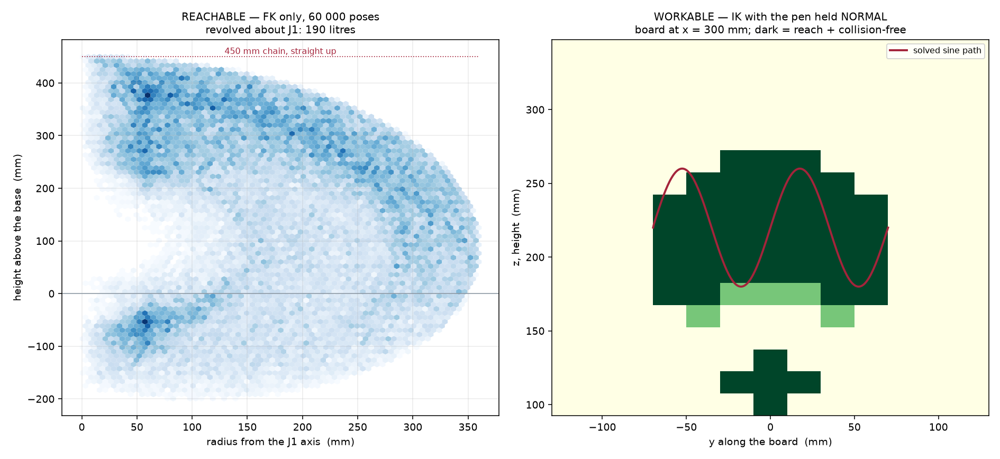

# ARM-450 — Workspace Analysis

**Built strictly in the stated convention: URDF → TF → FK → IK**

Each layer rests on the one below, and each is verified before the next is trusted.

| layer | what it provides | verified by |
| --- | --- | --- |
| **URDF** | joint origins, axes, limits | `check_urdf` parses, chain sums to 450.0 mm |
| **TF** | each joint as a 4×4 homogeneous transform ⁱ⁻¹ᵢT | Rodrigues rotation about the URDF axis |
| **FK** | the product of those transforms, base → TCP | q = 0 → TCP (0, 0, 450); J2 = 90° → (360, 0, 90) |
| **IK** | given a target, does a pose exist that reaches it | bounded least-squares, 0.014 mm rms on the sine |

---

## The three nested volumes

The word "workspace" hides a factor of five. These are strictly nested — each is a subset
of the one above.

| | definition | size |
| --- | --- | --- |
| **REACHABLE** | FK can put the TCP there | **190 litres** |
| **CLEAR** | …and the arm does not hit itself | **~88 %** of reachable |
| **WORKABLE** | …and the pen can be held **normal** to the board | **20 %** of the sampled patch |


*Reachable cloud with the sine demo overlaid, in the same three-panel layout used for the
myCobot study — 3-D view, top (x-y) with the maximum horizontal reach circle, and side
(x-z). Directly comparable: ARM-450 reaches **0.360 m** horizontally against the
myCobot 280's 0.30 m, in a 450 mm arm.*



---

## 1. Reachable — FK only

200 000 random poses sampled uniformly across the URDF limits.

| | |
| --- | --- |
| radius from the J1 axis | 0.3 – 360.0 mm |
| height above the base | −200.3 – 450.0 mm |
| maximum reach | 450.0 mm |
| swept volume, revolved about J1 | **189.7 litres** |
| inner dead zone | **none** |

**No dead zone is a design outcome, not luck.** The inner radius of a reachable annulus is
|L2 − L3|, so making the two links equal at 119 mm drives it to zero. The FK sweep confirms
the TCP reaches within 0.3 mm of the J1 axis.

The 450 mm figure is the chain standing straight up, which is also the specification the
arm was built to. Reach *outward* is 360 mm, because 90 mm of the chain is spent getting
from the table to the shoulder.

---

## 2. Workable — the IK layer, and where the real limit is

Position alone is 3 DOF. Holding the pen **normal to the board** adds 2 more, so the Rsine
task is 5-DOF on a 6-DOF arm — one spare. That one constraint is what collapses the usable
volume.

Sampled on a vertical board at x = 300 mm, over z = 100–340 mm and y = ±120 mm:

| | |
| --- | --- |
| reachable with the pen normal | 50 / 221 cells (23 %) |
| …**and** collision-free | **45 / 221 cells (20 %)** |
| usable patch | roughly **z 175–270 mm, y ±70 mm** |

So the arm reaches 190 litres, and can *work* on a patch about **95 × 140 mm**.

**The solved sine path fits inside that patch — but close to its edge.** y = ±80 mm is
already unreachable and the trace runs to ±70. That is the same limit found independently
when sweeping amplitude: the 140 mm span is near the practical maximum at this board
distance, and it is a workspace boundary, not a solver weakness.

---

## 3. The solved path, checked

Not the joint-limit box — the 240 waypoints actually solved and replayed.

| | |
| --- | --- |
| position error | **0.014 mm rms**, 0.217 mm max |
| pen tilt off normal | 0.093° rms, 1.417° max |
| largest joint step between waypoints | 2.09° |
| **collisions, exact mesh** | **0 of 240** |
| clearance margin | clear at +0.5 mm/face; 1 of 30 poses touches at +1.0 mm |

### This was not true a few hours ago

At the original trace height the same check found **72 of 240 waypoints colliding** — the
upper arm grazing the top rim of the base pedestal by 1.27 mm. Raising the trace 20 mm
(`Z_CENTER` 0.20 → 0.22) cleared every pose **and improved accuracy 14×**, from 0.194 mm to
0.014 mm rms, because the IK stopped working hard against the J2 limit.

**Why it had been missed:** `interference.py` samples the whole joint-limit box and reports
~30 % of poses colliding. That number is real but says nothing about the task, because the
task uses a tiny corner of that box. It had been read as background noise. Checking the
*solved path* is a different question, and nobody had asked it.

---

## 4. The wrist self-collision — investigated and fixed

The random sweep had been reporting **~30 % of poses colliding**, dominated by
`j4housing ↔ j6output`. That was real, and it is now resolved.

### It is a pure J5 fold

Mapping the wrist joint space settled it in one sweep: **every J4 row is identical.** J4
has no influence at all. It is not a combination of angles — it is J5 folding the J4
housing into the J6 output, and nothing else.

Bisecting to the exact boundary on the real meshes:

| | |
| --- | --- |
| collision-free J5 range | **−94.2° … +52.7°** |
| what the URDF declared | ±110° |
| optimistic by | **57° on the + side, 16° on the −** |
| usable span | 147° of 220° (67 %) |
| penetration 5° past the edge | 5.87 mm — a real overlap, not a graze |

The range is **asymmetric because the wrist is** — the servo pocket sits on one side.

### The fix

`joint5` is now declared **−91° … +49°**, the measured range with 3° held back. Nothing
about the geometry changed; the arm simply stops claiming travel it never had.

**The sine task is unaffected.** It uses J5 from +40.4° to +48.0°, inside the new limit,
and re-solves at **0.014 mm rms with 0 of 240 collisions.**

### A second defect this exposed

After narrowing the limit the sweep *still* reported ~30 %. `interference.py` carried its
own **hardcoded copy** of the joint limits and never read the URDF, so it went on sampling
poses the arm is no longer allowed to reach and reporting them as collisions. It now reads
the URDF. A limit written down twice is a limit that will disagree with itself.

### Result

| | before | after |
| --- | --- | --- |
| random poses colliding | ~30 % | **~12 %** |
| worst pair | `j4housing ↔ j6output` | **gone** |
| what remains | | `base ↔ j4housing`, `turret ↔ fore-B` |

What is left is the arm folding back onto its own base. Every arm does that; it is a
workspace boundary, not a defect, and no amount of geometry change removes it.

---

## 5. With a tool fitted

Everything above is the **bare J6 face**. That is not what the arm carries. The
quick-change adapter plus a gripper puts the working point **42 mm further out**, and that
moves the whole envelope.

| fitted | reach past J6 | max reach | horizontal reach | swept volume |
| --- | --- | --- | --- | --- |
| bare face | — | 450 mm | 360 mm | 188 L |
| pen | 30 mm | 480 mm | 390 mm | 239 L |
| **gripper** | **42 mm** | **492 mm** | **402 mm** | **262 L** |
| dock probe | 36 mm | 486 mm | 396 mm | 251 L |

A gripper adds **39 % of swept volume** for 42 mm of extension — volume grows far faster
than reach, because it goes roughly as the cube.

The "reach past J6" column is now **measured off the same assembly the collision check
uses**, not typed in. It used to be a hardcoded table, and the dock entry (43 mm) went
stale the moment the capture cone was shortened from 16 mm to 9 mm — the real figure is
36 mm. A hardcoded reach is exactly the kind of number that goes on being quoted in a
workspace table long after the part it describes has changed shape.

*Litre figures come from a 200 000-pose Monte-Carlo run binned into a 5 mm (r, z) grid, so
they carry a percent or two of sampling noise; the reach figures do not.*

**The specification consequence — resolved.** The arm is 450 mm; with a gripper fitted the
*system* reaches 492 mm. Asked whether 450 mm was a hard stowage envelope or a
target for the arm itself, **the user accepted 492 mm with a gripper (2026-08-22).** So
450 mm binds the arm — base to the J6 tool face — and the tool is payload beyond it.

That is now recorded rather than remembered: `params.SYSTEM_REACH_MAX = 495 mm`, checked in
**preflight stage 8**. The point of the check is not this tool but the next one — a longer
end effector cannot push the system past what was actually agreed without the gate saying
so. If a future tool needs more, that is a decision to re-make, not a number to edit.

### The sine path with a tool on

The trajectory was solved against a bare flange, so it was **not automatically valid** with
a tool fitted — a gripper is 48 mm across and reaches 42 mm out, which changes the
collision envelope, not just the reach. Re-checked on exact mesh geometry with the real
tool bodies placed by `assemble.build(..., tool=...)`:

| fitted | poses checked | colliding |
| --- | --- | --- |
| bare / pen | 240 (every waypoint) | **0** |
| gripper | 60 (every 4th) | **0** |
| dock probe | 60 (every 4th) | **0** |

All clear. The bare path gets every waypoint because it is the one the demo actually runs;
the fitted tools re-validate a path already solved and cleared, and adjacent waypoints are
at most 2.09° apart, so every fourth pose cannot hide an envelope change.

That was worth checking rather than assuming: the arm passes within about 1 mm of the base
pedestal at the closest point of this path, and a tool that reached *backwards* rather than
forwards would have used that margin up.

**Re-run on 2026-08-22** after the docking probe was re-cut (cone 16 → 9 mm, spigot
10 → 21 mm, height 38 → 31 mm). The old numbers were measured against a probe that could
not have docked with anything.

---

## Reproducing

```bash
cd ~/ros2_ws/arm450_design
python3 workspace.py            # reachable + workable, writes figures/workspace.png
python3 check_sine_clear.py     # all 240 waypoints, exact mesh collision
python3 verify_all.py 5         # full suite, new sweep seed each round
```
