# ARM-450 rev I.1 -- verification audit (Rules 3, 4, 6, 8), 2026-09-24, J3 lug fix 2026-09-27

**PRINT VERDICT: GREEN. Print the fit test first (7 coupons, about 2 h); when coupon 07 screws onto the back of your servo, print all 27 files. Every check is at 0 after M1 (servos screwed by their own holes), M2 (wire windows) and M3 (Rule 8: every servo seated on 4 supports, heads beside turning links sunk, cable route proven); wiring verified against your photo.**

## The three rules, clause by clause

| rule | what it asks | how it was checked | result |
|---|---|---|---|
| 3 | Manual verification by slicing | every joint cut through its axis, exact solids, each interface measured | 0 failures |
| 3 | Pockets and holes on the right faces; parameters proven in the CAD | 265 parameters measured back out of the exported files | 0 failures |
| 3 | No thin walls | inward rays on every printed part, walls < 0.8 mm (two lines) | 0 part(s) (upper GROOVE 0.5 mm skin accepted: already printed) |
| 3 | Servo seated on the right face, locked, driving the next link | J1..J6 drive trains part against part; link lock; YOUR servo model AND the manufacturer's STEP in all 6 seats | 0 failures; each servo SCREWED by its own back holes (M1: 20 screws, core in the manufacturer's holes) |
| 3 | Tool / hand reach | hex key to every screw at its build step | 0 failures |
| 3 | Rigid, joints in sync | 450 combined poses of J1..J5 together; 6 DOF (axes two ways, Jacobian rank) | 0 pair(s) too close; 6-DOF 0 failures |
| 3 | Stands up in use (new) | centre of mass over the 450 poses vs the foot | 0 problem(s) with the foot fixed by its 4 new table holes |
| 3 | Wiring clearance | both bus plugs in all 6 servos (sockets from the manufacturer's STEP, plug from your photo), exact solids; free run for the wires from each lead | 0 problem(s); nearest wall 1.98 mm; control detected. Route through the joints: see Rule 8 cables |
| 3 | Assemble / disassemble any time | each unit slid out along its path, exact booleans, both servo models | 0 failures |
| 3 | Bought hardware real | every screw, insert, nut, bearing, spring as a solid | 0 failures |
| 3 | Printable files, separate folder | print orientation gates, slicer on the print-ready STLs, bed size | 0 failures; bed: 0 part(s) too big |
| 4 | Mate on coincident planes, never overlap | all pairs of solids, exact boolean volume; whole-arm sweep | 0 failures |
| 4 | Touch only through designed pathways (bearing rings, horn, screws) | every contact classified; a body may meet the next only at its bearing race / horn / screw; controls injected | 0 failures |
| 4 | Every part attached, nothing floating | each body reached from its servo through touching contacts | 0 failures |
| 8 | Every servo seated, never floating | each servo's back plateau on >= 4 supports near both ends (face measured in the STLs) + Rule 4 planar mates | 0 failures |
| 8 | Screw heads beside a turning part | every screw vs every joint turned -180..+180 deg: clearance in range >= 1.0 mm, contact angle reported | 0 failures |
| 8 | Cables cannot wind up | one cable per joint; path change over the range measured; loops sized | 0 failures |
| 6 | Full assembly in different poses | ARM450_POSES.pdf, clearance measured in each pose | 6 pages, 0 failures |
| 6 | Part by part, with details | ARM450_PARTS.pdf: each part 4 views + axis sections of its features | 54 pages |
| 6 | Sharp interface pictures (Rule 5) | ARM450_REV_I_FINAL.pdf: exact sections per joint, overlap in red | 48 pages, 0 failures |

## What was missing -- found and fixed

### 1. rev I.1 -- J3 fork p1: both spring lugs joined to the cheeks by a 0.1 mm sliver (your slicer view, 2026-09-27)

*Found:* The J3 spring lugs stood on the ROUND tops of the fork cheeks with their base at the arc's apex: +y lug base z 246.80 on an apex of 246.91, -y lug 233.90 on 234.00. Joined by a 0.10-0.11 mm sliver (2.2 / 2.6 mm3 of overlap), corners 0.40 mm in the air, sharp notches on both sides; joint area 34-35 mm2 against the lug's own 75 mm2 section. The part was still ONE solid in the STEP, so no check saw it.

*Fixed:* Each lug is now SUNK 1.5 mm into its cheek below the arc at its edges (the generator asserts it never reaches the bearing pocket or any hole) and blended into the arc by R3 concave webs drawn in the cheek's plane: joint area 136 mm2. Spring pin position unchanged. New permanent check verify_union_joints.py: every glued feature of every printed part must be joined over at least 0.80 of its own section (all others read 1.00 or more).

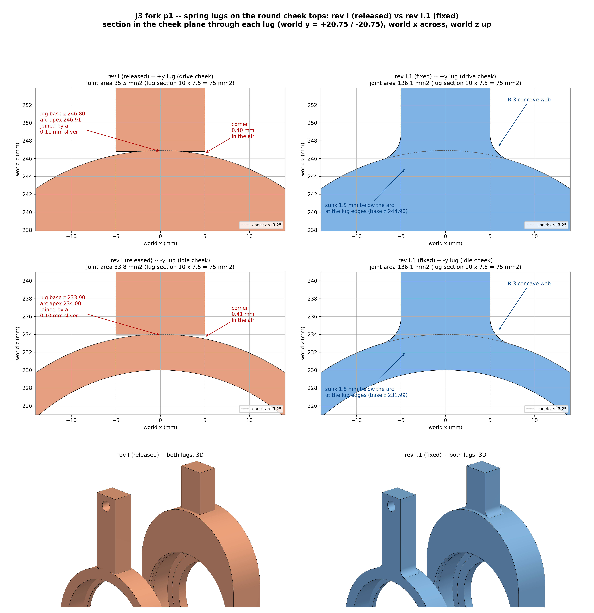

### 2. The real ST3215 has a REAR IDLER HORN (O19.2, turns with the output)

*Found:* Manufacturer's model (Waveshare ST3215-3D.zip) vs your Motor.stl: same case, but Motor.stl has no idler horn. Seated in the arm, the idler cut 169 mm3 into the back of the J1 foot, the J4 base and the J6 body -- all three would have jammed their servo.

*Fixed:* O20.4 x 4.35 pocket round the output axis in j1_mount, j4_base, j6_body (0.6 mm radial and axial). The fork bays J2/J3/J5 already clear it by 0.95 mm. New permanent check: verify_official_servo.py.

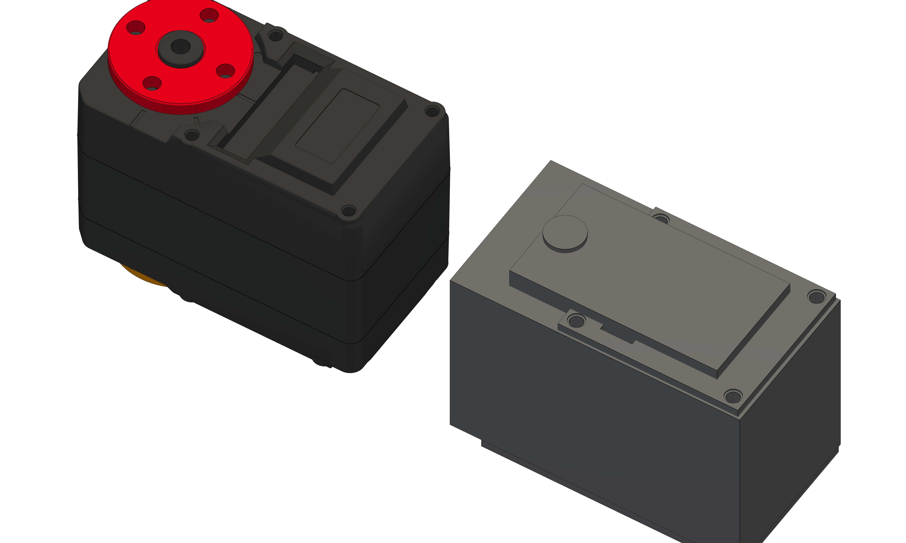
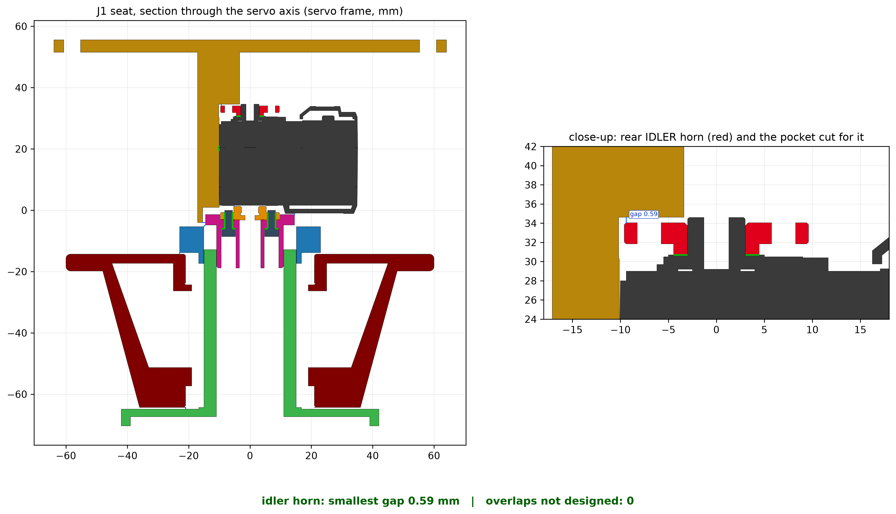
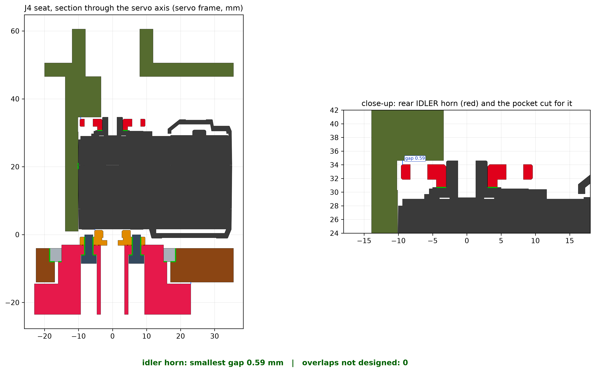
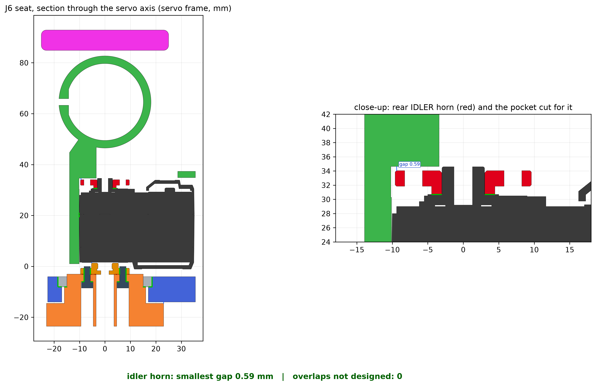

### 3. The real drive horn stands 0.20 mm further out than in Motor.stl

*Found:* Every shaft, hub and flange bolted to a horn therefore sits 0.20 mm further along its axis.

*Fixed:* Checked, no change needed: with each driven chain shifted 0.20 mm, every joint keeps >= 0.30 mm running clearance.

### 4. The J5 wrist could not be assembled or taken apart

*Found:* The J5 axle's flat covered only its middle 31 mm; the round idle end jammed in the blade's D-bore (exact solids: 30 mm3) whichever way it was pushed. Only the final position had ever been checked.

*Fixed:* The flat now runs out of the axle's idle end. All 7 assembly / disassembly paths are free with our servo model AND the manufacturer's. New permanent check: verify_disassembly.py.

### 5. The arm falls over unless the foot is fixed down

*Found:* At full reach the centre of mass (~1.5 kg arm) is 118 mm from the J1 axis; the foot's radius is 64 mm.

*Fixed:* 4 x O5.5 table holes in the foot plate (r 58, between the columns): M5 bolts or #10 wood screws, driven before the base goes on. Or clamp the foot.

### 6. Thin walls a slicer would drop or print as one fragile line

*Found:* Inward rays on every part: base foot floor 0.5 mm over ~5100 mm2 (the released recess was written for a 7.0 mm foot; the foot became 5.5); J3/J5 servo-cover walls 0.06-0.5 mm at the far end of the bay; J4 cap 0.15 mm beside the bolt counterbores; J6 bosses 0.44 mm round the inserts; spigot-collar pad 0.5 mm over the head counterbore; centring-ring gap corners a 17 deg knife edge; forearm / tongue cable-bore skin 0.5 mm.

*Fixed:* Base floor 3.0; 2.4 mm shell round the J3 / J5 bays; J4 cap sides +1.45; J6 bosses O21.6; collar pad +0.8; ring corners squared; cable skin 1.2 (forearm, upper tongue). Accepted: your already-printed upper GROOVE keeps its 0.5 mm cable skin (bottom layers on the bed, carries no load).

### 7. Printer tolerance vs the tight fits

*Found:* The key fits are finer than FDM accuracy (+-0.1..0.2 mm): bearing seats O42.00 / O37.02, printed shafts O29.95 in 30 mm bores, the -0.22 servo pinch, the 0.025 mm centring-ring fit.

*Fixed:* PRINTABLE_FILES/00_FIT_TEST_print_first: 6 small coupons (~1.5 h) with exactly those fits. Print them first and tune the slicer's XY hole / contour compensation before the big parts.

### 8. A checker reported disassembly paths as BLOCKED that are free

*Found:* audit_gaps.py section E swept the units with FCL mesh depth: it read the designed press fits (bearings) and the -0.22 servo pinch as obstructions (J4/J6 'deepest contact 25.6 mm', J1 1.7 mm on a pressed bearing).

*Fixed:* Removed; disassembly is judged only by verify_disassembly.py (exact OCC booleans, with a baseline for the fit each unit starts in, both servo models).

### 9. One of my own audit fixes broke Rule 4 -- caught by the re-run

*Found:* The 1.2 mm cable-skin fill added to the upper tongue ran 0.5 mm past the link's end face into the J3 fork (exact solids: 1.2 mm3 overlap; the part grew from x 85.0 to 85.5). The Rule 4 check flagged it as the only failure.

*Fixed:* The fill now ends exactly at the end face, and the generator refuses to export if the tongue runs past it. Whole release pass run again on the corrected part.

### 10. J1 foot: the locating end wall was 0.6 mm thin over the lip height

*Found:* The O31 clearance bore for the hub flange cut the 6.0 mm end wall down to a 0.6 mm crescent (44 mm2) from the cap face to the lip top -- found by the thin-wall check once it judged areas instead of single points.

*Fixed:* End wall 7.0 mm (outward only; the servo seat is unchanged): 1.6 mm at its thinnest.

### 11. A checker's mesh was coarser than its own threshold

*Found:* The static all-pairs check (PAIRS) meshed the released upper groove at 0.4 mm deflection and judged clashes at 0.15 mm: it reported the 0.025 mm centring-ring fit as a 0.15 mm clash, and it MISSED the real 1.2 mm3 tongue overlap (too few sample points in so small a volume). Both exact checks (Rule 4 booleans, joint sections) measured the ring fit as 0.025 mm clear and caught the tongue.

*Fixed:* PAIRS now uses the groove's own fine STL (115 756 faces) and its exact solid for containment. The exact Boolean checks remain the authority; PAIRS is the independent second method.

### 12. The J6 servo's rear boss snagged the new screw bridge -- and a checker hid it

*Found:* The pads keep a channel clear over the servo's raised back features so the servo can slide in; it was 2.35 mm deep, sized for the idler horn (2.04 above the plateau) -- but the bare rear boss (as on your servo) stands 2.589 above it: the J6 servo would catch 0.24 mm on the bridge while sliding in. The insertion check (verify_wrist) caught it; the exact disassembly sweep did not, because it compared the total overlap with the housing against the starting pinch -- and the pinch overlap SHRINKS as the servo slides out, hiding the 6.5 mm3.

*Fixed:* Channel 2.9 deep on every pad (0.31 over the boss). The disassembly sweep now judges each servo by its core (everything but its two pinched side strips): shown to report the snag (+6.53 mm3 at 32 mm) before the fix, free after it.

## Checked and clean

* Joints moving TOGETHER: 450 combined poses (J1 x J2 x J3 x J4 x J5): every pair of neighbouring bodies keeps >= 0.47 mm (running gaps), every other pair >= 15 mm.
* Bed: every part fits a 180 mm cube (the largest, the forearm tongue, is 144 mm).
* Wiring (new check, verify_wiring.py): both bus plugs fit in all 6 servos -- sockets from the manufacturer's STEP at the place your photo shows, plug as wide as its socket -- nearest wall 1.0 mm (J2/J3/J5 cover windows) to 2.45 mm; the wires leave straight out through the J2/J3/J5 windows, along the channel at J1/J4, and at J6 2 mm further out, then over the new screw bridge. Your photo shows the rear boss without an idler horn; the seats clear the idler horn either way.
* Every earlier check re-run on the fixed geometry, see the stage table.

## Modifications made in this audit (your go-ahead: "do it on the spot")

### M1 (done). Every servo screwed into its own back-face holes -- your requirement

Before: each servo was captured, not fastened (pinch walls, lips, end wall; the J1 pedestal stood 0.6 mm clear of its back) -- along its axis only friction held it, and the press depends on printer accuracy. Hole pattern: the Waveshare 2D drawing (DXF, exact) -- back face x 8.30 / 32.75 from the output shaft, y +-10.25 (24.45 x 20.5). Your photo of the back face gives ratio 1.14 (drawing 1.19; 19.05 x 20.29 would be 0.94) and your 37.24 mm horn-to-horn and O5.95 boss match the drawing (37.25, O6.0), so the drawing describes your servo. Now: pads / posts touch the servo's back plateau (32.0 above its seat face, both servo models) round each hole and the servo's own self-tapping screws (~8 mm, from the box) pull it down: J2, J3, J5 through the cover (heads on its outer face), J1 from under the foot plate (4 posts, O5.6 counterbores), J4 from under its base plate and J6 through a bridge over the servo's far end -- the far pair only there: behind the near pair sit the forearm (J4) and the J5 hub (J6), no screwdriver reaches. 20 screws, 2.6 mm into the servo (holes 3.0 deep). The pads keep |y| < 9.9 clear for 2.35 mm, so the servos still slide in and out (checked, both servo models). Checked: every screw passes free, bites, head seated, tip free; the screw's core runs down the MANUFACTURER'S hole at all 20; each screw clamps the housing to the servo on a face along its axis (Rule 4); tool access at its build step.

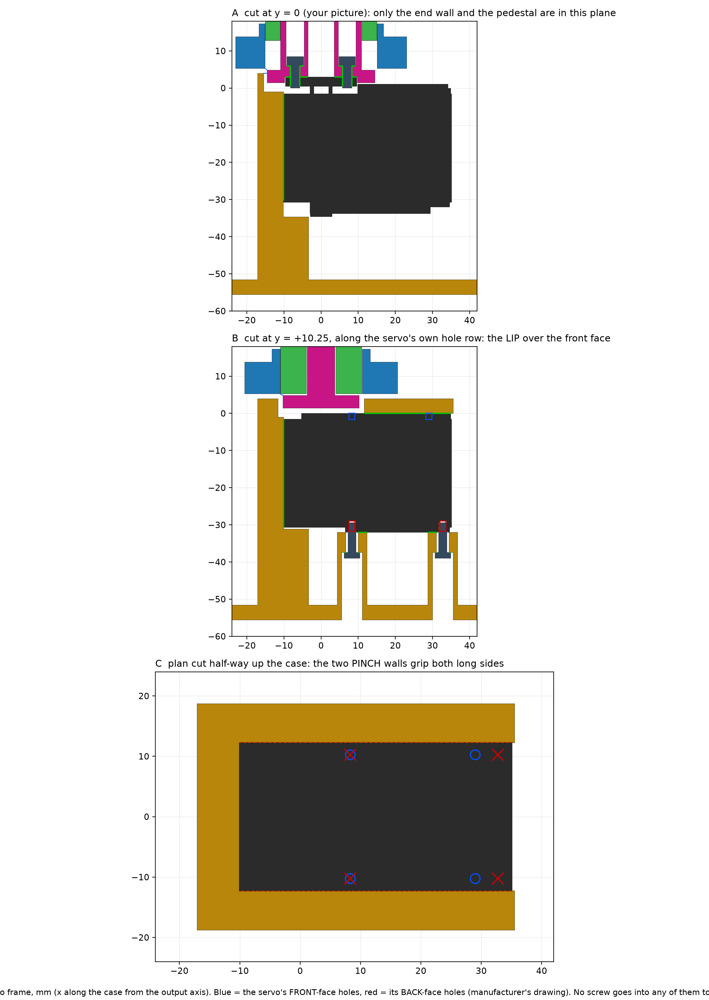
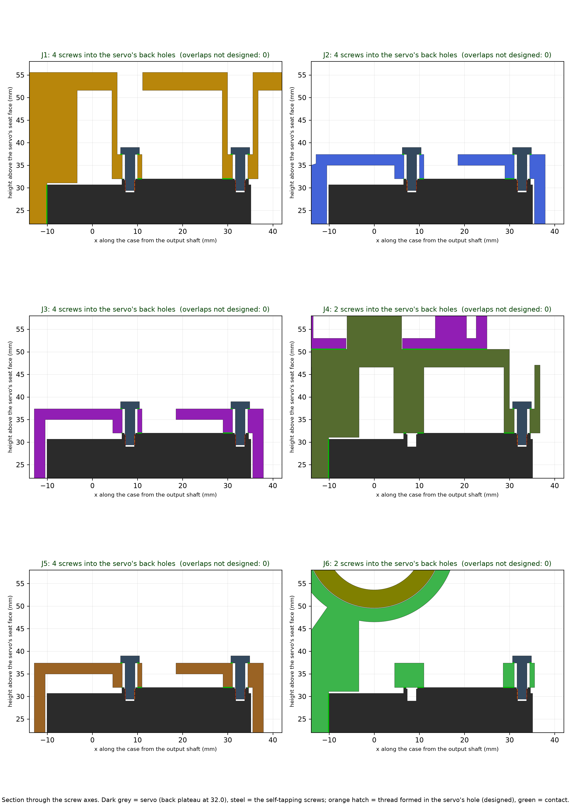

### M2 (done). Cover wire windows fitted to the plugs

The J2 / J3 / J5 cover windows were 12 x 20 centred on the case; the two plugs' footprint reached 0.2 past the edge. Now x 12.2..18.5 from the output shaft (the wires leave at 13.2..15.2), 22 wide: both plugs fit, wires 1.0 mm clear, and the window stops short of the new near screw pads.

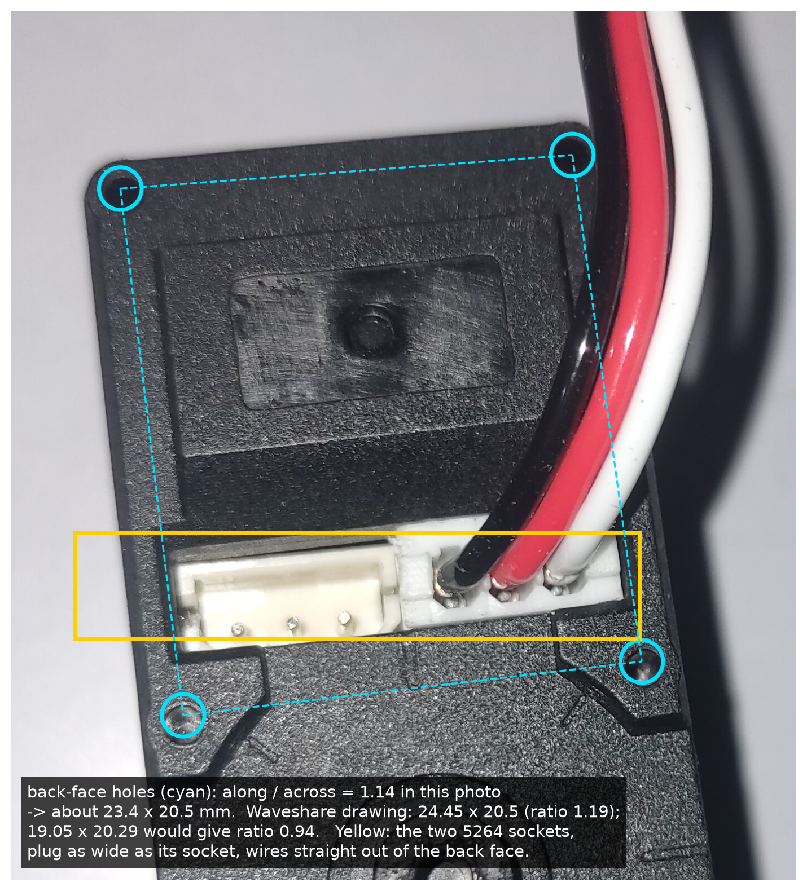

### M3 (done). Rule 8 from your Fusion snapshots: seated servos, sunk heads, cable route

J4 and J6 servos now stand on 4 back supports like the others; the 8 fork-floor bolt heads are sunk 3.2 mm (M3 x 10), the J4 / J6 cap counterbores deepened to 3.8; new permanent checks: verify_head_clearance.py (every screw vs every joint, -180..+180 deg) and cable_route.py (path change per joint, loops).

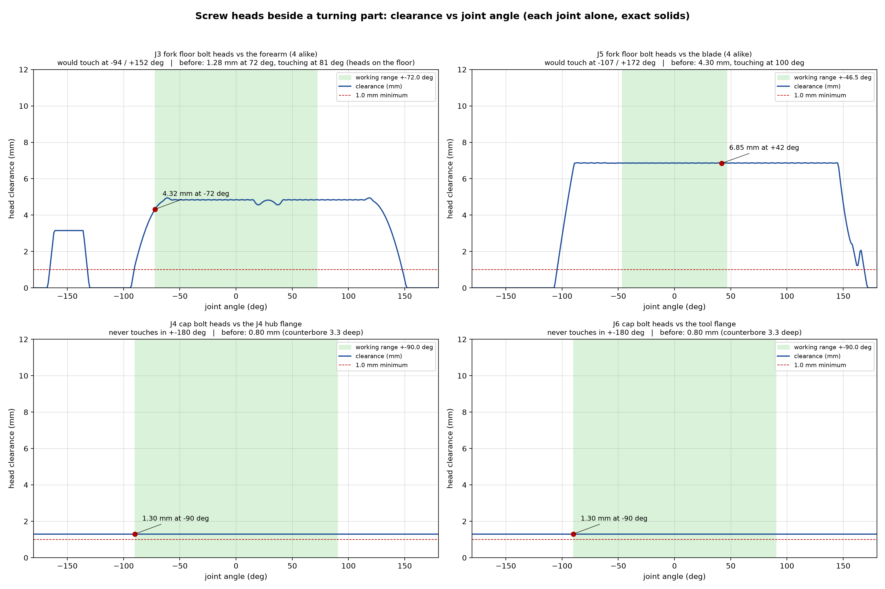

## Your questions on the Fusion snapshots

### Q1. How is J1 connected, how does it drive the turret, how is it aligned?

Servo horn -> 4 x M2.5 -> J1 hub. The hub's plug has a D-flat that sits in the turret spigot's D-key: that turns the turret. The spigot's end is slit into a collet; the spigot collar round it is pinched by one M3 bolt and clamps it onto the plug (no play). Alignment: the turret's spigot runs in the base's two 6806 bearings, 40 mm apart; they carry the arm's weight and tipping moment into the base, the columns and the foot, so the servo gives torque only. Servo axis = bearing axis (measured, 0.000 mm).

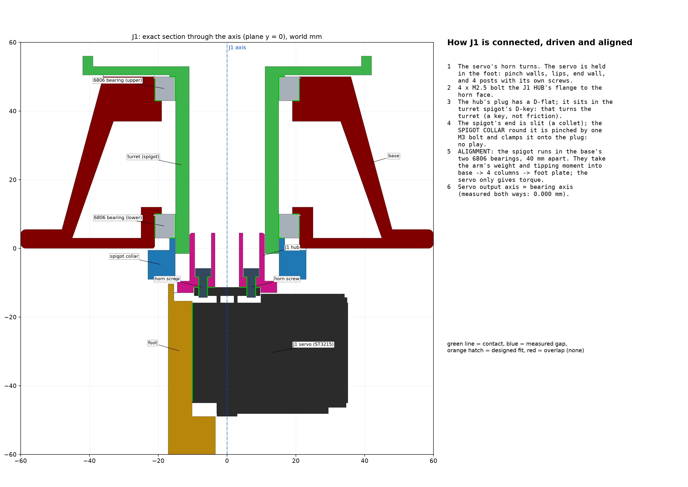

### Q2. Won't the cables wind up during joint motion?

No. The bus is a daisy chain; each cable joins servo k to servo k+1 and so crosses ONE joint -- joint k, whose axis is servo k's own output axis. No joint turns more than 180 deg in total (the ST3215 is not continuous), so a cable only flexes back and forth; it can never wind turn after turn. The change of each cable's path over its joint's range is measured below; leave that + 20 mm as a loop at the joint and tie the cable down on both sides.   cable      crosses range        exit r from axis         span min..max (mm)     change     loop / cable
  J1 -> J2   J1      +-90.0       40.0 mm (bound   80)      144.6 .. 179.0         34.5 mm    54 / 263 mm
  J2 -> J3   J2      +-54.0       14.8 mm (bound   24)      184.1 .. 200.7         16.6 mm    37 / 267 mm
  J3 -> J4   J3      +-72.0       14.8 mm (bound   28)      141.6 .. 155.1         13.5 mm    33 / 219 mm
  J4 -> J5   J4      +-90.0       40.0 mm (bound   80)      106.8 .. 148.4         41.6 mm    62 / 240 mm
  J5 -> J6   J5      +-46.5       14.8 mm (bound   21)       74.6 .. 85.3          10.7 mm    31 / 146 mm
  J6 is the last servo on the bus: no cable leaves it

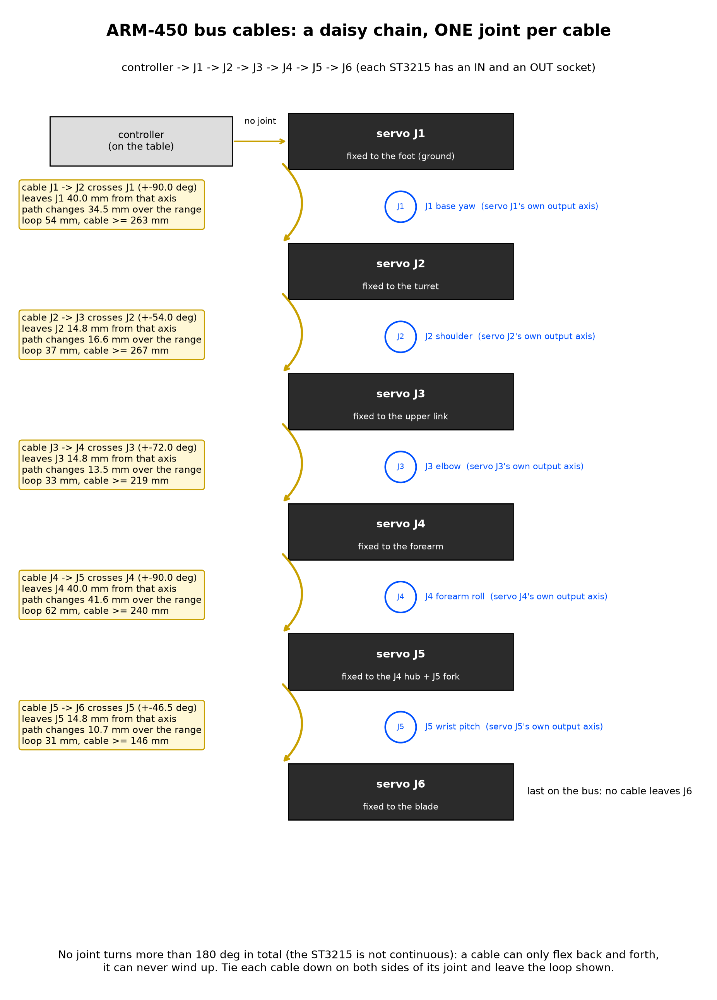

### Q3. Servos floating (your J4 and J6 snapshots)

They were: the J4 and J6 servos hung from their front lips with only friction at the back (J4: a 12 mm cable space under it). Now every servo stands on 4 supports on its back plateau near both ends -- J1: 4 posts, J2/J3/J5: 4 pads in the cover, J4: 4 posts, J6: 2 far pads (bridge) + 2 near pads -- and is screwed by its own holes where a screwdriver reaches (20 screws). The middle of the servo's back carries the label block, the rear idler horn and the bus sockets, so the supports sit on the flat plateau along both long edges: a cut at y = 0 still shows the gap there; the cut through the hole rows shows the contact.

### Q4. The screw heads under the swinging links -- collision, and at what angle?

Measured for every screw beside a turning part (-180..+180 deg). The J3 fork floor heads came within 1.28 mm of the forearm at +-72 deg and would touch at 81 deg -- only 9 deg of margin. All fork-floor heads are now sunk 3.2 mm into O6.2 counterbores (M3 x 10 instead of x 14): J3 4.32 mm in range, first contact 94 deg; J5 6.85 mm, first contact 107 deg; the J4 / J6 cap heads went 0.80 -> 1.30 mm (counterbore 3.3 -> 3.8).

### Q5. Slots to plug the servo cables in -- is there clearance?

Plugged in: yes, both plugs in every servo with >= 1.0 mm to spare (verify_wiring). Plugging IN or OUT with the arm assembled: not before -- the new screw pads / posts near the horn end and the cover window's edge stood 0.5 to 1 mm in the plug's way. Now a clear passage above both sockets (their footprint + margin) is cut through every pad, post and cover (J2/J3/J5 window 7.5 x 22 mm). New check verify_plug_insert.py pulls each of the 12 plugs out of its socket with the arm assembled: J2/J3/J5 straight out through the cover; J1/J4 10 mm straight out, a few mm sideways, then out along the channel; J6 14 mm straight out, then sideways -- all 12 free.

## Print order (GREEN)

1. 00_FIT_TEST_print_first -- FIRST, all 7 coupons (07 = the servo-screw plate)
2. then all 27 files in PRINTABLE_FILES (33 pieces); the 6 servo housings (03_j1_mount, 06_J2_turret_p2, 13_J3_p2, 18_j4_base, 22_J5_p2, 25_j6_body) once coupon 07 has screwed onto your servo's back

## Before and while building

* **Servo screws** -- Use the self-tapping screws from the servo box (~8 mm under the head): 2.6 mm go into the servo. A longer screw needs a washer under its head so that no more than 2.6 mm go in. J1: drive the 4 from under the foot plate BEFORE the foot is fixed to the table. J4: from under its base plate -- in the finished arm the forearm spring collars cover them (take the collars off to service J4).
* **Print the fit test first** -- About 1.5 h. If a coupon is tight or loose, tell me the numbers or set hole compensation before the big parts.
* **Fix the foot to the table** -- 4 screws through the new holes (or a clamp); otherwise the arm tips at reach.
* **Cable loops** -- Leave the loop listed for each joint (31-61 mm) and tie each cable down on both sides of its joint; move every joint through its full range once by hand before powering up.
* **Watch the servo temperature** -- The J2 servo works near its continuous rating (SF 1.07 with the springs) in a closed pod. The ST3215 reports its temperature over the bus: watch it in your control code.

## Every stage of the re-verification

| stage | failures |
|---|---|
| J1 | 0 |
| J2 | 0 |
| J3 | 0 |
| J4 | 0 |
| WRIST | 0 |
| HARDWARE (bearings + bolts as solids) | 0 |
| LINK LOCK (J2/J3 set screws, centring rings) | 0 |
| FASTENERS (every screw, insert, nut) | 0 |
| PARAMETER AUDIT | 0 |
| TOOL ACCESS (hex key to every screw at its build step) | 0 |
| RULE 4 (mate, never overlap; pathways; attached) | 0 |
| SPRINGS | 0 |
| SWEEP | 0 |
| 6-DOF (axes two ways, Jacobian rank) | 0 |
| OFFICIAL ST3215 (manufacturer's model, rear idler horn) | 0 |
| DISASSEMBLY PATHS (our servo model) | 0 |
| DISASSEMBLY PATHS (official servo) | 0 |
| AUDIT GAPS (joints together, tipping, walls, bed) | 0 |
| GATES (each part in its chosen PRINT orientation) | 0 |
| PAIRS (static all-pairs) | 0 |
| WIRING (both bus plugs in every servo, way out) | 0 |
| HEAD CLEARANCE (screw heads vs turning parts, contact angle) | 0 |
| CABLE ROUTE (one joint per cable, path change, loops) | 0 |
| PLUG INSERTION (bus plugs in and out with the arm assembled) | 0 |
| UNION JOINTS (every glued feature joined over its full section) | 0 |
| ASSEMBLY | 0 |
| SECTION MEASURE (manual check by slicing) | 0 |
| PRINT SLICER on the print-ready files | 0 |
| FINAL PDF (Rule 5 pages) | 0 |
| POSES + PARTS PDFs (Rule 6) | 0 |
| EDITABLE CAD folder (Rule 7) | 0 |

## Files changed by this audit (reprint these)

* rev I.1 (2026-09-27): J3_p1 -- spring lugs sunk 1.5 mm into the cheeks + R3 blend webs (reprint J3_p1 only)
* j1_mount (idler pocket, table holes, end wall 7.0, 4 servo-screw posts, plug slot)
* base (foot floor 3.0)
* J3_p1, J5_p1 (floor bolt heads sunk 3.2 mm; bolts now M3 x 10)
* j4_cap, j6_cap (cap bolt counterbores 3.8)
* spigot_collar (pad)
* J2_turret_p2 (servo-screw pads, wire window + plug slot 7.5 x 22)
* J3_p2, J5_p2 (bay shell, servo-screw pads, wire window + plug slot 7.5 x 22)
* J5_shaft (flat to the idle end)
* j4_base (idler pocket, 4 support posts, 2 with servo screws)
* j4_cap (wider sides)
* j6_body (idler pocket, bosses O21.6, servo-screw bridge + 2 near pads)
* j6_cap (bosses O21.6)
* shaft_clamp (corners)
* link_fore_tongue, link_fore_groove (cable skin)
* link_upper_tongue (cable skin)
* NEW: 00_FIT_TEST_print_first (7 coupons; 07 = servo-screw plate)

## Outside references

* [Waveshare ST3215 servo wiki (3D model ST3215-3D.zip, specifications)](https://www.waveshare.com/wiki/ST3215_Servo)
* [SKF 61806-2RS1 (drive bearings J1/J2/J3/J5)](https://www.skf.com/us/products/rolling-bearings/ball-bearings/deep-groove-ball-bearings/productid-61806-2RS1)
* [61706 dimensions (J4/J6 bearings)](https://www.123bearing.com/bearing-housing/deep-groove-bearing/single-row/61706)
* [Waveshare ST3215 2D drawing (face-hole positions)](https://files.waveshare.com/upload/0/08/ST3215-2D.zip)
* [ST3215 pinout / 5264 connector](https://docs.cirkitdesigner.com/component/20f64312-8ca7-4cd1-86c1-882fd984ad37/st3215-servo)

Logs: REVI_CHECKS.log, FINAL_RUN.log, DOCS_RUN.log, OFFICIAL_SERVO_CHECK.log, DISASSEMBLY_CHECK*.log, AUDIT_GAPS.json, PARAM_AUDIT.md, MATING_CHECK.log, WIRING_CHECK.log
