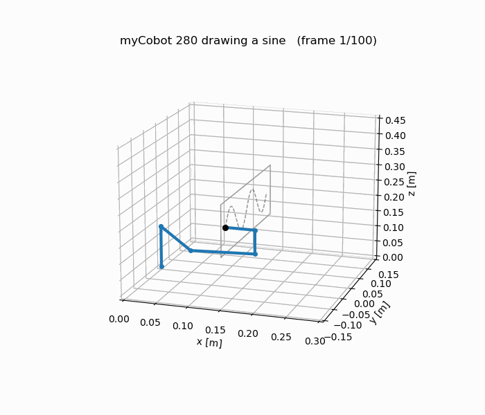
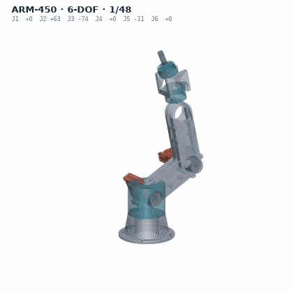
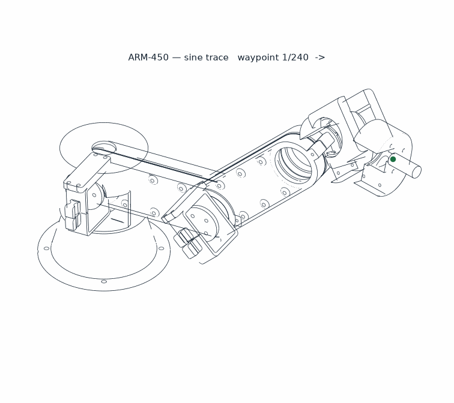

# Robotics Engineering Portfolio — Abhishek Ray

**6-DOF robot arms: from the kinematics maths, to a mechanical design, to servos moving on a real bus.**

ROS 2 Jazzy · Python · analytical kinematics · parametric CAD · embedded serial-bus servos

I build the whole stack rather than gluing libraries together: the forward kinematics,
Jacobian and IK solvers here are derived and implemented from first principles, then
**verified numerically** against an independent library and against the URDF itself.

---

## Project 1 — Sine-wave trajectory tracing on a myCobot 280

<p align="center"></p>

A ROS 2 package that drives a 6-DOF arm along a sine wave on a surface, holding the pen
**normal to that surface** throughout.

| | |
| --- | --- |
| **Kinematics** | Modified (Craig) DH forward kinematics, written from scratch |
| **Jacobian** | Velocity propagation, link by link |
| **IK** | Damped least squares, with a tuned damping sweep |
| **Verification** | FK matches the URDF to **~1e-15 m**; Jacobian matches finite differences to **2.5e-7**; cross-checked against `ikpy` |
| **Runtime** | Precomputed trajectory streamed to `/joint_states` at 30 Hz; `robot_state_publisher` → TF → RViz |
| **Feedback** | A second node accumulates the *actually drawn* line from TF, so target (green) and achieved (red) are visible side by side |

→ [`1-ros2-sine-tracing/`](1-ros2-sine-tracing) · [package README](1-ros2-sine-tracing/README.md)

**Why it's not trivial:** a naive IK solution flips the wrist mid-stroke or drifts off the
plane. Constraining the tool orientation while tracking a moving Cartesian target is where
the DLS damping term and the seeding strategy actually matter.

---

## Project 2 — ARM-450: a clean-sheet 6-DOF arm, designed to a hard mass budget

<p align="center">


</p>

A complete arm designed from nothing — geometry, structure, bearings, fasteners, thermals,
print plan — driven entirely by **parametric Python**, not by hand-modelling in a GUI.
Every dimension comes from `design_params.py`; the URDF, the STEP/STL exports, the
drawings and the reports all regenerate from it.

| Requirement | Result |
| --- | --- |
| Overall length ≤ 450 mm | **450.0 mm** |
| Mass ≤ 1450 g | **1365 g** (85 g headroom) |
| Degrees of freedom | **6**, all with real, sourced hardware |
| Horizontal reach | 360 mm |
| Reachable workspace | **190 litres**, no dead zone |
| Printed parts | 19 pieces, 624 g |
| Sine tracing on the design | **240/240 waypoints, 0.014 mm RMS, 0 collisions** |
| Pre-print gate | **60 checks passed, 0 warnings, 0 failures** |
| STEP B-rep geometry audit | **52 features verified, 0 outstanding** |

**Engineering done here:** joint bearing selection and clearance fits, stress and FEA runs,
compliance budget, creep/fatigue check, servo thermal analysis, interference and mate
checking on the real B-rep, topology and geometry optimisation, slicing/print planning,
and a full bill of materials with sourcing.

The audit caught three defects that would each have wasted a print run — including three
bearing seats that did not physically exist in the solid.

**It is not only drawings — the arm runs.** [`ros2/arm450_description`](2-arm450-mechanical-design/ros2/arm450_description)
is the generated URDF plus meshes, and [`ros2/arm450_sine`](2-arm450-mechanical-design/ros2/arm450_sine)
drives the sine trajectory on it: the design is loaded into ROS 2 and moved, so the geometry
is checked by simulation and not only by the drawings that produced it.

→ [`2-arm450-mechanical-design/`](2-arm450-mechanical-design) ·
[Summary](2-arm450-mechanical-design/SUMMARY.md) ·
[Full report](2-arm450-mechanical-design/REPORT.md) ·
[Drawings](2-arm450-mechanical-design/output) ·
[BOM](2-arm450-mechanical-design/BUY.md)

---

## Project 3 — Hardware bring-up: ESP32 + STS3215 serial-bus servos

Getting a real arm to move, working up from a dead bus.

- **Read-only diagnostics first.** [`scs_diag.py`](3-hardware-esp32-servo/arm_demo/scs_diag.py)
  pings each servo ID and dumps registers using only `PING` and `READ` — no motion command
  is issued until the bus is understood.
- **Protocol reverse-engineering.** Determines the servo family (SC vs ST) from the model
  register, because the two families differ in **units and endianness**; getting this wrong
  drives joints to the wrong angle.
- **Opening the port without resetting the board.** The ESP32 resets on DTR/RTS pulse, which
  drops it out of `SERIAL_FORWARDING` mode — so the port is opened with those lines
  suppressed. This was the actual blocker that stopped the arm moving.
- **Then motion:** single-joint moves, continuous oscillation with logged runs, and finally
  the same sine trajectory from Project 1 streamed to the physical arm.

Stack: Waveshare ESP32 driver board → USB `SERIAL_FORWARDING` bridge → 1 Mbps servo bus → STS3215 servos.

→ [`3-hardware-esp32-servo/`](3-hardware-esp32-servo) · [operating guide (PDF)](3-hardware-esp32-servo/robotic_motion/Robotic_Motion_Guide.pdf) · [run logs](3-hardware-esp32-servo/robotic_motion/logs)

---

## Project 4 — myCobot RViz demo (earlier iteration)

The first working version: offline `ikpy` IK over the official M5 URDF, streamed as
`/joint_states` for RViz. Kept because it shows the progression from *using* an IK library
to *writing* the solver in Project 1.

→ [`4-mycobot-rviz-demo/`](4-mycobot-rviz-demo)

---

## Project 5 — How I got here: the ROS 2 learning progression

I started ROS 2 from zero. The six packages that led to Project 1 are kept **in order and
unedited** — publisher/subscriber, forward kinematics, a first sine attempt, a rewrite after
that attempt drifted, a modular restructure, then the verified solver.

Steps 3 and 4 exist because step 3 was wrong: the arm drifted off the plane, so I wrote a
separate FK test to isolate whether the fault was in the kinematics or the solver. It was in
the kinematics. The 1e-15 m agreement in the finished package is a direct consequence.

→ [`5-ros2-learning-progression/`](5-ros2-learning-progression)

---

## Skills, concretely

| Area | Evidence |
| --- | --- |
| **ROS 2** (Jazzy) | Custom packages, launch files, nodes, TF, `robot_state_publisher`, RViz config, colcon |
| **Robot kinematics** | Modified-DH FK, velocity-propagation Jacobian, DLS / pseudoinverse / Jacobian-transpose / Levenberg–Marquardt IK, manipulability and conditioning |
| **Python** | NumPy, SciPy, matplotlib, ReportLab, PyBullet, `ikpy`, `pyserial` |
| **Mechanical design** | Parametric CAD in code, STEP/STL export, bearing fits, tolerance and compliance budgets, FEA, DFM for FDM printing |
| **Embedded / hardware** | Serial bus protocols, register-level servo control, ESP32 bridges, systematic bring-up and fault isolation |
| **Verification** | Numerical cross-checking against independent implementations; automated pre-flight gates before committing to hardware |
| **Documentation** | Every project ships a README, a generated PDF report, and reproducible figure scripts |

---

## Running any of it

```bash
# ROS 2 Jazzy on Ubuntu
mkdir -p ~/ws/src && cp -r 1-ros2-sine-tracing ~/ws/src/Rsine
cd ~/ws && colcon build --symlink-install && source install/setup.bash
ros2 launch Rsine sine_draw.launch.py
```

Hardware and design scripts are plain Python — see each folder's README.

---

**Abhishek Ray** — Junior Research Fellow, Space Dynamics and Flight Control Laboratory
(SDFCL), Department of Aerospace Engineering, IIT Kanpur · royabhishek4650roy@gmail.com
